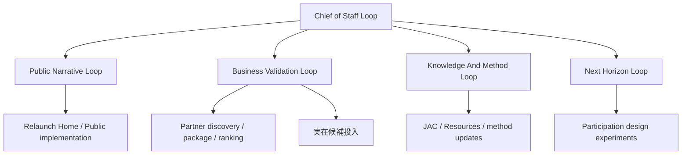

# NBL Executive Start Here

更新日: 2026-03-26

このファイルは、NBL の全体像を最短で把握するための `1枚紙`。
細かい `md` や `tsx` を順番に追わなくても、いま何が決まり、何が未決で、どこだけ見ればよいかが分かるようにしている。

## 5-Line Summary

- NBL は `個別相談事業` ではなく、`AI時代の社会OSを設計する研究と実装のスタジオ` として整理している。
- 運営前提は `AI運営のバーチャルチーム`。人の常設相談窓口があるようには見せない。
- 本番公開サイトはいったん安全な仮公開状態に退避済みで、完成版は hidden review drafts を積み上げながら作っている。
- その次の本流として、各 draft を束ねる `relaunch home` を hidden review で組み始めている。
- さらに、その方針を実際の完成版トップに近い画面へ下ろした `relaunch public home` draft も hidden review で実装済み。
- そのうえで、`showcase direction` ラウンドを通じて、NBL サイト自体を AI-native 組織の showcase にするための設計原則も追加した。
- AI中心の運営を `気分` でなく `定常ループ` として回すため、`operating loops` の整理を追加した。
- さらに、単月売上より先に何を複利で増やすかを定義する `value compounding` の operating draft も追加した。
- 事業構造の現在地は `AI core + partner edge + human review boundary`、`startup fee + recurring platform fee + bounded usage`。
- 2026年3月26日付で、`赤字でも product-first で進める / content の投げ銭的収益は bridge revenue に留める` 方針を追加した。
- 同じく 2026年3月26日付で、daily / weekly recurring ops は `状況報告` ではなく `AI が進めること` と `Founder に返してほしい判断` を分けて返す運用に寄せた。
- 直近の実務は `design partner -> commercial package -> discovery kit -> partner discovery ops -> anonymous pipeline -> dossier/readout kit` に加え、`enterprise inbound prep` まで進んでいる。
- 直近の public 側の実務は、`3月20日までに一旦出せる面` を仕上げる sprint に入っている。
- その先の本流では、`Horizon 1 = 障害・難病の雇用支援R&D` と `Horizon 2 = participation design の芽出し` を並走させる整理に入っている。

## いま固定されていること

### 事業定義

- NBL は `AIで人を不要にする` ためではなく、AIで人間の限界を超える事業を動かし、その余力で新しい仕事と社会参加の受け皿を生み出すことを本丸に置く。
- つまり、`automation 自体` より `participation design` が目的。
- そのために、`当面の雇用支援R&D` と `次の participation design 実験` の二層を同時に持つ。

### 運営モデル

- NBL は `AI運営のバーチャルチーム`
- public copy は `人が常時対応する相談窓口` に見せない
- 高リスク領域は `AI-supported, human-decided`
- Chief of Staff / Public Narrative / Business Validation / Knowledge & Method / Next Horizon の 5 loop で定常運転する

### サイト全体像

- provisional site map:
  - Home
  - What We Do
  - Resources
  - JAC
  - About
- `見えない障害の理解` は重要だが、NBL 全体の中では 1 シリーズ
- JAC は NBL 全体そのものではなく `product / method stream`

### 事業構造

- operating shape:
  - AI core
  - partner edge
  - human review boundary
- revenue shape:
  - bridge revenue:
    - optional support / tip-style contributions for content lanes
  - startup fee
  - recurring platform fee
  - bounded usage

### 初期 partner / package

- first design partner:
  - employer-facing intermediary が第一候補
- second-best:
  - design-forward employer
- first package:
  - `1 core + 2 wrappers`
- core:
  - `NBL OS Pilot`
- wrappers:
  - `Workplace Pilot`
  - `Partner Node Pilot`

## いまの進捗地図

### Public / Site

- 本番は仮公開に退避済み
- 完成版は hidden review page 群で詰めている
- 次の中核は `relaunch home` を軸に、全体像を 1 ページで返せる構造へ寄せること
- `配慮設計アシスト` の `1日20件` 制限は Vercel 本番では shared Redis 前提。Upstash env が入るまで production hardening は未完

### Business / Management

- 事業構造ラウンド:
  - 完了
- validation ラウンド:
  - 完了
- design partner ラウンド:
  - 完了
- commercial package ラウンド:
  - 完了
- discovery kit:
  - 完了
- partner discovery ops:
  - 完了
- anonymous candidate pipeline:
  - 完了
- dossier / round readout kit:
  - 完了
- enterprise inbound prep:
  - 完了
- march 20 release sprint:
  - 進行中

### Next Real Bottleneck

- 実在候補を A1 / A2 / B1 / C1 に入れるところから、現実の network と接続する
- ここはユーザーの情報か、実候補リストが必要

## あなたが全部読まなくてよいもの

- 各 round の詳細メモ全文
- 各 `tsx` の実装詳細
- 古い triage メモや素材棚卸しの細部

## あなたがまず読むべきもの

### 3分で追う

1. このファイル
2. `docs/nbl-workspace/decision-log.md`
3. `docs/nbl-workspace/ai-driven-social-os-management-policy-2026-03-26.md`
4. `NBL-FOUNDER-INPUT-GUIDE.md`
5. `docs/nbl-workspace/vercel-jac-rate-limit-cutover-2026-03-26.md`

### 10分で追う

1. このファイル
2. `docs/nbl-workspace/decision-log.md`
3. `docs/nbl-workspace/ai-driven-social-os-management-policy-2026-03-26.md`
4. `NBL-FOUNDER-INPUT-GUIDE.md`
5. `docs/nbl-workspace/operating-loops-round-2026-03-17.md`
6. `docs/nbl-workspace/value-compounding-operating-system-2026-03-17.md`
7. `docs/nbl-workspace/snapshot-automation-design-2026-03-17.md`
8. `docs/nbl-workspace/relaunch-home-round-2026-03-17.md`
9. `docs/nbl-workspace/showcase-direction-round-2026-03-17.md`
10. `docs/nbl-workspace/next-horizon-round-2026-03-17.md`

### partner discovery だけ追うなら

1. `docs/nbl-workspace/partner-ops-map-2026-03-17.md`
2. `docs/nbl-workspace/decision-log.md`

### 3月20日以降の企業流入だけ追うなら

1. `docs/nbl-workspace/enterprise-inbound-round-2026-03-17.md`
2. `docs/nbl-workspace/decision-log.md`
3. `http://localhost:3000/review/enterprise-inbound`

### 3月20日までに何を出すかだけ追うなら

1. `docs/nbl-workspace/march20-release-sprint-2026-03-17.md`
2. `content-review/march20-release/public-explainer-notes.md`
3. `http://localhost:3000/review/march20-release`

### hidden review page をざっと見るなら

- まず `http://localhost:3000/review`
- `/review/relaunch-home`
- `/review/relaunch-public-home`
- `/review/showcase-direction`
- `/review/operating-loops`
- `/review/value-compounding`
- `/review/snapshot-automation`
- `/review/site-architecture`
- `/review/what-we-do`
- `/review/home-first-release`
- `/review/march20-release`
- `/review/enterprise-inbound`
- `/review/resources-first-release`
- `/review/jac-positioning`
- `/review/about`
- `/review/next-horizon`
- `/review/business-structure`
- `/review/business-validation`
- `/review/design-partner-round`
- `/review/commercial-package-round`
- `/review/commercial-discovery-kit`
- `/review/partner-discovery-ops`
- `/review/partner-pipeline`
- `/review/partner-sample-packet`
- `/review/partner-dossier-kit`

## いまの意思決定チェーン

## あなたが律速段階にならなくてよいように

あなたが毎回判断しなくてよい領域:

- round の下準備
- 比較表や scorecard の整備
- hidden review page の作成
- draft copy の圧縮
- pipeline や tracker の型づくり

あなたにしか決めにくい領域:

- 実名候補を誰にするか
- public で本当に約束する表現
- 思想や経営判断としての最終採否
- 外部に連絡するかどうか

### あなたが最小限やること

- 随時: 呼ばれたときだけ `Yes / No / Name` を返す
- 週1回 15-20分: weekly CEO brief の `Founder Decision Queue` に `Yes / No / Adjust` を返す
- 月1回 30-45分: compounding dashboard に `Keep / Adjust / Stop` を返す
- 四半期ごと 60分: NBL の器と Horizon 1 / Horizon 2 の比重を見直す

赤信号がなければ、何もしなくてよい。

weekly output は今後、必ず次のどちらかで終わる。

- `no founder action needed`
- `Decision / Recommended / Why now / Default if no reply` の 4 点に圧縮された判断キュー
- 返答フォーマットは `1. Yes / No / Adjust: ...` の 1 行でよい

つまり、Founder は `全部を見張る人` ではなく、`節目の境界だけ切る人` でよい。

## いま次に来るもの

次の本当の段は 2 本ある。

1. `Business Validation Loop`
   `A1 / A2 / B1 / C1` に実名候補を入れること
2. `Public Narrative Loop`
   `relaunch home` と `showcase direction` を基準に、完成版 Home / What We Do / JAC / Resources / About を順に実装すること
3. `Operating / Monitoring Layer`
   `value compounding` と `snapshot automation` を基準に、daily / weekly snapshot、自動運転 cadence、monthly review の実装を固めること

## 迷ったときの戻り先

もし全体像がまた見えなくなったら、まずこの順で見る。

1. このファイル
2. `docs/nbl-workspace/decision-log.md`
3. `docs/nbl-business-agent-briefs.md`
4. `docs/nbl-workspace/ai-driven-social-os-management-policy-2026-03-26.md`

これで、今どこにいて、何が終わっていて、次に何が必要かは再把握できる。
