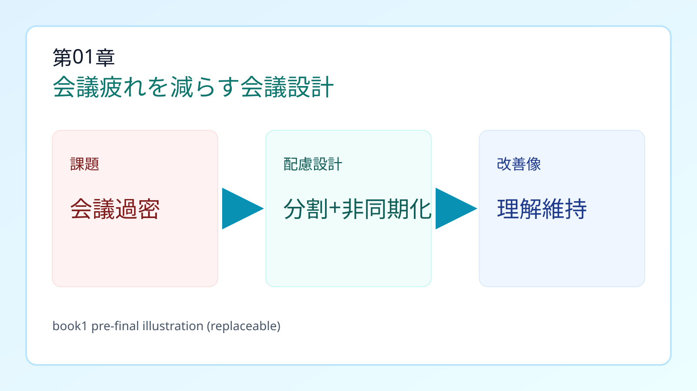
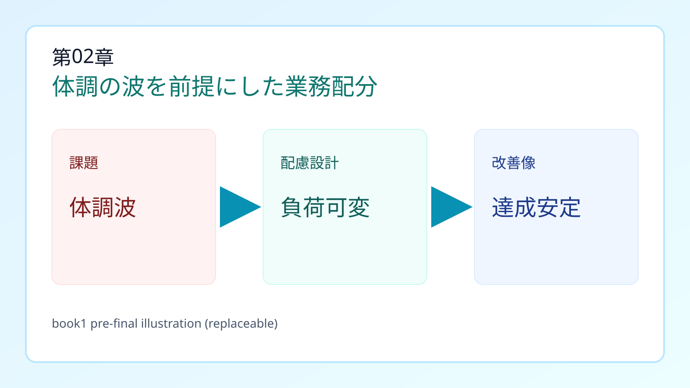
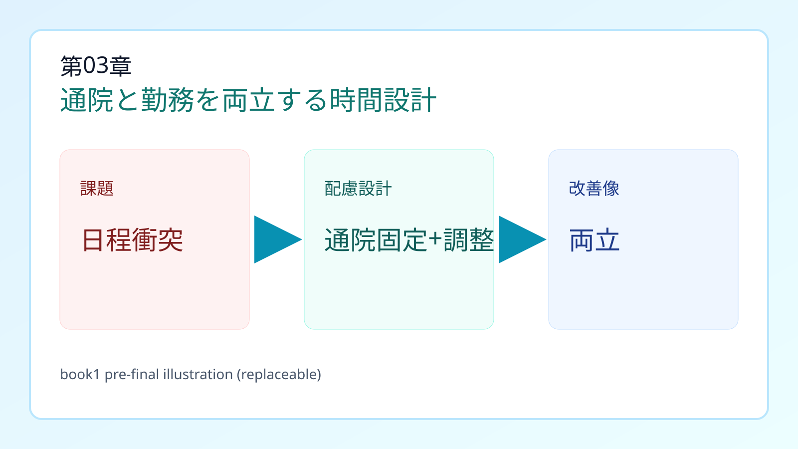
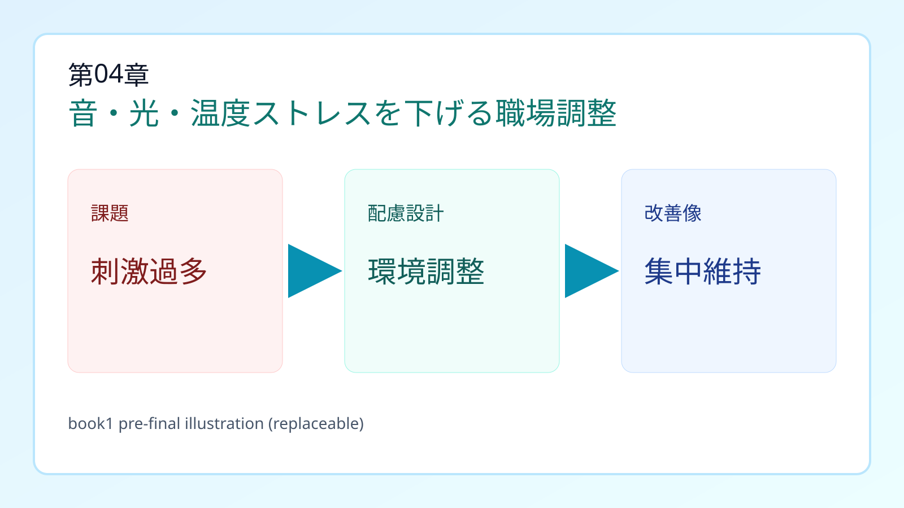
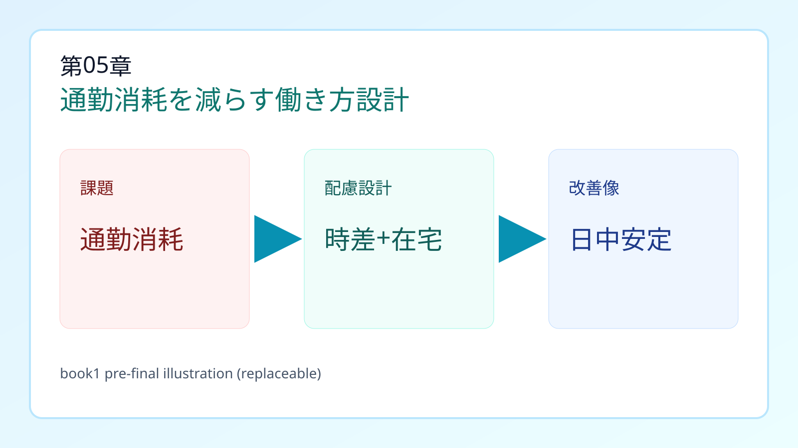
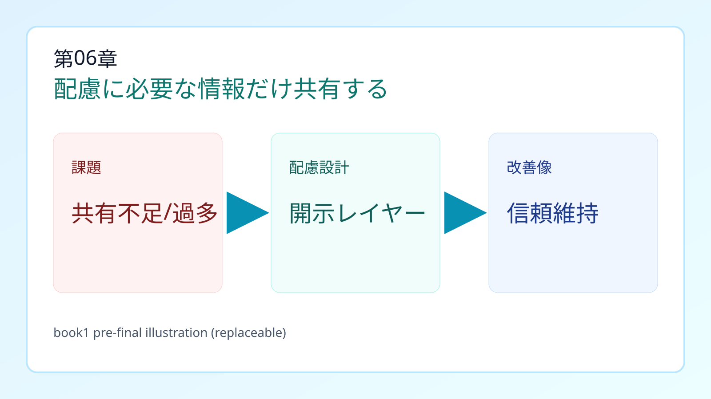
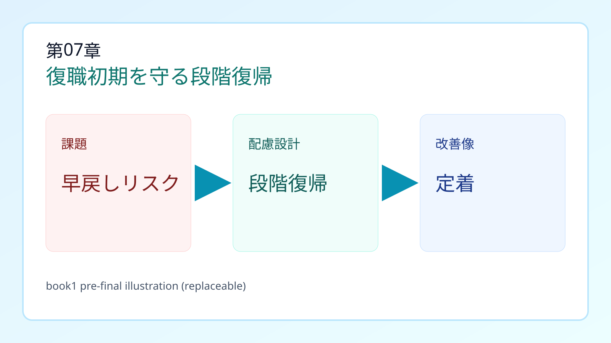
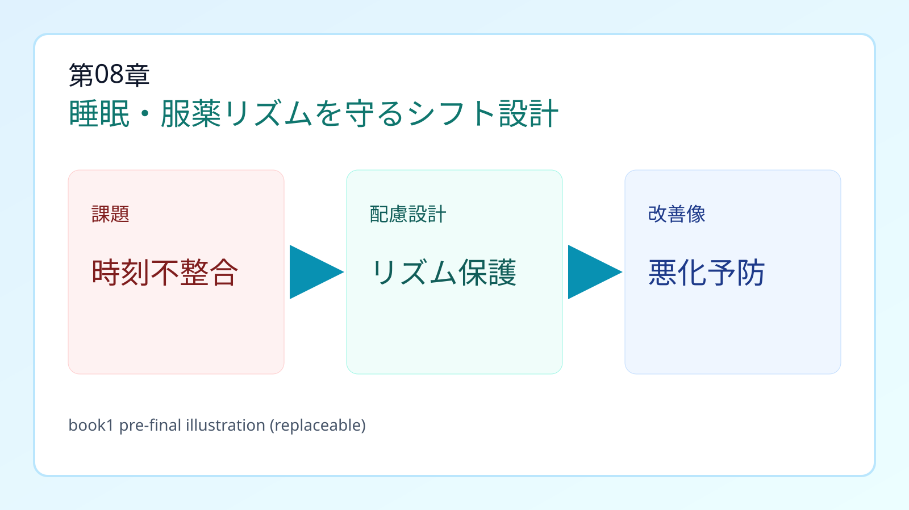
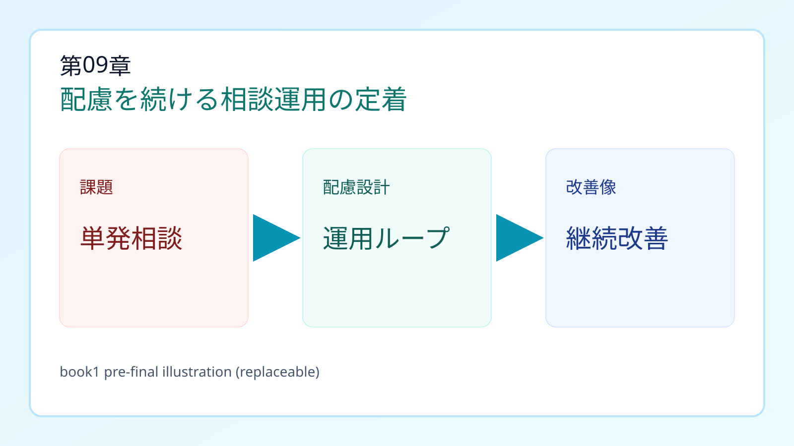

# JACガイドブック 第1冊（体調レイヤー）初稿

- 対象: 体調レイヤー 9フレーム（第01章〜第09章）
- 生成日: 2026-02-18T13:37:06.338Z
- 目的: Webカードを読み物として連続理解できる初稿を作る（レビュー用）
- 注意: 個別助言ではなく、職場設計の叩き台として利用する。

## この原稿の使い方
1. 近い章を1つ選び、「最初の7日」だけ先に実施する。
2. 4週間運用し、章内KPIで再評価する。
3. 境界に当たる場合は「この章を選ぶ条件」を優先して章を切り替える。

## 章一覧（体調レイヤー）
1. 第01章 会議同時処理負荷が主因: 理解遅延が午後疲労へ連鎖する
2. 第02章 体調変動が主因: 日ごとの業務達成度が安定しない
3. 第03章 通院日程の衝突が主因: 通院・治療と勤務スケジュールが噛み合わない
4. 第04章 環境刺激が主因: 音・光・温度で症状が悪化する
5. 第05章 通勤負荷が主因: 始業前消耗で日中稼働が崩れる
6. 第06章 情報開示の設計不足が主因: 配慮実装とプライバシーが両立しにくい
7. 第07章 復職初期の負荷復帰が主因: 早戻しで再不調が起きやすい
8. 第08章 勤務時刻の不整合が主因: 生活・服薬リズムが崩れる
9. 第09章 相談運用の欠如が主因: 配慮が単発で定着しない

---

## 第01章 会議疲れを減らす会議設計

> 元フレーム名: 会議同時処理負荷が主因: 理解遅延が午後疲労へ連鎖する

- フレームID: `p-meeting-overload`
- 推奨モード: `conditional_only`

### 章の核心（因果）
長時間会議・即時応答・資料の同時読解が重なると、理解遅延と疲労蓄積が同時に起きやすい。

### この章を選ぶ条件（境界）
選ぶ目安: 主困りごとが会議中の同時処理（聞く・読む・即答）なら本カード。会議外の割込み切替が中心なら「タスク切替過多が主因」カード、聞こえ/見えのアクセス不足が中心なら各アクセスカードを優先。

### 最初の7日（まずここだけ実装）
1. 会議を30分単位に分割し、論点を1テーマずつ固定する
2. 事前資料を前日配布し、当日は意思決定項目だけに集中する
3. 同期会議の一部を非同期コメントに置き換える
4. 会議後15分の回復バッファを勤務設計に組み込む

### 4週間の定着運用（チーム運用に落とす）
#### パッケージ1: 会議再設計パッケージ
- 目的: 同時処理負荷を減らし、会議中の理解精度を上げる。
- 実施:
  - 会議を「共有」「判断」「調整」に分離して別枠化
  - 事前資料は24時間前配布し、当日は決定論点のみ扱う
  - 会議後15分の回復バッファを標準運用にする
- 運用:
  - 4週間の試行期間を設定し、毎週運用レビューを実施する
  - 司会者が議題逸脱を止める責任を持つ
- 指標:
  - 会議後の再説明依頼件数
  - 会議後30分の疲労自己評価
  - 会議内意思決定率
- 再評価トリガー: 2週間連続で疲労自己評価が悪化した場合、会議数と密度を再設計する。

#### パッケージ2: 同期→非同期シフトパッケージ
- 目的: 即時応答ストレスを下げつつ、合意速度を維持する。
- 実施:
  - 情報共有は非同期スレッドへ移行し、会議は意思決定のみ
  - 返信SLA（例: 4営業時間以内）を合意する
  - 非同期議論のテンプレート（論点/懸念/提案）を固定化する
- 運用:
  - レスポンス遅延を個人責任化しない
  - 会議と非同期の役割境界を明文化する
- 指標:
  - 非同期スレッド完結率
  - 会議時間総量
  - 締切遅延件数
- 再評価トリガー: 締切遅延が増えた場合、非同期対象タスクを再分類する。

### 前提条件チェック（実装前に確認）
- 職務上、会議参加が必須である
- 会議目的（共有/意思決定/調整）が区別されている
- 上長・司会者が進行設計を変更できる

### 失敗を防ぐポイント
- 会議時間だけ短縮して論点密度を下げないと、効果が出にくい
- 非同期化しても返信SLAを決めないと逆に負荷が増える

### 追加確認質問（不足コンテキスト補完）
- 理解遅延は「どの会議」で最も起きやすいか？
- 会議後に落ちる業務（文章作成/判断/対人調整）は何か？
- 短縮と非同期化のどちらが現場文化に適合するか？
- person: 本人の強み・疲労サイン・回復手段は何か。
- job: 必須業務と代替可能業務の境界はどこか。
- environment: トリガーになっている環境要因は何か。
- support: 誰が調整責任者か。支援機関連携は必要か。
- time: いつ悪化し、いつ回復するか。週内パターンはあるか。
- institution: 法域・就業規則・制度制約は何か。
- evidence: 導入後に何を指標として改善判定するか。

### 関連章（次に見る候補）
- 対人即時応答負荷が主因: 接客場面でミスと疲労が増える（p-customer-facing-load）
- タスク切替過多が主因: 認知負荷が急上昇する（p-developmental-switch-load）
- 記憶・遂行機能負荷が主因: 業務が分断され手戻りが増える（p-higher-brain-memory-support）

### 根拠メモ（監修・監査用）
- GLM: GLM-S3-002, GLM-S1-001
- claim IDs: 9a810f34c89b02b2, 627977e3fd538fe0
- source regions: JP, US, UK

---

## 第02章 体調の波を前提にした業務配分

> 元フレーム名: 体調変動が主因: 日ごとの業務達成度が安定しない

- フレームID: `p-fatigue-pacing`
- 推奨モード: `conditional_only`

### 章の核心（因果）
症状の波・疲労・回復遅延がある場合、同じ業務量でも日ごとの達成度が大きく変動しやすい。

### この章を選ぶ条件（境界）
選ぶ目安: 日ごとの体調波で同一業務量を維持しにくいなら本カード。通院日の当て込み不足は「通院日程の衝突が主因」、治療後の回復時間不足は「回復時間不足が主因」、勤務時刻制度の不整合は「勤務時刻の不整合が主因」を優先。

### 最初の7日（まずここだけ実装）
1. 業務量を週単位で平準化し、ピーク日を作らない
2. 90分ごとの短休憩を標準運用にする
3. 重要タスクを体調の安定時間帯へ再配置する
4. 週次レビューで負荷の上げ下げを事前合意する

### 4週間の定着運用（チーム運用に落とす）
#### パッケージ1: ペーシング運用パッケージ
- 目的: 体調波がある前提で、負荷を可変制御する。
- 実施:
  - 業務を高負荷/中負荷/低負荷で分類して日次配分する
  - 90分ごとに強制マイクロ休憩を入れる
  - 安定時間帯に重要判断タスクを配置する
- 運用:
  - 週次で業務密度を再調整する
  - 自己申告を評価不利益に結びつけない
- 指標:
  - 週次完了率
  - 疲労ピーク頻度
  - 体調要因による遅延件数
- 再評価トリガー: 完了率低下が2週続いたら、目標設定を再調整する。

#### パッケージ2: 負荷バッファ設計パッケージ
- 目的: 症状悪化日の影響を翌日以降に連鎖させない。
- 実施:
  - 予備日を週1回設ける
  - 納期を中間締切付きの二段階にする
  - 代替担当ルールを明文化する
- 運用:
  - 繁忙期は前倒し着手を標準化する
  - 調整履歴を記録し翌月設計に反映する
- 指標:
  - 中間締切遵守率
  - 突発残業時間
  - 代替発動件数
- 再評価トリガー: 突発残業が増加した場合は中間締切の設計を見直す。

### 前提条件チェック（実装前に確認）
- 日内/週内で体調波の傾向が把握できる
- 業務の優先順位づけが可能
- レビューで調整する運用責任者がいる

### 失敗を防ぐポイント
- 根性論でカバーすると再発・離脱リスクが上がる
- 本人の自己申告チャネルがないと調整が後手になる

### 追加確認質問（不足コンテキスト補完）
- 体調が崩れる直前の業務パターンは何か？
- 休憩で回復するのか、タスク変更が必要なのか？
- 調整後に改善を測るKPIは何か？
- person: 本人の強み・疲労サイン・回復手段は何か。
- job: 必須業務と代替可能業務の境界はどこか。
- environment: トリガーになっている環境要因は何か。
- support: 誰が調整責任者か。支援機関連携は必要か。
- time: いつ悪化し、いつ回復するか。週内パターンはあるか。
- institution: 法域・就業規則・制度制約は何か。
- evidence: 導入後に何を指標として改善判定するか。

### 関連章（次に見る候補）
- 通勤負荷が主因: 始業前消耗で日中稼働が崩れる（p-commute-hybrid）
- 勤務時刻の不整合が主因: 生活・服薬リズムが崩れる（p-shift-rhythm-guard）
- 会議同時処理負荷が主因: 理解遅延が午後疲労へ連鎖する（p-meeting-overload）

### 根拠メモ（監修・監査用）
- GLM: GLM-S3-001, GLM-S2-001
- claim IDs: d2033f3551357dd0, 55b623ad4146f8b9
- source regions: US, JP, NBL-local

---

## 第03章 通院と勤務を両立する時間設計

> 元フレーム名: 通院日程の衝突が主因: 通院・治療と勤務スケジュールが噛み合わない

- フレームID: `p-medical-schedule`
- 推奨モード: `questions_first`

### 章の核心（因果）
主課題が「通院日・受診時刻の調整不足」にある場合のカード。受診予定と業務ピークが重なると、欠勤不安・有給消費不安・心理的負荷が重なり、就業継続の見通しが下がりやすい。

### この章を選ぶ条件（境界）
選ぶ目安: 課題の中心が日程衝突（いつ通院するか）なら本カード。定期治療でも、主課題が通院時刻・勤務調整ならこちらを優先。治療後の長い回復時間や体力低下が主因なら「回復時間不足が主因」カードを優先。

### 最初の7日（まずここだけ実装）
1. 通院日を固定し、前後で業務負荷を調整する
2. 始業/終業時刻の可変枠を設定する
3. 引き継ぎテンプレートを作り、突発時の業務穴を最小化する
4. 治療ピーク期だけ短期運用ルールを別立てにする

### 4週間の定着運用（チーム運用に落とす）
#### パッケージ1: 治療ウィンドウ確保パッケージ
- 目的: 治療継続と業務継続を両立する時間枠を作る。
- 実施:
  - 通院日を先に固定し、納期計画を逆算する
  - 始業/終業の可変枠を定義する
  - 通院当日・翌日の負荷上限を明文化する
- 運用:
  - 適用対象の法域と雇用区分を必ず確認する
  - 運用開始前に本人同意範囲を確認する
- 指標:
  - 通院実施率
  - 治療関連欠勤率
  - 納期遅延率
- 再評価トリガー: 通院実施率が下がった場合、業務配分と時間枠を優先的に再設計する。

#### パッケージ2: 欠勤影響最小化パッケージ
- 目的: 急な不調時でも業務穴を最小化する。
- 実施:
  - 引き継ぎテンプレートを1ページ化する
  - 代替担当を事前合意する
  - 未完了タスクの優先順位ルールを設定する
- 運用:
  - 代替担当への負担偏りを週次で点検する
  - 引き継ぎ記録は更新責任者を固定する
- 指標:
  - 代替起動から再開までの時間
  - 引き継ぎ漏れ件数
  - 周囲負担自己評価
- 再評価トリガー: 引き継ぎ漏れが月2件を超えたらテンプレート項目を見直す。

### 前提条件チェック（実装前に確認）
- 通院予定と業務ピークの重なりが見える化されている
- 代替担当・先送り基準が運用で合意されている

### 失敗を防ぐポイント
- 制度だけ作って案件優先ルールを変えないと、現場で形骸化する
- 本人の開示範囲が未整理のまま運用すると対人摩擦が増える

### 追加確認質問（不足コンテキスト補完）
- 適用法域（JP/US/EUなど）と雇用区分は何か？
- 通院直後に難しくなる具体タスクは何か？
- 既に試した配慮で効いたもの/逆効果だったものは何か？
- person: 本人の強み・疲労サイン・回復手段は何か。
- job: 必須業務と代替可能業務の境界はどこか。
- environment: トリガーになっている環境要因は何か。
- support: 誰が調整責任者か。支援機関連携は必要か。
- time: いつ悪化し、いつ回復するか。週内パターンはあるか。
- institution: 法域・就業規則・制度制約は何か。
- evidence: 導入後に何を指標として改善判定するか。

### 関連章（次に見る候補）
- 通勤負荷が主因: 始業前消耗で日中稼働が崩れる（p-commute-hybrid）
- 体調変動が主因: 日ごとの業務達成度が安定しない（p-fatigue-pacing）
- 復職初期の負荷復帰が主因: 早戻しで再不調が起きやすい（p-return-to-work-ramp）

### 根拠メモ（監修・監査用）
- GLM: GLM-S4-001, GLM-S1-003
- claim IDs: 5991a785430975cb, 86f336fb9e05cec8
- source regions: JP, NBL-local

---

## 第04章 音・光・温度ストレスを下げる職場調整

> 元フレーム名: 環境刺激が主因: 音・光・温度で症状が悪化する

- フレームID: `p-environment-sensory`
- 推奨モード: `conditional_only`

### 章の核心（因果）
感覚刺激が強い環境では、集中低下と疲労増幅が重なり、業務継続性が下がることがある。

### この章を選ぶ条件（境界）
選ぶ目安: 音・光・温度など刺激そのものが主トリガーなら本カード。資料や画面の見え方が主因なら「視覚アクセス障壁が主因」、音声情報の欠落が主因なら「音声アクセス障壁が主因」を優先。

### 最初の7日（まずここだけ実装）
1. 静音席・照明調整・通知制御をセットで導入する
2. 作業ゾーン（集中/連絡）を分離する
3. 在宅/出社の使い分け基準を業務ごとに定義する
4. 環境調整の効果を2週間単位で測定する

### 4週間の定着運用（チーム運用に落とす）
#### パッケージ1: 感覚刺激制御パッケージ
- 目的: 音・光・通知刺激を下げ、集中維持を改善する。
- 実施:
  - 静音席/遮光/通知制御を同時導入する
  - 必要に応じて耳栓・ノイズキャンセル機器を許容する
  - 会議室・執務席で刺激量基準を設定する
- 運用:
  - 単一施策で終わらせず、複合導入を前提とする
  - 周囲に運用意図を説明し誤解を防ぐ
- 指標:
  - 集中中断回数
  - 刺激要因による離席回数
  - 終業時疲労スコア
- 再評価トリガー: 刺激要因離席が減らない場合、席配置とタスク設計を同時に見直す。

#### パッケージ2: 作業ゾーニングパッケージ
- 目的: 環境とタスクのミスマッチを減らす。
- 実施:
  - 集中ゾーンと連絡ゾーンを分ける
  - 在宅/出社の使い分け基準を業務単位で定義する
  - 高集中時間帯に割込連絡を制限する
- 運用:
  - チーム全体でゾーニングルールを共有する
  - 例外処理手順を先に決める
- 指標:
  - 高集中タスクの完了時間
  - 割込件数
  - 業務再開までの平均時間
- 再評価トリガー: 割込件数が増える場合は例外運用の範囲を再設定する。

### 前提条件チェック（実装前に確認）
- 刺激要因（音/光/温度）の特定ができている
- 座席・設備・勤務形態の調整権限がある

### 失敗を防ぐポイント
- 単一施策（例: イヤホンのみ）では十分な改善にならないことがある
- 周囲説明なしの個別運用は運用摩擦につながる

### 追加確認質問（不足コンテキスト補完）
- どの刺激がどの時間帯に影響するか？
- 環境変更後に改善を測る指標は何か？
- 在宅化と現場要件の境界線はどこか？
- person: 本人の強み・疲労サイン・回復手段は何か。
- job: 必須業務と代替可能業務の境界はどこか。
- environment: トリガーになっている環境要因は何か。
- support: 誰が調整責任者か。支援機関連携は必要か。
- time: いつ悪化し、いつ回復するか。週内パターンはあるか。
- institution: 法域・就業規則・制度制約は何か。
- evidence: 導入後に何を指標として改善判定するか。

### 関連章（次に見る候補）
- 会議同時処理負荷が主因: 理解遅延が午後疲労へ連鎖する（p-meeting-overload）
- 体調変動が主因: 日ごとの業務達成度が安定しない（p-fatigue-pacing）
- 通勤負荷が主因: 始業前消耗で日中稼働が崩れる（p-commute-hybrid）

### 根拠メモ（監修・監査用）
- GLM: GLM-S3-003, GLM-S4-002
- claim IDs: 030f6c25bee7e726, 8a704d1bd91c999b
- source regions: US, EU, AU

---

## 第05章 通勤消耗を減らす働き方設計

> 元フレーム名: 通勤負荷が主因: 始業前消耗で日中稼働が崩れる

- フレームID: `p-commute-hybrid`
- 推奨モード: `conditional_only`

### 章の核心（因果）
混雑・移動時間・気温差が大きいと、業務開始前にエネルギーを消耗し、日中の集中維持が難しくなる。

### この章を選ぶ条件（境界）
選ぶ目安: 混雑・移動時間・気温差など通勤そのものが主因なら本カード。職場内の段差や動線負荷が主因なら「動線・移動負荷が主因」を優先。

### 最初の7日（まずここだけ実装）
1. 時差出勤と在宅勤務をタスク単位で使い分ける
2. 出社日は高協働タスク、在宅日は高集中タスクに再編する
3. 遠距離移動・連続出張の回避ルールを明文化する
4. 通勤負荷が高い日の代替KPI（成果基準）を定義する

### 4週間の定着運用（チーム運用に落とす）
#### パッケージ1: 通勤負荷分散ハイブリッドパッケージ
- 目的: 移動負荷を抑えつつ成果を維持する。
- 実施:
  - 時差出勤と在宅勤務をタスク別に割り当てる
  - 出社日は協働タスク、在宅日は集中タスクへ再編する
  - 移動が重い日は業務開始前の高負荷作業を避ける
- 運用:
  - ハイブリッド対象業務を四半期ごとに棚卸しする
  - 評価は拘束時間より成果基準を優先する
- 指標:
  - 通勤後1時間の生産性指標
  - 移動要因の欠勤率
  - タスク完了率
- 再評価トリガー: 通勤後パフォーマンス低下が続く場合、勤務開始時刻を再設計する。

#### パッケージ2: 移動制約ガードレールパッケージ
- 目的: 連続移動による症状悪化を予防する。
- 実施:
  - 遠距離出張の除外基準を定義する
  - 連続移動日の翌日は回復重視タスクにする
  - 代替参加（オンライン参加）ルールを明文化する
- 運用:
  - 例外承認フローを短くし、無理な出張を防ぐ
  - 業務都合のみで除外基準を崩さない
- 指標:
  - 連続移動後の体調悪化報告件数
  - 出張代替実施率
  - 翌日欠勤率
- 再評価トリガー: 悪化報告が続く場合は移動上限と参加方式を再定義する。

### 前提条件チェック（実装前に確認）
- 業務を出社必須/非必須に分解できる
- 成果評価を時間拘束中心から調整できる

### 失敗を防ぐポイント
- 在宅化だけで業務設計を変えないと、生産性が不安定になる
- 同僚負担の再設計がないと長期運用しにくい

### 追加確認質問（不足コンテキスト補完）
- 通勤で最も消耗する要因（距離/混雑/乗換/気温）は何か？
- 出社必須タスクは本当に必須か？
- 在宅時の成果確認基準は合意されているか？
- person: 本人の強み・疲労サイン・回復手段は何か。
- job: 必須業務と代替可能業務の境界はどこか。
- environment: トリガーになっている環境要因は何か。
- support: 誰が調整責任者か。支援機関連携は必要か。
- time: いつ悪化し、いつ回復するか。週内パターンはあるか。
- institution: 法域・就業規則・制度制約は何か。
- evidence: 導入後に何を指標として改善判定するか。

### 関連章（次に見る候補）
- 体調変動が主因: 日ごとの業務達成度が安定しない（p-fatigue-pacing）
- 通院日程の衝突が主因: 通院・治療と勤務スケジュールが噛み合わない（p-medical-schedule）
- 勤務時刻の不整合が主因: 生活・服薬リズムが崩れる（p-shift-rhythm-guard）

### 根拠メモ（監修・監査用）
- GLM: GLM-S1-001, GLM-S3-001
- claim IDs: dafcf53e7fe87f2c, d9d2a5f228f59eef
- source regions: JP, NBL-local, US

---

## 第06章 配慮に必要な情報だけ共有する

> 元フレーム名: 情報開示の設計不足が主因: 配慮実装とプライバシーが両立しにくい

- フレームID: `p-disclosure-boundary`
- 推奨モード: `questions_first`

### 章の核心（因果）
必要配慮の実装には情報共有が必要だが、開示過多はプライバシー侵害リスクを高める。

### この章を選ぶ条件（境界）
選ぶ目安: 課題が「誰に何をどこまで共有するか」の設計なら本カード。面接での伝え方が主課題なら「面接時自己説明不足が主因」、相談運用の定着が主課題なら「相談運用の欠如が主因」を優先。

### 最初の7日（まずここだけ実装）
1. 「共有する情報」と「共有しない情報」を二層で定義する
2. 職務遂行に必要な配慮情報だけをチーム共有する
3. 個人情報は管理責任者ルートで限定管理する
4. 定期面談で開示範囲を見直す

### 4週間の定着運用（チーム運用に落とす）
#### パッケージ1: 開示レイヤー設計パッケージ
- 目的: 配慮実装に必要な情報だけを適切に共有する。
- 実施:
  - 共有情報を「業務必要」「本人限定」「管理者限定」に分ける
  - チーム共有は配慮実施に必要な事実のみとする
  - 同意取得と更新タイミングを明示する
- 運用:
  - 共有範囲の変更は本人同意を必須にする
  - 目的外利用を禁止し記録を残す
- 指標:
  - 配慮実装までのリードタイム
  - 情報共有トラブル件数
  - 本人納得度
- 再評価トリガー: トラブル発生時は共有範囲とアクセス権限を即時見直す。

#### パッケージ2: 面談・見直しループパッケージ
- 目的: 開示と配慮のバランスを継続的に調整する。
- 実施:
  - 月次面談で開示範囲と配慮効果を評価する
  - 配慮情報の更新履歴を管理責任者が保持する
  - 異動・業務変更時は再評価を必須化する
- 運用:
  - 面談未実施を放置しない
  - 担当者依存を避けて複線管理する
- 指標:
  - 面談実施率
  - 配慮更新反映率
  - 再発トラブル率
- 再評価トリガー: 組織変更や担当変更が起きた時点で再設計する。

### 前提条件チェック（実装前に確認）
- 情報共有ポリシーと責任者が定義されている
- 現場が目的限定の情報共有ルールを運用できる

### 失敗を防ぐポイント
- 開示を本人任せにしすぎると配慮が実装されない
- 逆に過剰開示すると信頼損失と二次被害が起きる

### 追加確認質問（不足コンテキスト補完）
- 配慮実装に必須な情報は何で、不要な情報は何か？
- どの役割まで共有する必要があるか？
- 本人同意と見直しタイミングをどう設計するか？
- person: 本人の強み・疲労サイン・回復手段は何か。
- job: 必須業務と代替可能業務の境界はどこか。
- environment: トリガーになっている環境要因は何か。
- support: 誰が調整責任者か。支援機関連携は必要か。
- time: いつ悪化し、いつ回復するか。週内パターンはあるか。
- institution: 法域・就業規則・制度制約は何か。
- evidence: 導入後に何を指標として改善判定するか。

### 関連章（次に見る候補）
- 相談運用の欠如が主因: 配慮が単発で定着しない（p-manager-checkin）
- 指示の曖昧さが主因: 作業再現性が下がる（p-intellectual-task-clarity）
- 悪化前対応の欠如が主因: 精神・心理面の症状の波に先手を打てない（p-mental-fluctuation-plan）

### 根拠メモ（監修・監査用）
- GLM: GLM-S4-001, GLM-S2-001
- claim IDs: 39c93a1d04fe9955, d2f92a0d8af18ab3
- source regions: JP, UK, CA

---

## 第07章 復職初期を守る段階復帰

> 元フレーム名: 復職初期の負荷復帰が主因: 早戻しで再不調が起きやすい

- フレームID: `p-return-to-work-ramp`
- 推奨モード: `questions_first`

### 章の核心（因果）
復職初期は「できる業務」と「継続できる業務」が一致しないことが多く、段階設計がないと再不調が起きやすい。

### この章を選ぶ条件（境界）
選ぶ目安: 休職・病休からの復職初期に負荷段階設計がないことが主因なら本カード。通常運用時の悪化予防手順不足が主因なら「悪化前対応の欠如が主因」を優先。

### 最初の7日（まずここだけ実装）
1. 復職初月は段階負荷（例: 60%→80%→100%）で設定する
2. 体調・勤務・業務進捗を同じシートで見える化する
3. 復職面談を週次で実施し、配慮を微調整する
4. 支援機関・産業保健との連携窓口を固定する

### 4週間の定着運用（チーム運用に落とす）
#### パッケージ1: 段階復職ランプパッケージ
- 目的: 復職初期の再不調リスクを下げ、定着確率を上げる。
- 実施:
  - 週単位で業務負荷上限を設定する
  - 復職後4週間は週次面談を固定する
  - 症状悪化時の即時調整ルールを明示する
- 運用:
  - 短期の生産性低下を許容し長期安定を優先する
  - 面談結果を業務計画に反映する責任者を定める
- 指標:
  - 復職後8週間の継続率
  - 再不調による離脱件数
  - 計画負荷遵守率
- 再評価トリガー: 欠勤・早退が増加した場合、負荷段階を一段戻して再設計する。

#### パッケージ2: 支援連携ブリッジパッケージ
- 目的: 職場外支援と職場運用を接続し、情報断絶を防ぐ。
- 実施:
  - 支援機関/産業保健/現場責任者の連絡窓口を一本化する
  - 共有情報を目的限定で定義する
  - 月次で連携評価会を実施する
- 運用:
  - 本人同意範囲を超える共有をしない
  - 共有は配慮実装に必要な最小限に留める
- 指標:
  - 連携会実施率
  - 情報連携遅延件数
  - 配慮反映までの日数
- 再評価トリガー: 連携遅延が続く場合は窓口設計を再編する。

### 前提条件チェック（実装前に確認）
- 復職計画の合意がある
- 調整責任者と面談スケジュールが確定している

### 失敗を防ぐポイント
- 本人の一時的回復を恒常能力と誤認すると再不調につながる
- 面談だけで業務計画を変えないと実質改善しない

### 追加確認質問（不足コンテキスト補完）
- 復職初期に崩れやすいタスクは何か？
- 負荷を戻す判断基準はどの指標か？
- 連携先（支援機関/産業保健）の役割分担は明確か？
- person: 本人の強み・疲労サイン・回復手段は何か。
- job: 必須業務と代替可能業務の境界はどこか。
- environment: トリガーになっている環境要因は何か。
- support: 誰が調整責任者か。支援機関連携は必要か。
- time: いつ悪化し、いつ回復するか。週内パターンはあるか。
- institution: 法域・就業規則・制度制約は何か。
- evidence: 導入後に何を指標として改善判定するか。

### 関連章（次に見る候補）
- 勤務時刻の不整合が主因: 生活・服薬リズムが崩れる（p-shift-rhythm-guard）
- 相談運用の欠如が主因: 配慮が単発で定着しない（p-manager-checkin）
- 回復時間不足が主因: 定期治療の回復リズムと業務密度が衝突する（p-internal-treatment-compatibility）

### 根拠メモ（監修・監査用）
- GLM: GLM-S2-001, GLM-S4-001
- claim IDs: 1bc1228c08504dbb, 3dfea629344d20c3
- source regions: JP, NBL-local

---

## 第08章 睡眠・服薬リズムを守るシフト設計

> 元フレーム名: 勤務時刻の不整合が主因: 生活・服薬リズムが崩れる

- フレームID: `p-shift-rhythm-guard`
- 推奨モード: `conditional_only`

### 章の核心（因果）
早出/遅出/夜勤や連続残業があると、睡眠・服薬・通院リズムが崩れやすく、症状悪化を引き起こしやすい。

### この章を選ぶ条件（境界）
選ぶ目安: 早出/遅出/夜勤/連勤など勤務時刻そのものが悪化要因なら本カード。通院日の当て込み不足が主因なら「通院日程の衝突が主因」を優先。

### 最初の7日（まずここだけ実装）
1. 固定シフト優先と残業上限の設定
2. 夜勤・連続勤務の除外条件を明文化
3. セルフチェック（睡眠/体調）を日次で記録
4. 体調指標に応じて勤務時間を段階調整

### 4週間の定着運用（チーム運用に落とす）
#### パッケージ1: 生活リズム保護パッケージ
- 目的: 勤務設計で症状悪化トリガーを減らす。
- 実施:
  - 固定シフトを基本とし、急な時刻変更を抑える
  - 残業・夜勤の上限ルールを設定する
  - 睡眠・体調のセルフチェックを運用する
- 運用:
  - シフト変更時は本人確認を必須化する
  - 業務都合による例外を乱用しない
- 指標:
  - 睡眠不足日数
  - 体調悪化報告件数
  - シフト逸脱件数
- 再評価トリガー: 体調悪化報告が増えた週はシフト設計を即時見直す。

#### パッケージ2: 勤務形態フォールバックパッケージ
- 目的: 悪化兆候が出た時に勤務を安全側へ切り替える。
- 実施:
  - 悪化サイン時の短時間勤務ルールを事前定義する
  - 業務引き継ぎ先を先に決める
  - 回復後の復帰ステップを明文化する
- 運用:
  - 本人申告の遅れを責めない
  - フォールバック適用記録を残す
- 指標:
  - フォールバック起動時間
  - 復帰までの日数
  - 再悪化率
- 再評価トリガー: 再悪化が続く場合は基本勤務設計を再定義する。

### 前提条件チェック（実装前に確認）
- シフト編成権限がある
- 体調記録の運用が受け入れられている

### 失敗を防ぐポイント
- 例外運用の常態化でルールが形骸化する
- データ記録だけで勤務を調整しないと効果が出ない

### 追加確認質問（不足コンテキスト補完）
- どの勤務帯で悪化しやすいか？
- 夜勤・残業の代替手段はあるか？
- 悪化兆候の閾値をどう定義するか？
- person: 本人の強み・疲労サイン・回復手段は何か。
- job: 必須業務と代替可能業務の境界はどこか。
- environment: トリガーになっている環境要因は何か。
- support: 誰が調整責任者か。支援機関連携は必要か。
- time: いつ悪化し、いつ回復するか。週内パターンはあるか。
- institution: 法域・就業規則・制度制約は何か。
- evidence: 導入後に何を指標として改善判定するか。

### 関連章（次に見る候補）
- 体調変動が主因: 日ごとの業務達成度が安定しない（p-fatigue-pacing）
- 通勤負荷が主因: 始業前消耗で日中稼働が崩れる（p-commute-hybrid）
- 復職初期の負荷復帰が主因: 早戻しで再不調が起きやすい（p-return-to-work-ramp）

### 根拠メモ（監修・監査用）
- GLM: GLM-S3-001, GLM-S1-003
- claim IDs: 344f20a67c246bb1, 9823aa9bed509b53
- source regions: JP

---

## 第09章 配慮を続ける相談運用の定着

> 元フレーム名: 相談運用の欠如が主因: 配慮が単発で定着しない

- フレームID: `p-manager-checkin`
- 推奨モード: `conditional_only`

### 章の核心（因果）
相談窓口が曖昧だと、困りごとが蓄積してから顕在化し、調整が後手になりやすい。

### この章を選ぶ条件（境界）
選ぶ目安: 定期面談・エスカレーション・更新責任がなく配慮運用が続かないなら本カード。開示範囲の判断が主課題なら「情報開示の設計不足が主因」を優先。

### 最初の7日（まずここだけ実装）
1. 相談窓口を固定し、週次チェックインを定例化する
2. 本人申告が苦手でも拾える声かけ運用を設計する
3. 現場→人事→支援機関のエスカレーション経路を明文化する
4. 相談内容を業務設計変更に反映する運用責任者を置く

### 4週間の定着運用（チーム運用に落とす）
#### パッケージ1: チェックイン定着パッケージ
- 目的: 問題を早期検知し、配慮の微調整を継続する。
- 実施:
  - 週次15分チェックインを固定化する
  - 相談項目テンプレート（体調/業務/環境）を使う
  - 未対応項目に期限と責任者を設定する
- 運用:
  - 単なる傾聴で終わらせず、次アクションを必ず決める
  - 申告しづらい人向けに代替入力手段を用意する
- 指標:
  - 相談実施率
  - 未対応項目滞留日数
  - 配慮更新件数
- 再評価トリガー: 未対応滞留が増えた場合は会議体と責任分担を再設計する。

#### パッケージ2: 支援連携エスカレーションパッケージ
- 目的: 現場だけで抱え込まない運用を作る。
- 実施:
  - エスカレーション条件を明文化する
  - 人事・産業保健・支援機関の接続点を定義する
  - 連携結果を現場運用へ戻す
- 運用:
  - 目的外共有をしない
  - 連携結果を現場で実装したか確認する
- 指標:
  - エスカレーション適時率
  - 連携後の再発率
  - 現場納得度
- 再評価トリガー: 再発率が下がらない場合は連携プロトコルを改定する。

### 前提条件チェック（実装前に確認）
- 相談窓口の担当が明確
- 業務変更権限を持つ管理者が関与できる

### 失敗を防ぐポイント
- 相談だけ増えて実装が伴わない
- 担当者依存で運用継続性が落ちる

### 追加確認質問（不足コンテキスト補完）
- 現在の相談導線は誰が担っているか？
- 相談内容が業務変更へ反映されるまでの遅延は何日か？
- 連携先へのエスカレーション条件は明確か？
- person: 本人の強み・疲労サイン・回復手段は何か。
- job: 必須業務と代替可能業務の境界はどこか。
- environment: トリガーになっている環境要因は何か。
- support: 誰が調整責任者か。支援機関連携は必要か。
- time: いつ悪化し、いつ回復するか。週内パターンはあるか。
- institution: 法域・就業規則・制度制約は何か。
- evidence: 導入後に何を指標として改善判定するか。

### 関連章（次に見る候補）
- 情報開示の設計不足が主因: 配慮実装とプライバシーが両立しにくい（p-disclosure-boundary）
- 復職初期の負荷復帰が主因: 早戻しで再不調が起きやすい（p-return-to-work-ramp）
- 悪化前対応の欠如が主因: 精神・心理面の症状の波に先手を打てない（p-mental-fluctuation-plan）

### 根拠メモ（監修・監査用）
- GLM: GLM-S4-001, GLM-S2-002
- claim IDs: c496569b9ed0b484, bc5b77049ad3cbbd
- source regions: JP, NBL-local

---

## 付録: レビュー時の確認観点
- 章タイトルがデータ根拠に沿って過不足なく表現されているか。
- 似た章との境界が読者に分かるか。
- 7日プランが「誰が、いつ、何を」実行する単位になっているか。
- 測定指標が現場で実際に記録できる粒度か。
- 追加質問で person/job/environment/support/time/institution/evidence を埋められるか。
