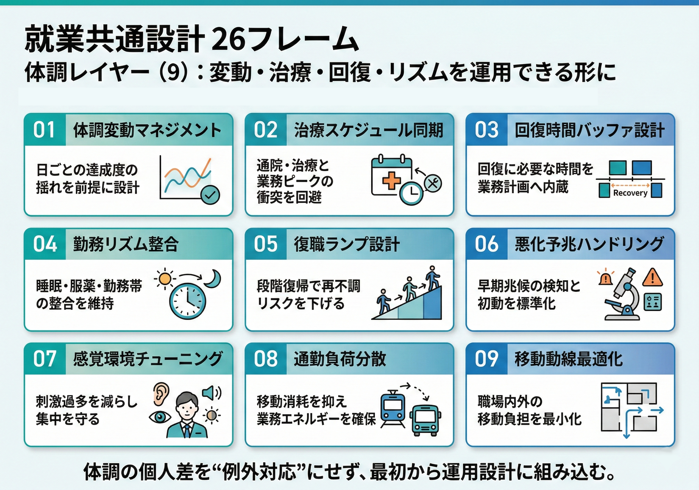
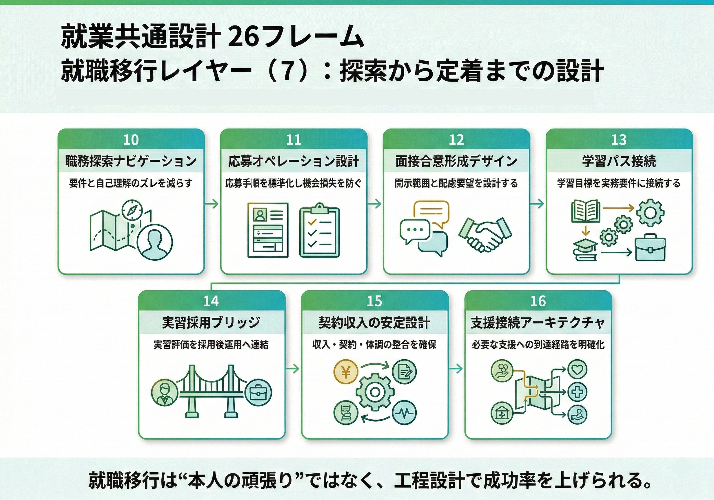
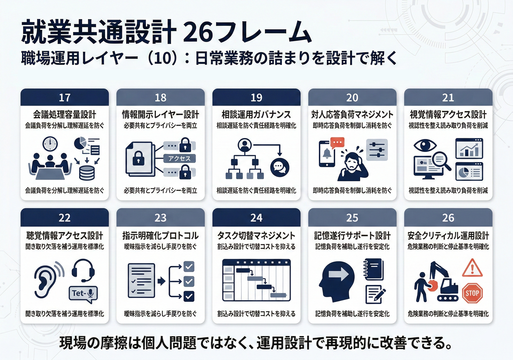

# JAC 26フレーム 実践ガイドブック（読者別編集版）

改訂版: 2026-03-09

この冊子は、職場で繰り返し起きる詰まりを26の型で捉え直し、企業関係者・支援者・当事者が同じ地図で話せるようにするためのものです。
この版では、既存の26フレームに相談データと整理済み知識を重ね、法政策差と地域支援の条件を読み落としにくい流れへ組み替えています。

## この冊子の使い方
1. 困りごとに近い章を1つ選び、章タイトルと「1. こんな場面で起きやすい」で全体像を掴む。
2. 次に「2. 何が起きているのか」から「4. 進める前に外せない条件」までを順に読み、何を見誤りやすいのかを確かめる。
3. 実装するときは「5. 最初の1週間で試すこと」「6. 1か月で整えること」「7. つまずきやすい点と見直しの問い」を使い、必ず再評価する。

## 3レイヤー構成
- 体調レイヤー（9フレーム）: 変動・治療・回復・リズムを運用できる形に整理
- 就職移行レイヤー（7フレーム）: 探索→応募→面接→合意→定着までの移行工程を整理
- 職場運用レイヤー（10フレーム）: 会議・指示・安全・日常業務の詰まりを運用設計として整理

## 重要な前提
- 診断名だけで結論を固定しない。
- 推奨は、本人・仕事・環境・支援・時間・制度・根拠の条件が揃って初めて有効になる。
- うまくいかない場合は、本人要因ではなく運用設計の再調整を優先する。
- 法政策差は共通ガードレール層で確認し、カード本文には誤用防止の補助線だけを残す。
- 地域支援の詳細運用は、カード本文に過積載せず、共通レイヤーまたは別ガイドへ振り分ける。

## 26フレームと個別相談の役割分担
- 26フレームは、千差万別に見える困りごとを「反復する職場課題の型」として整理するための地図。
- これ以上細かく分けすぎると、導入時の判断速度と共通言語が失われやすい。
- 一方で個別性は常に残るため、最終設計はJAC個別相談で条件確認して調整する。

### 個別相談で対応する具体例
- 同じ「体調変動」でも、通院翌日・睡眠・服薬副作用・気圧など悪化トリガーが違う。
- 同じカードでも、職務要件（安全クリティカル/締切密度/対人負荷）で運用が変わる。
- 複数特性の重なり（例: 聴覚 + 発達、内部障害 + メンタル）でカード横断設計が必要。
- 開示範囲・復職段階・制度/契約条件の整合は個社/個人条件で最適解が変わる。

---
## 体調レイヤー（9フレーム）

変動・治療・回復・リズムを運用できる形に整理

## 第01章 体調変動マネジメント（体調の波で日ごとの達成度がぶれやすい）

この章で扱うのは、症状の波・疲労・回復遅延がある場合、同じ業務量でも日ごとの達成度が大きく変動しやすいという詰まり。 本人の頑張り方ではなく、体調レイヤーでどの条件を動かせるかを見る。
学習障害、学習障害(調査回答)、発達障害全体、高次脳機能障害など複数の文脈で似た詰まりが繰り返し見えるため、ここでは診断名ではなく仕事・環境・支援の条件から読み解く。

### 1. こんな場面で起きやすい
主課題が「日内・週内の体調波に合わせた業務密度の可変運用」なら本カード。通院時刻の衝突が中心なら「治療スケジュール同期」、治療後の回復時間確保が中心なら「回復時間バッファ設計」、復職初期の段階復帰設計が中心なら「復職の段階設計」を優先。
たとえば内部障害と精神障害で先に見えやすい課題だが、ここでは多様性の例として挙げている。 診断名ではなく、困りごとの出方と運用条件で読む。
#### 状況レベル（🟢 → 💣）
診断の重さではなく、仕事がどれだけ詰まり、運用でどこまで吸収できているかで見る。
- 🟢 安定・予防: 波を前提に業務量と休憩が組まれ、悪化前に負荷を下げられる。
- 🟡 要調整: 休憩や業務再配置で持ち直せるが、波に合わせた負荷調整がまだ不十分。
- 🔴 高頻度支障: 週の後半や繁忙日に失速が反復し、品質と回復の両方が落ちる。
- 💣 破綻・停止: 数日単位で稼働が崩れ、欠勤や納期断念が出ている。

### 2. 何が起きているのか
体調管理と業務要求が不整合なとき、就労困難が発生しやすい。 放置すると個人依存の対処になりやすいが、業務配分の再設計で、解決難易度を下げられる可能性がある。
とくに、疲労の蓄積は翌日以降へ遅延影響し、連鎖的に作業品質を下げる。 必要な支援は固定ではなく、時間帯・季節・治療状況で再形成される。
現場では、「たまたま体調が落ち着いて動けたり、他の業務もこなせたりすると、ずるずると仕事が増える事が多く、結果、勤務時間や仕事内容が増えて負担になる」のように、小さな違和感が積み重なって表れやすい。

### 3. まず誰が何を確認するか
まず職場側は、症状の波・疲労・回復遅延がある場合、同じ業務量でも日ごとの達成度が大きく変動しやすいという詰まりを本人の適性ではなく仕事と運用の課題として見る。 そのうえで、誰が条件を動かせるのか、どこまでが職場内で担え、どこからが外部接続を要するのかを先に整理する。

支援者は、「体調が崩れる直前の業務パターンは何か？」「休憩で回復するのか、タスク変更が必要なのか？」を入口に、本人・業務・環境・支援・時間の条件を混ぜずに切り分ける。 このカードが主課題なのか、隣のカードを先に見るべきなのかをここで見極める。

本人は、「体調が崩れる直前の業務パターンは何か？」「休憩で回復するのか、タスク変更が必要なのか？」に答えられる程度でよいので、具体場面を2つほど言葉にしておく。 言い切れない部分は「まだ分からない」と残してよく、その整理が次の調整や相談の材料になる。

### 4. 進める前に外せない条件
#### 制度面で先に決めること
通院・復職・勤務条件の扱いは制度や雇用区分で変わる。善意運用だけで決めない。
- 先に確認すること: 適用法域を JP / US / UK / EU-DE のどこで使うか先に固定する / 休職、短時間勤務、通院配慮、在宅などの適用条件を確認する / 健康情報は最小限共有にとどめ、勤務変更権限者を明確にする
- 迷ったとき: 就業可否や勤務条件変更が絡む場合は、人事・労務・産業保健へ戻す。
#### 支援体制で先に決めること
企業単独で重い配慮は、JAC提案と地域支援体制をセットで示すと実施しやすい。
- JACで先に決めること: 企業内で回せる共通設計と、個別調整が必要な部分を切り分ける / 企業内担当者、期限、見直し条件を明文化し、重い実装は外部支援込みで提示する
- 地域支援者に頼むこと: 通院、復職、定着支援、ケース会議で再評価を支える / 企業単独で抱えにくい配慮や支援を、実施可能な体制へ翻訳する
- 止まったとき: 実施が止まったら、本人・JAC・企業・地域支援者で役割と次回判断点を再固定する。

### 5. 最初の1週間で試すこと
#### 共通設計（標準運用）
- 実践1: 業務量を週単位で平準化し、ピーク日を作らない
  ねらい: 業務負荷の偏りを減らし、体調変動があっても納期を守れる運用にする。
  具体的な進め方: 今週タスクを高・中・低負荷に分類し、同日に高負荷案件を集中させないよう再配置する。
  確認の目安: 遅延件数、高負荷日の偏り、手戻り件数が減ったか。
  注意点: 適用範囲を広げすぎると運用が破綻する。まず対象部署を限定して試行する。
- 実践2: 90分ごとの短休憩を標準運用にする
  ねらい: 疲労の蓄積を予防し、悪化前に回復できるリズムを作る。
  具体的な進め方: 休憩タイミング・場所・代替連絡先を先に決め、実運用で回復できたかを当日中に確認する。
  確認の目安: 午後の疲労度、体調悪化の発生回数、集中維持時間が改善したか。
  注意点: 予定だけ確保して業務再配分しないと現場負荷が増える。担当再配分を同時実施する。
- 実践3: 重要タスクを体調の安定時間帯へ再配置する
  ねらい: 負荷の高い作業を安定しやすい時間帯へ寄せ、無理な波を作らないようにする。
  具体的な進め方: 1日の中で比較的安定しやすい時間帯を確認し、高負荷タスクだけをその枠へ移して1週間試す。
  確認の目安: 午後の疲労度、体調悪化の発生回数、集中維持時間が改善したか。
  注意点: 適用範囲を広げすぎると運用が破綻する。まず対象部署を限定して試行する。
#### 個別調整（条件適合）
- 個別調整1: 体調が崩れる直前の業務パターンは何か？
  ねらい: 「体調が崩れる直前の業務パターンは何か？」を具体場面で確かめ、個別調整の前提条件を揃える。
  具体的な進め方: 本人と管理者で短時間の確認を行い、「体調が崩れる直前の業務パターンは何か？」が出た場面と、そのとき有効だった対処を2例ずつ記録する。
  確認の目安: 確認事項の具体度、合意できた条件数、試行後の適合度を面談で確認する。
  注意点: 質問が抽象的だと回答が曖昧になる。具体場面・時間帯・業務名まで掘り下げて確認する。
- 個別調整2: 休憩で回復するのか、タスク変更が必要なのか？
  ねらい: 「休憩で回復するのか、タスク変更が必要なのか？」を具体場面で確かめ、個別調整の前提条件を揃える。
  具体的な進め方: 本人と管理者で短時間の確認を行い、「休憩で回復するのか、タスク変更が必要なのか？」が出た場面と、そのとき有効だった対処を2例ずつ記録する。
  確認の目安: 確認事項の具体度、合意できた条件数、試行後の適合度を面談で確認する。
  注意点: 質問が抽象的だと回答が曖昧になる。具体場面・時間帯・業務名まで掘り下げて確認する。

### 6. 1か月で整えること
- 週次で業務密度を再調整する
- 自己申告を評価不利益に結びつけない
- 繁忙期は前倒し着手を標準化する
- 調整履歴を記録し翌月設計に反映する

### 7. つまずきやすい点と見直しの問い
#### つまずきやすい点
- 根性論でカバーすると再発・離脱リスクが上がる
- 本人の自己申告チャネルがないと調整が後手になる

#### 見直しの問い
- 体調が崩れる直前の業務パターンは何か？
- 休憩で回復するのか、タスク変更が必要なのか？
- 調整後に改善を測るKPIは何か？

### 8. あわせて見たい章
- 勤務リズム整合 (`p-shift-rhythm-guard`)
- 通勤負荷分散 (`p-commute-hybrid`)
- タスク切替の負荷調整 (`p-developmental-switch-load`)

---

## 第02章 治療スケジュール同期（通院予定と業務ピークが衝突しやすい）

この章で扱うのは、受診予定と業務ピークが重なると、欠勤不安・有給消費不安・心理的負荷が重なり、就業継続の見通しが下がりやすいという詰まり。 本人の頑張り方ではなく、体調レイヤーでどの条件を動かせるかを見る。
脊髄損傷、尿路変更、自己導尿、切断、その他の肢体不自由、てんかんなど複数の文脈で似た詰まりが繰り返し見えるため、ここでは診断名ではなく仕事・環境・支援の条件から読み解く。

### 1. こんな場面で起きやすい
主課題が「受診日・受診時刻」と「納期・会議枠」の衝突なら本カード。勤務制度（夜勤・連勤・早出）の不整合が中心なら「勤務リズム整合」、始業前の移動消耗が中心なら「通勤負荷分散」、復職初期の負荷段階設計が中心なら「復職の段階設計」を優先。
たとえば内部障害と肢体不自由で先に見えやすい課題だが、ここでは多様性の例として挙げている。 診断名ではなく、困りごとの出方と運用条件で読む。
#### 状況レベル（🟢 → 💣）
診断の重さではなく、仕事がどれだけ詰まり、運用でどこまで吸収できているかで見る。
- 🟢 安定・予防: 受診枠・引継ぎ・前後の負荷調整が固定され、通院が就労継続を壊さない。
- 🟡 要調整: 通院日の調整で回るが、突発受診や治療ピーク期に運用が崩れやすい。
- 🔴 高頻度支障: 受診日と会議・納期が定期的に衝突し、欠勤不安や有給消耗が積み上がる。
- 💣 破綻・停止: 通院を優先すると仕事が落ち、仕事を優先すると受診が崩れる。

### 2. 何が起きているのか
治療スケジュールと納期密度の衝突が発生トリガーになりやすい。 放置すると個人依存の対処になりやすいが、時間制度・代替体制・優先順位調整の3点で改善可能性が上がる。
とくに、通院後の疲労や副作用が、当日後半タスクへ遅延影響を与える。 必要な支援は治療フェーズに連動し、恒久ではなく可変で設計する必要がある。
現場では、「通院や退院後の配慮（少しずつ職場復帰）」のように、小さな違和感が積み重なって表れやすい。

### 3. まず誰が何を確認するか
まず職場側は、受診予定と業務ピークが重なると、欠勤不安・有給消費不安・心理的負荷が重なり、就業継続の見通しが下がりやすいという詰まりを本人の適性ではなく仕事と運用の課題として見る。 そのうえで、誰が条件を動かせるのか、どこまでが職場内で担え、どこからが外部接続を要するのかを先に整理する。

支援者は、「適用法域（JP/US/EUなど）と雇用区分は何か？」「通院直後に難しくなる具体タスクは何か？」を入口に、本人・業務・環境・支援・時間の条件を混ぜずに切り分ける。 このカードが主課題なのか、隣のカードを先に見るべきなのかをここで見極める。

本人は、「適用法域（JP/US/EUなど）と雇用区分は何か？」「通院直後に難しくなる具体タスクは何か？」に答えられる程度でよいので、具体場面を2つほど言葉にしておく。 言い切れない部分は「まだ分からない」と残してよく、その整理が次の調整や相談の材料になる。

### 4. 進める前に外せない条件
#### 制度面で先に決めること
通院・復職・勤務条件の扱いは制度や雇用区分で変わる。善意運用だけで決めない。
- 先に確認すること: 適用法域を JP / US / UK / EU-DE のどこで使うか先に固定する / 休職、短時間勤務、通院配慮、在宅などの適用条件を確認する / 健康情報は最小限共有にとどめ、勤務変更権限者を明確にする
- 迷ったとき: 就業可否や勤務条件変更が絡む場合は、人事・労務・産業保健へ戻す。
#### 支援体制で先に決めること
企業単独で重い配慮は、JAC提案と地域支援体制をセットで示すと実施しやすい。
- JACで先に決めること: person / job / environment / support / time / institution を先に確認し、適用条件を狭める / 企業内担当者、期限、見直し条件を明文化し、重い実装は外部支援込みで提示する
- 地域支援者に頼むこと: 通院、復職、定着支援、ケース会議で再評価を支える / 企業単独で抱えにくい配慮や支援を、実施可能な体制へ翻訳する
- 止まったとき: 実施が止まったら、本人・JAC・企業・地域支援者で役割と次回判断点を再固定する。

### 5. 最初の1週間で試すこと
#### 共通設計（標準運用）
- 実践1: 通院日を固定し、前後で業務負荷を調整する
  ねらい: 治療と業務の衝突を減らし、就業継続の不安を下げる。
  具体的な進め方: 通院・治療予定を先に確保し、その前後で納期・会議・担当を組み替える。
  確認の目安: 通院予定の遵守率、欠勤不安の申告、業務穴の発生件数が改善したか。
  注意点: 予定だけ確保して業務再配分しないと現場負荷が増える。担当再配分を同時実施する。
- 実践2: 始業/終業時刻の可変枠を設定する
  ねらい: 今週の運用に実装し、効果と負荷のバランスを確認する。
  具体的な進め方: 対象運用を1週間だけ試行し、開始条件・停止条件・評価基準を事前に定義する。
  確認の目安: 遅延件数・手戻り件数・自己負荷の週次推移を確認する。
  注意点: 適用範囲を広げすぎると運用が破綻する。まず対象部署を限定して試行する。
- 実践3: 引き継ぎテンプレートを作り、突発時の業務穴を最小化する
  ねらい: 担当者ごとの差を減らし、再現性のある対応へ揃える。
  具体的な進め方: 1ページの手順書を作成し、誰が実施しても同じ流れになるよう入力項目を固定する。
  確認の目安: 遅延件数・手戻り件数・自己負荷の週次推移を確認する。
  注意点: 形式だけ整えて運用されないと効果が出ない。実施責任者と更新タイミングを固定する。
#### 個別調整（条件適合）
- 個別調整1: 適用法域（JP/US/EUなど）と雇用区分は何か？
  ねらい: 「適用法域（JP/US/EUなど）と雇用区分は何か？」を具体場面で確かめ、個別調整の前提条件を揃える。
  具体的な進め方: 本人と管理者で短時間の確認を行い、「適用法域（JP/US/EUなど）と雇用区分は何か？」が出た場面と、そのとき有効だった対処を2例ずつ記録する。
  確認の目安: 確認事項の具体度、合意できた条件数、試行後の適合度を面談で確認する。
  注意点: 質問が抽象的だと回答が曖昧になる。具体場面・時間帯・業務名まで掘り下げて確認する。
- 個別調整2: 通院直後に難しくなる具体タスクは何か？
  ねらい: 「通院直後に難しくなる具体タスクは何か？」を具体場面で確かめ、個別調整の前提条件を揃える。
  具体的な進め方: 本人と管理者で短時間の確認を行い、「通院直後に難しくなる具体タスクは何か？」が出た場面と、そのとき有効だった対処を2例ずつ記録する。
  確認の目安: 確認事項の具体度、合意できた条件数、試行後の適合度を面談で確認する。
  注意点: 質問が抽象的だと回答が曖昧になる。具体場面・時間帯・業務名まで掘り下げて確認する。
- 個別調整3: person/job/environment/support/time/…
  ねらい: 本人条件と業務条件のズレを特定し、適用範囲を誤らないようにする。
  具体的な進め方: 本人・業務・環境を分けて確認し、適用条件と除外条件を短文で合意する。
  確認の目安: 本人納得度、遂行率、悪化兆候の有無を面談で確認する。
  注意点: 一度の面談で固定するとズレる。週末に条件を必ず更新する。

### 6. 1か月で整えること
- 適用対象の法域と雇用区分を必ず確認する
- 運用開始前に本人同意範囲を確認する
- 代替担当への負担偏りを週次で点検する
- 引き継ぎ記録は更新責任者を固定する

### 7. つまずきやすい点と見直しの問い
#### つまずきやすい点
- 制度だけ作って案件優先ルールを変えないと、現場で形骸化する
- 本人の開示範囲が未整理のまま運用すると対人摩擦が増える

#### 見直しの問い
- 適用法域（JP/US/EUなど）と雇用区分は何か？
- 通院直後に難しくなる具体タスクは何か？
- 既に試した配慮で効いたもの/逆効果だったものは何か？

### 8. あわせて見たい章
- 通勤負荷分散 (`p-commute-hybrid`)
- 移動動線最適化 (`p-physical-mobility-route`)
- 回復時間バッファ設計 (`p-internal-treatment-compatibility`)

---

## 第03章 回復時間バッファ設計（治療後の回復時間を確保できない）

この章で扱うのは、定期治療の回復を無視して業務密度を維持すると、欠勤・再悪化・離脱が起きやすいという詰まり。 本人の頑張り方ではなく、体調レイヤーでどの条件を動かせるかを見る。
脊髄損傷、学習障害、アスペルガー障害、学習障害(調査回答)など複数の文脈で似た詰まりが繰り返し見えるため、ここでは診断名ではなく仕事・環境・支援の条件から読み解く。

### 1. こんな場面で起きやすい
回復時間の確保や業務密度の再設計が中心なら本カード。通院日程の当て込みが中心なら「治療スケジュール同期」カードを優先。定期治療でも、回復遅延が主問題でない限りは通院日程カードを先に見る。
たとえば内部障害で先に見えやすい課題だが、ここでは多様性の例として挙げている。 診断名ではなく、困りごとの出方と運用条件で読む。
#### 状況レベル（🟢 → 💣）
診断の重さではなく、仕事がどれだけ詰まり、運用でどこまで吸収できているかで見る。
- 🟢 安定・予防: 回復時間帯を前提に業務密度が組まれ、治療と仕事がぶつかりにくい。
- 🟡 要調整: 一部の軽減はあるが、不可業務帯や代替担当が未固定で無理が残る。
- 🔴 高頻度支障: 治療翌日まで疲労や副作用が残り、業務密度を維持できない状態が続く。
- 💣 破綻・停止: 治療後の回復時間が取れず、悪化と欠勤が連鎖している。

### 2. 何が起きているのか
治療リズム不整合は困難発生率を高める。 放置すると個人依存の対処になりやすいが、業務設計を治療前提へ切り替えると解決可能性が上がる。
とくに、無理な勤務は症状悪化を遅延的に増幅する。 必要な支援は治療条件と業務要件の接続で形成される。
現場では、「通院や身体の負担を先パイ・同僚は十分理解してくれていた上で、他の社員と区別する事なく接してくれたおかげで、仕事はもちろん社会勉強に大いになった」のように、小さな違和感が積み重なって表れやすい。

### 3. まず誰が何を確認するか
まず職場側は、定期治療の回復を無視して業務密度を維持すると、欠勤・再悪化・離脱が起きやすいという詰まりを本人の適性ではなく仕事と運用の課題として見る。 そのうえで、誰が条件を動かせるのか、どこまでが職場内で担え、どこからが外部接続を要するのかを先に整理する。

支援者は、「不可業務帯と回復時間帯はどこか？」「悪化兆候の判定基準は何か？」を入口に、本人・業務・環境・支援・時間の条件を混ぜずに切り分ける。 このカードが主課題なのか、隣のカードを先に見るべきなのかをここで見極める。

本人は、「不可業務帯と回復時間帯はどこか？」「悪化兆候の判定基準は何か？」に答えられる程度でよいので、具体場面を2つほど言葉にしておく。 言い切れない部分は「まだ分からない」と残してよく、その整理が次の調整や相談の材料になる。

### 4. 進める前に外せない条件
#### 制度面で先に決めること
通院・復職・勤務条件の扱いは制度や雇用区分で変わる。善意運用だけで決めない。
- 先に確認すること: 適用法域を JP / US / UK / EU-DE のどこで使うか先に固定する / 休職、短時間勤務、通院配慮、在宅などの適用条件を確認する / 健康情報は最小限共有にとどめ、勤務変更権限者を明確にする
- 迷ったとき: 就業可否や勤務条件変更が絡む場合は、人事・労務・産業保健へ戻す。
#### 支援体制で先に決めること
企業単独で重い配慮は、JAC提案と地域支援体制をセットで示すと実施しやすい。
- JACで先に決めること: person / job / environment / support / time / institution を先に確認し、適用条件を狭める / 企業内担当者、期限、見直し条件を明文化し、重い実装は外部支援込みで提示する
- 地域支援者に頼むこと: 通院、復職、定着支援、ケース会議で再評価を支える / 企業単独で抱えにくい配慮や支援を、実施可能な体制へ翻訳する
- 止まったとき: 実施が止まったら、本人・JAC・企業・地域支援者で役割と次回判断点を再固定する。

### 5. 最初の1週間で試すこと
#### 共通設計（標準運用）
- 実践1: 治療日を前提に業務密度を週単位で設計する
  ねらい: 業務負荷の偏りを減らし、体調変動があっても納期を守れる運用にする。
  具体的な進め方: 今週タスクを高・中・低負荷に分類し、同日に高負荷案件を集中させないよう再配置する。
  確認の目安: 遅延件数、高負荷日の偏り、手戻り件数が減ったか。
  注意点: 予定だけ確保して業務再配分しないと現場負荷が増える。担当再配分を同時実施する。
- 実践2: 不可業務帯を先に定義し、代替担当を確保する
  ねらい: 担当者ごとの差を減らし、再現性のある対応へ揃える。
  具体的な進め方: 1ページの手順書を作成し、誰が実施しても同じ流れになるよう入力項目を固定する。
  確認の目安: 遅延件数・手戻り件数・自己負荷の週次推移を確認する。
  注意点: 適用範囲を広げすぎると運用が破綻する。まず対象部署を限定して試行する。
- 実践3: 再悪化サイン時の勤務フォールバックを明文化する
  ねらい: 担当者ごとの差を減らし、再現性のある対応へ揃える。
  具体的な進め方: 1ページの手順書を作成し、誰が実施しても同じ流れになるよう入力項目を固定する。
  確認の目安: 遅延件数・手戻り件数・自己負荷の週次推移を確認する。
  注意点: 形式だけ整えて運用されないと効果が出ない。実施責任者と更新タイミングを固定する。
#### 個別調整（条件適合）
- 個別調整1: 不可業務帯と回復時間帯はどこか？
  ねらい: 「不可業務帯と回復時間帯はどこか？」を具体場面で確かめ、個別調整の前提条件を揃える。
  具体的な進め方: 本人と管理者で短時間の確認を行い、「不可業務帯と回復時間帯はどこか？」が出た場面と、そのとき有効だった対処を2例ずつ記録する。
  確認の目安: 確認事項の具体度、合意できた条件数、試行後の適合度を面談で確認する。
  注意点: 質問が抽象的だと回答が曖昧になる。具体場面・時間帯・業務名まで掘り下げて確認する。
- 個別調整2: 悪化兆候の判定基準は何か？
  ねらい: 「悪化兆候の判定基準は何か？」を具体場面で確かめ、個別調整の前提条件を揃える。
  具体的な進め方: 本人と管理者で短時間の確認を行い、「悪化兆候の判定基準は何か？」が出た場面と、そのとき有効だった対処を2例ずつ記録する。
  確認の目安: 確認事項の具体度、合意できた条件数、試行後の適合度を面談で確認する。
  注意点: 質問が抽象的だと回答が曖昧になる。具体場面・時間帯・業務名まで掘り下げて確認する。
- 個別調整3: person/job/environment/support/time/…
  ねらい: 本人条件と業務条件のズレを特定し、適用範囲を誤らないようにする。
  具体的な進め方: 本人・業務・環境を分けて確認し、適用条件と除外条件を短文で合意する。
  確認の目安: 本人納得度、遂行率、悪化兆候の有無を面談で確認する。
  注意点: 一度の面談で固定するとズレる。週末に条件を必ず更新する。

### 6. 1か月で整えること
- 治療情報の共有範囲は目的限定にする
- 計画逸脱時は即週次で再設計する
- フォールバック発動を不利益評価しない
- 発動履歴を次月計画へ反映する

### 7. つまずきやすい点と見直しの問い
#### つまずきやすい点
- 通常勤務復帰を急ぐと再悪化しやすい
- 代替担当が未定義だと運用が破綻する

#### 見直しの問い
- 不可業務帯と回復時間帯はどこか？
- 悪化兆候の判定基準は何か？
- 代替担当の権限と引継ぎ時間を確保できるか？

### 8. あわせて見たい章
- 勤務リズム整合 (`p-shift-rhythm-guard`)
- 復職の段階設計 (`p-return-to-work-ramp`)
- 治療スケジュール同期 (`p-medical-schedule`)

---

## 第04章 勤務リズム整合（勤務帯の乱れで睡眠・服薬リズムが崩れやすい）

この章で扱うのは、早出/遅出/夜勤や連続残業があると、睡眠・服薬・通院リズムが崩れやすく、症状悪化を引き起こしやすいという詰まり。 本人の頑張り方ではなく、体調レイヤーでどの条件を動かせるかを見る。
脊髄損傷、尿路変更、自己導尿、学習障害、学習障害(調査回答)など複数の文脈で似た詰まりが繰り返し見えるため、ここでは診断名ではなく仕事・環境・支援の条件から読み解く。

### 1. こんな場面で起きやすい
主課題が早出/遅出/夜勤/連勤など「勤務時刻制度」と症状リズムの不整合なら本カード。受診日・受診時刻の衝突が中心なら「治療スケジュール同期」、日ごとの負荷配分が中心なら「体調変動マネジメント」を優先。
たとえば内部障害と精神障害で先に見えやすい課題だが、ここでは多様性の例として挙げている。 診断名ではなく、困りごとの出方と運用条件で読む。
#### 状況レベル（🟢 → 💣）
診断の重さではなく、仕事がどれだけ詰まり、運用でどこまで吸収できているかで見る。
- 🟢 安定・予防: 勤務帯の制約とフォールバックが共有され、生活リズムを保って働ける。
- 🟡 要調整: シフト配慮で持つが、連勤や突発変更が入るとすぐ不安定になる。
- 🔴 高頻度支障: 特定の勤務帯のたびに症状悪化や遅刻・欠勤が反復する。
- 💣 破綻・停止: 夜勤・早出・残業で睡眠や服薬が崩れ、勤務継続自体が危うい。

### 2. 何が起きているのか
生活リズム不整合は困難発生の基礎リスクを上げる。 放置すると個人依存の対処になりやすいが、勤務時間設計の柔軟性が解決可能性を左右する。
とくに、睡眠不足・不規則勤務は症状悪化を誘発しやすい。 必要な支援は勤務形態と体調データの組合せで形成される。
集まった事例では、フルタイム労働に関わる場面で詰まりが見えやすい。 支えとして勤務時間中の服薬や自己管理、治療等への職場の配慮が入ると、詰まり方が変わりやすい。

### 3. まず誰が何を確認するか
まず職場側は、早出/遅出/夜勤や連続残業があると、睡眠・服薬・通院リズムが崩れやすく、症状悪化を引き起こしやすいという詰まりを本人の適性ではなく仕事と運用の課題として見る。 そのうえで、誰が条件を動かせるのか、どこまでが職場内で担え、どこからが外部接続を要するのかを先に整理する。

支援者は、「どの勤務帯で悪化しやすいか？」「夜勤・残業の代替手段はあるか？」を入口に、本人・業務・環境・支援・時間の条件を混ぜずに切り分ける。 このカードが主課題なのか、隣のカードを先に見るべきなのかをここで見極める。

本人は、「どの勤務帯で悪化しやすいか？」「夜勤・残業の代替手段はあるか？」に答えられる程度でよいので、具体場面を2つほど言葉にしておく。 言い切れない部分は「まだ分からない」と残してよく、その整理が次の調整や相談の材料になる。

### 4. 進める前に外せない条件
#### 制度面で先に決めること
通院・復職・勤務条件の扱いは制度や雇用区分で変わる。善意運用だけで決めない。
- 先に確認すること: 適用法域を JP / US / UK / EU-DE のどこで使うか先に固定する / 休職、短時間勤務、通院配慮、在宅などの適用条件を確認する / 健康情報は最小限共有にとどめ、勤務変更権限者を明確にする
- 迷ったとき: 就業可否や勤務条件変更が絡む場合は、人事・労務・産業保健へ戻す。
#### 支援体制で先に決めること
企業単独で重い配慮は、JAC提案と地域支援体制をセットで示すと実施しやすい。
- JACで先に決めること: 企業内で回せる共通設計と、個別調整が必要な部分を切り分ける / 企業内担当者、期限、見直し条件を明文化し、重い実装は外部支援込みで提示する
- 地域支援者に頼むこと: 通院、復職、定着支援、ケース会議で再評価を支える / 企業単独で抱えにくい配慮や支援を、実施可能な体制へ翻訳する
- 止まったとき: 実施が止まったら、本人・JAC・企業・地域支援者で役割と次回判断点を再固定する。

### 5. 最初の1週間で試すこと
#### 共通設計（標準運用）
- 実践1: 固定シフト優先と残業上限の設定
  ねらい: 担当者ごとの差を減らし、再現性のある対応へ揃える。
  具体的な進め方: 1ページの手順書を作成し、誰が実施しても同じ流れになるよう入力項目を固定する。
  確認の目安: 遅延件数・手戻り件数・自己負荷の週次推移を確認する。
  注意点: 適用範囲を広げすぎると運用が破綻する。まず対象部署を限定して試行する。
- 実践2: 夜勤・連続勤務の除外条件を明文化
  ねらい: 担当者ごとの差を減らし、再現性のある対応へ揃える。
  具体的な進め方: 1ページの手順書を作成し、誰が実施しても同じ流れになるよう入力項目を固定する。
  確認の目安: 遅延件数・手戻り件数・自己負荷の週次推移を確認する。
  注意点: 形式だけ整えて運用されないと効果が出ない。実施責任者と更新タイミングを固定する。
- 実践3: セルフチェック（睡眠/体調）を日次で記録
  ねらい: 効果検証を可能にし、改善の根拠を残す。
  具体的な進め方: 対象運用を1週間だけ試行し、開始条件・停止条件・評価基準を事前に定義する。
  確認の目安: 午後の疲労度、体調悪化の発生回数、集中維持時間が改善したか。
  注意点: 適用範囲を広げすぎると運用が破綻する。まず対象部署を限定して試行する。
#### 個別調整（条件適合）
- 個別調整1: どの勤務帯で悪化しやすいか？
  ねらい: 「どの勤務帯で悪化しやすいか？」を具体場面で確かめ、個別調整の前提条件を揃える。
  具体的な進め方: 本人と管理者で短時間の確認を行い、「どの勤務帯で悪化しやすいか？」が出た場面と、そのとき有効だった対処を2例ずつ記録する。
  確認の目安: 確認事項の具体度、合意できた条件数、試行後の適合度を面談で確認する。
  注意点: 質問が抽象的だと回答が曖昧になる。具体場面・時間帯・業務名まで掘り下げて確認する。
- 個別調整2: 夜勤・残業の代替手段はあるか？
  ねらい: 「夜勤・残業の代替手段はあるか？」を具体場面で確かめ、個別調整の前提条件を揃える。
  具体的な進め方: 本人と管理者で短時間の確認を行い、「夜勤・残業の代替手段はあるか？」が出た場面と、そのとき有効だった対処を2例ずつ記録する。
  確認の目安: 確認事項の具体度、合意できた条件数、試行後の適合度を面談で確認する。
  注意点: 質問が抽象的だと回答が曖昧になる。具体場面・時間帯・業務名まで掘り下げて確認する。

### 6. 1か月で整えること
- シフト変更時は本人確認を必須化する
- 業務都合による例外を乱用しない
- 本人申告の遅れを責めない
- フォールバック適用記録を残す

### 7. つまずきやすい点と見直しの問い
#### つまずきやすい点
- 例外運用の常態化でルールが形骸化する
- データ記録だけで勤務を調整しないと効果が出ない

#### 見直しの問い
- どの勤務帯で悪化しやすいか？
- 夜勤・残業の代替手段はあるか？
- 悪化兆候の閾値をどう定義するか？

### 8. あわせて見たい章
- 回復時間バッファ設計 (`p-internal-treatment-compatibility`)
- 体調変動マネジメント (`p-fatigue-pacing`)
- 通勤負荷分散 (`p-commute-hybrid`)

---

## 第05章 復職の段階設計（復職初期に負荷設定を誤ると再不調しやすい）

この章で扱うのは、復職初期は「できる業務」と「継続できる業務」が一致しないことが多く、段階設計がないと再不調が起きやすいという詰まり。 本人の頑張り方ではなく、体調レイヤーでどの条件を動かせるかを見る。
発達障害全体、高次脳機能障害、小腸機能障害３、４級、アスペルガー障害など複数の文脈で似た詰まりが繰り返し見えるため、ここでは診断名ではなく仕事・環境・支援の条件から読み解く。

### 1. こんな場面で起きやすい
休職・病休からの復帰初期（目安4〜12週）で、負荷を段階的に戻す設計が主課題なら本カード。通常運用期の悪化兆候対応が主課題なら「悪化の予兆対応」、日々の体調波全般の配分調整が主課題なら「体調変動マネジメント」を優先。
たとえば精神障害、内部障害、肢体不自由で先に見えやすい課題だが、ここでは多様性の例として挙げている。 診断名ではなく、困りごとの出方と運用条件で読む。
#### 状況レベル（🟢 → 💣）
診断の重さではなく、仕事がどれだけ詰まり、運用でどこまで吸収できているかで見る。
- 🟢 安定・予防: 負荷段階・面談・戻し条件が明確で、復職初期を安全に越えられている。
- 🟡 要調整: 段階復帰はあるが、面談や負荷見直しが追いつかず微調整が後手になる。
- 🔴 高頻度支障: できる日は回るが継続できず、週単位で負荷と回復の噛み合いが悪い。
- 💣 破綻・停止: 復職直後に旧負荷へ戻し、再不調や再休職の兆候が出ている。

### 2. 何が起きているのか
復職初期に旧来負荷へ戻すと困難発生率が上がる。 放置すると個人依存の対処になりやすいが、段階負荷と週次調整により解決可能性を高められる。
とくに、回復途中の症状は負荷変化に敏感で、遅延悪化しやすい。 必要な支援は復職フェーズごとに変化する。
現場では、「採用は全て企業側に権限があり、どうしようもない」のように、小さな違和感が積み重なって表れやすい。

### 3. まず誰が何を確認するか
まず職場側は、復職初期は「できる業務」と「継続できる業務」が一致しないことが多く、段階設計がないと再不調が起きやすいという詰まりを本人の適性ではなく仕事と運用の課題として見る。 そのうえで、誰が条件を動かせるのか、どこまでが職場内で担え、どこからが外部接続を要するのかを先に整理する。

支援者は、「復職初期に崩れやすいタスクは何か？」「負荷を戻す判断基準はどの指標か？」を入口に、本人・業務・環境・支援・時間の条件を混ぜずに切り分ける。 このカードが主課題なのか、隣のカードを先に見るべきなのかをここで見極める。

本人は、「復職初期に崩れやすいタスクは何か？」「負荷を戻す判断基準はどの指標か？」に答えられる程度でよいので、具体場面を2つほど言葉にしておく。 言い切れない部分は「まだ分からない」と残してよく、その整理が次の調整や相談の材料になる。

### 4. 進める前に外せない条件
#### 制度面で先に決めること
健康情報・個人情報の扱いは法域差が大きい。共有目的と共有範囲を先に固定してから実装する。
- 先に確認すること: 適用法域を JP / US / UK / EU-DE のどこで使うか先に固定する / 共有情報を配慮実装に必要な最小限へ絞り、同意と見直し時点を決める / 共有先ごとの目的、記録責任、保存ルールを分けておく
- 迷ったとき: 共有範囲、同意、記録要件で迷う場合は人事・法務・制度窓口へエスカレーションする。
#### 支援体制で先に決めること
企業単独で重い配慮は、JAC提案と地域支援体制をセットで示すと実施しやすい。
- JACで先に決めること: person / job / environment / support / time / institution を先に確認し、適用条件を狭める / 企業内担当者、期限、見直し条件を明文化し、重い実装は外部支援込みで提示する
- 地域支援者に頼むこと: 通院、復職、定着支援、ケース会議で再評価を支える / 企業単独で抱えにくい配慮や支援を、実施可能な体制へ翻訳する
- 止まったとき: 実施が止まったら、本人・JAC・企業・地域支援者で役割と次回判断点を再固定する。

### 5. 最初の1週間で試すこと
#### 共通設計（標準運用）
- 実践1: 復職初月は段階負荷（例: 60%→80%→100%）で設定する
  ねらい: 今週の運用に実装し、効果と負荷のバランスを確認する。
  具体的な進め方: 対象運用を1週間だけ試行し、開始条件・停止条件・評価基準を事前に定義する。
  確認の目安: 遅延件数・手戻り件数・自己負荷の週次推移を確認する。
  注意点: 適用範囲を広げすぎると運用が破綻する。まず対象部署を限定して試行する。
- 実践2: 体調・勤務・業務進捗を同じシートで見える化する
  ねらい: 効果検証を可能にし、改善の根拠を残す。
  具体的な進め方: 対象運用を1週間だけ試行し、開始条件・停止条件・評価基準を事前に定義する。
  確認の目安: 午後の疲労度、体調悪化の発生回数、集中維持時間が改善したか。
  注意点: 適用範囲を広げすぎると運用が破綻する。まず対象部署を限定して試行する。
- 実践3: 支援機関・産業保健との連携窓口を固定する
  ねらい: 担当者ごとの差を減らし、再現性のある対応へ揃える。
  具体的な進め方: 1ページの手順書を作成し、誰が実施しても同じ流れになるよう入力項目を固定する。
  確認の目安: 相談から初動までの時間、未解決案件数、再相談率。
  注意点: 窓口が複数で曖昧だと逆に遅れる。一次窓口を1つに絞る。
#### 個別調整（条件適合）
- 個別調整1: 復職面談を週次で実施し、配慮を微調整する
  ねらい: 効果検証を可能にし、改善の根拠を残す。
  具体的な進め方: 本人・業務・環境を分けて確認し、適用条件と除外条件を短文で合意する。
  確認の目安: 本人納得度、遂行率、悪化兆候の有無を面談で確認する。
  注意点: 一度の面談で固定するとズレる。週末に条件を必ず更新する。
- 個別調整2: 復職計画の合意がある
  ねらい: 「復職計画の合意がある」を具体場面で確かめ、個別調整の前提条件を揃える。
  具体的な進め方: 本人と管理者で短時間の確認を行い、「復職計画の合意がある」が出た場面と、そのとき有効だった対処を2例ずつ記録する。
  確認の目安: 確認事項の具体度、合意できた条件数、試行後の適合度を面談で確認する。
  注意点: 質問が抽象的だと回答が曖昧になる。具体場面・時間帯・業務名まで掘り下げて確認する。
- 個別調整3: person/job/environment/support/time/…
  ねらい: 本人条件と業務条件のズレを特定し、適用範囲を誤らないようにする。
  具体的な進め方: 本人・業務・環境を分けて確認し、適用条件と除外条件を短文で合意する。
  確認の目安: 本人納得度、遂行率、悪化兆候の有無を面談で確認する。
  注意点: 一度の面談で固定するとズレる。週末に条件を必ず更新する。

### 6. 1か月で整えること
- 短期の生産性低下を許容し長期安定を優先する
- 面談結果を業務計画に反映する責任者を定める
- 本人同意範囲を超える共有をしない
- 共有は配慮実装に必要な最小限に留める

### 7. つまずきやすい点と見直しの問い
#### つまずきやすい点
- 本人の一時的回復を恒常能力と誤認すると再不調につながる
- 面談だけで業務計画を変えないと実質改善しない

#### 見直しの問い
- 復職初期に崩れやすいタスクは何か？
- 負荷を戻す判断基準はどの指標か？
- 連携先（支援機関/産業保健）の役割分担は明確か？

### 8. あわせて見たい章
- 回復時間バッファ設計 (`p-internal-treatment-compatibility`)
- 勤務リズム整合 (`p-shift-rhythm-guard`)
- 相談ルートの整備 (`p-manager-checkin`)

---

## 第06章 悪化の予兆対応（悪化兆候の見逃しで離脱リスクが上がる）

この章で扱うのは、悪化兆候の定義や連絡手順がないと、対応が遅れて離脱・長期休職リスクが上がりやすいという詰まり。 本人の頑張り方ではなく、体調レイヤーでどの条件を動かせるかを見る。
気分障害（うつ、そううつ等）、広汎性発達障害(調査回答)、学習障害、学習障害(調査回答)など複数の文脈で似た詰まりが繰り返し見えるため、ここでは診断名ではなく仕事・環境・支援の条件から読み解く。

### 1. こんな場面で起きやすい
悪化兆候の定義や連絡・負荷調整手順の不在が中心なら本カード。日常的な体調波全般のペーシング課題が中心なら「体調変動マネジメント」を優先。
たとえば精神障害で先に見えやすい課題だが、ここでは多様性の例として挙げている。 診断名ではなく、困りごとの出方と運用条件で読む。
#### 状況レベル（🟢 → 💣）
診断の重さではなく、仕事がどれだけ詰まり、運用でどこまで吸収できているかで見る。
- 🟢 安定・予防: 初期サインと調整手順が合意され、悪化前に運用を切り替えられる。
- 🟡 要調整: 兆候は見えているが、連絡手順や段階調整が担当者ごとにぶれる。
- 🔴 高頻度支障: 波のたびに対応が後手になり、負荷調整や共有が追いつかない。
- 💣 破綻・停止: 悪化兆候を拾えず、離脱や長期休職に直結する局面が出ている。

### 2. 何が起きているのか
悪化前運用がないほど困難発生率が上がる。 放置すると個人依存の対処になりやすいが、兆候定義と段階調整で解決可能性が上がる。
とくに、無調整の高負荷継続は症状悪化を誘発しやすい。 必要な支援は症状波と職場運用の相互作用で形成される。
現場では、「長期休みをとっているので、復帰できるか不安」のように、小さな違和感が積み重なって表れやすい。

### 3. まず誰が何を確認するか
まず職場側は、悪化兆候の定義や連絡手順がないと、対応が遅れて離脱・長期休職リスクが上がりやすいという詰まりを本人の適性ではなく仕事と運用の課題として見る。 そのうえで、誰が条件を動かせるのか、どこまでが職場内で担え、どこからが外部接続を要するのかを先に整理する。

支援者は、「初期悪化サインは何で、誰が確認するか？」「段階調整の発動条件は定義済みか？」を入口に、本人・業務・環境・支援・時間の条件を混ぜずに切り分ける。 このカードが主課題なのか、隣のカードを先に見るべきなのかをここで見極める。

本人は、「初期悪化サインは何で、誰が確認するか？」「段階調整の発動条件は定義済みか？」に答えられる程度でよいので、具体場面を2つほど言葉にしておく。 言い切れない部分は「まだ分からない」と残してよく、その整理が次の調整や相談の材料になる。

### 4. 進める前に外せない条件
#### 制度面で先に決めること
健康情報・個人情報の扱いは法域差が大きい。共有目的と共有範囲を先に固定してから実装する。
- 先に確認すること: 適用法域を JP / US / UK / EU-DE のどこで使うか先に固定する / 共有情報を配慮実装に必要な最小限へ絞り、同意と見直し時点を決める / 共有先ごとの目的、記録責任、保存ルールを分けておく
- この章で特に外せないこと: 初期サインと段階調整の閾値を明文化する
- 制度差が残るとき: 法政策ガードレール層で詳細を確認する。
- 迷ったとき: 共有範囲、同意、記録要件で迷う場合は人事・法務・制度窓口へエスカレーションする。
#### 支援体制で先に決めること
悪化時対応を社内ルールだけで閉じず、外部支援者の再評価導線を持つと運用しやすい。
- この章で特に外せないこと: 再評価導線と戻し先を示す
- JACで先に決めること: 初期サイン、段階調整、緊急時連絡の閾値を明文化する / 企業単独で担えない対応を地域支援体制つきで提示する
- 地域支援者に頼むこと: 再評価、定着支援、緊急時の伴走を支える / 必要時に医療・福祉・就労支援との接続を調整する
- 止まったとき: 兆候が再発したら、初期サイン定義と支援頻度を見直す。

### 5. 最初の1週間で試すこと
#### 共通設計（標準運用）
- 実践1: 段階的な負荷調整ルールを先に決める
  ねらい: 今週の運用に実装し、効果と負荷のバランスを確認する。
  具体的な進め方: 対象運用を1週間だけ試行し、開始条件・停止条件・評価基準を事前に定義する。
  確認の目安: 遅延件数・手戻り件数・自己負荷の週次推移を確認する。
  注意点: 適用範囲を広げすぎると運用が破綻する。まず対象部署を限定して試行する。
- 実践2: 緊急時の連絡・共有範囲を目的限定で定義する
  ねらい: 担当者ごとの差を減らし、再現性のある対応へ揃える。
  具体的な進め方: 1ページの手順書を作成し、誰が実施しても同じ流れになるよう入力項目を固定する。
  確認の目安: 相談から初動までの時間、未解決案件数、再相談率。
  注意点: 窓口が複数で曖昧だと逆に遅れる。一次窓口を1つに絞る。
#### 個別調整（条件適合）
- 個別調整1: 悪化兆候の観測項目を本人と合意する
  ねらい: 本人条件と業務条件のズレを特定し、適用範囲を誤らないようにする。
  具体的な進め方: 本人・業務・環境を分けて確認し、適用条件と除外条件を短文で合意する。
  確認の目安: 本人納得度、遂行率、悪化兆候の有無を面談で確認する。
  注意点: 一度の面談で固定するとズレる。週末に条件を必ず更新する。
- 個別調整2: 相談窓口と責任者が明確
  ねらい: 「相談窓口と責任者が明確」を具体場面で確かめ、個別調整の前提条件を揃える。
  具体的な進め方: 本人と管理者で短時間の確認を行い、「相談窓口と責任者が明確」が出た場面と、そのとき有効だった対処を2例ずつ記録する。
  確認の目安: 確認事項の具体度、合意できた条件数、試行後の適合度を面談で確認する。
  注意点: 質問が抽象的だと回答が曖昧になる。具体場面・時間帯・業務名まで掘り下げて確認する。
- 個別調整3: person/job/environment/support/time/…
  ねらい: 本人条件と業務条件のズレを特定し、適用範囲を誤らないようにする。
  具体的な進め方: 本人・業務・環境を分けて確認し、適用条件と除外条件を短文で合意する。
  確認の目安: 本人納得度、遂行率、悪化兆候の有無を面談で確認する。
  注意点: 一度の面談で固定するとズレる。週末に条件を必ず更新する。

### 6. 1か月で整えること
- 本人同意のない共有をしない
- 兆候報告を不利益評価しない
- 訓練を年2回以上実施する
- 目的外共有を禁止する

### 7. つまずきやすい点と見直しの問い
#### つまずきやすい点
- 兆候を本人任せにすると検知遅延が起きる
- 緊急手順を文書化しても訓練しないと機能しない

#### 見直しの問い
- 初期悪化サインは何で、誰が確認するか？
- 段階調整の発動条件は定義済みか？
- 緊急連絡時の共有範囲は目的限定になっているか？

### 8. あわせて見たい章
- 記憶と段取りの支援設計 (`p-higher-brain-memory-support`)
- 情報共有の線引き (`p-disclosure-boundary`)
- 相談ルートの整備 (`p-manager-checkin`)

---

## 第07章 感覚環境の調整（刺激過多で集中と持続が落ちやすい）

この章で扱うのは、感覚刺激が強い環境では、集中低下と疲労増幅が重なり、業務継続性が下がることがあるという詰まり。 本人の頑張り方ではなく、体調レイヤーでどの条件を動かせるかを見る。
脊髄損傷、学習障害、学習障害(調査回答)、広汎性発達障害など複数の文脈で似た詰まりが繰り返し見えるため、ここでは診断名ではなく仕事・環境・支援の条件から読み解く。

### 1. こんな場面で起きやすい
音・光・温度など刺激そのものが主トリガーなら本カード。資料や画面の見え方が中心なら「資料の見やすさ設計」、音声情報の欠落が中心なら「聞き取りやすさ設計」を優先。
たとえば発達障害、精神障害、視覚障害、聴覚障害で先に見えやすい課題だが、ここでは多様性の例として挙げている。 診断名ではなく、困りごとの出方と運用条件で読む。
#### 状況レベル（🟢 → 💣）
診断の重さではなく、仕事がどれだけ詰まり、運用でどこまで吸収できているかで見る。
- 🟢 安定・予防: 刺激源が把握され、席・通知・働く場所の切替で安定して作業できる。
- 🟡 要調整: 席替えや通知制御で持つが、会議室や繁忙帯ではまだ消耗が大きい。
- 🔴 高頻度支障: 刺激の強い時間帯に集中と持続が落ち、ミスや疲労増幅が反復する。
- 💣 破綻・停止: 音・光・温度刺激でその場に居続けられず、離席や早退が頻発する。

### 2. 何が起きているのか
刺激量と業務要求が同時に高いと問題発生率が上がる。 放置すると個人依存の対処になりやすいが、環境因子を可変化できるほど改善余地が広がる。
とくに、刺激の累積は疲労回復を遅らせ、翌日以降にも波及する。 必要な支援は人によって閾値が異なるため、固定テンプレだけでは不足する。
集まった事例では、精神的ストレスに適切に対処することに関わる場面で詰まりが見えやすい。 支えとして仕事用の機器や道具、作業机等の個別的な環境整備や改造が入ると、詰まり方が変わりやすい。

### 3. まず誰が何を確認するか
まず職場側は、感覚刺激が強い環境では、集中低下と疲労増幅が重なり、業務継続性が下がることがあるという詰まりを本人の適性ではなく仕事と運用の課題として見る。 そのうえで、誰が条件を動かせるのか、どこまでが職場内で担え、どこからが外部接続を要するのかを先に整理する。

支援者は、「どの刺激がどの時間帯に影響するか？」「環境変更後に改善を測る指標は何か？」を入口に、本人・業務・環境・支援・時間の条件を混ぜずに切り分ける。 このカードが主課題なのか、隣のカードを先に見るべきなのかをここで見極める。

本人は、「どの刺激がどの時間帯に影響するか？」「環境変更後に改善を測る指標は何か？」に答えられる程度でよいので、具体場面を2つほど言葉にしておく。 言い切れない部分は「まだ分からない」と残してよく、その整理が次の調整や相談の材料になる。

### 4. 進める前に外せない条件
#### 制度面で先に決めること
安全・アクセシビリティ・就業可否は現場裁量だけで決めない。最低基準を前提に調整する。
- 先に確認すること: 適用法域を JP / US / UK / EU-DE のどこで使うか先に固定する / 安全衛生、設備、アクセシビリティの最低基準を確認する / 職務要件と調整可能範囲を分けて記録する
- 迷ったとき: 安全判断が割れる場合は、安全衛生・産業保健・制度窓口へ接続する。
#### 支援体制で先に決めること
企業単独で重い配慮は、JAC提案と地域支援体制をセットで示すと実施しやすい。
- JACで先に決めること: 企業内で回せる共通設計と、個別調整が必要な部分を切り分ける / 企業内担当者、期限、見直し条件を明文化し、重い実装は外部支援込みで提示する
- 地域支援者に頼むこと: 専門評価、訓練導入、安全配慮の再設計を支える / 企業単独で抱えにくい配慮や支援を、実施可能な体制へ翻訳する
- 止まったとき: 実施が止まったら、本人・JAC・企業・地域支援者で役割と次回判断点を再固定する。

### 5. 最初の1週間で試すこと
#### 共通設計（標準運用）
- 実践1: 静音席・照明調整・通知制御をセットで導入する
  ねらい: 今週の運用に実装し、効果と負荷のバランスを確認する。
  具体的な進め方: 対象運用を1週間だけ試行し、開始条件・停止条件・評価基準を事前に定義する。
  確認の目安: 遅延件数・手戻り件数・自己負荷の週次推移を確認する。
  注意点: 適用範囲を広げすぎると運用が破綻する。まず対象部署を限定して試行する。
- 実践2: 作業ゾーン（集中/連絡）を分離する
  ねらい: 相談遅延を防ぎ、調整を後手にしない運用を作る。
  具体的な進め方: 相談窓口と応答期限を決め、未対応項目は週次レビューで必ず更新する。
  確認の目安: 相談から初動までの時間、未解決案件数、再相談率。
  注意点: 窓口が複数で曖昧だと逆に遅れる。一次窓口を1つに絞る。
- 実践3: 在宅/出社の使い分け基準を業務ごとに定義する
  ねらい: 移動や環境負荷を下げ、業務遂行に使えるエネルギーを確保する。
  具体的な進め方: タスクを出社必須/在宅可に分け、出社日は協働業務、在宅日は集中業務へ振り分ける。
  確認の目安: 通勤負荷の主観評価、開始直後の作業着手率、途中離脱の有無。
  注意点: 適用範囲を広げすぎると運用が破綻する。まず対象部署を限定して試行する。
#### 個別調整（条件適合）
- 個別調整1: どの刺激がどの時間帯に影響するか？
  ねらい: 「どの刺激がどの時間帯に影響するか？」を具体場面で確かめ、個別調整の前提条件を揃える。
  具体的な進め方: 本人と管理者で短時間の確認を行い、「どの刺激がどの時間帯に影響するか？」が出た場面と、そのとき有効だった対処を2例ずつ記録する。
  確認の目安: 確認事項の具体度、合意できた条件数、試行後の適合度を面談で確認する。
  注意点: 質問が抽象的だと回答が曖昧になる。具体場面・時間帯・業務名まで掘り下げて確認する。
- 個別調整2: 環境変更後に改善を測る指標は何か？
  ねらい: 「環境変更後に改善を測る指標は何か？」を具体場面で確かめ、個別調整の前提条件を揃える。
  具体的な進め方: 本人と管理者で短時間の確認を行い、「環境変更後に改善を測る指標は何か？」が出た場面と、そのとき有効だった対処を2例ずつ記録する。
  確認の目安: 確認事項の具体度、合意できた条件数、試行後の適合度を面談で確認する。
  注意点: 質問が抽象的だと回答が曖昧になる。具体場面・時間帯・業務名まで掘り下げて確認する。

### 6. 1か月で整えること
- 単一施策で終わらせず、複合導入を前提とする
- 周囲に運用意図を説明し誤解を防ぐ
- チーム全体でゾーニングルールを共有する
- 例外処理手順を先に決める

### 7. つまずきやすい点と見直しの問い
#### つまずきやすい点
- 単一施策（例: イヤホンのみ）では十分な改善にならないことがある
- 周囲説明なしの個別運用は運用摩擦につながる

#### 見直しの問い
- どの刺激がどの時間帯に影響するか？
- 環境変更後に改善を測る指標は何か？
- 在宅化と現場要件の境界線はどこか？

### 8. あわせて見たい章
- タスク切替の負荷調整 (`p-developmental-switch-load`)
- 悪化の予兆対応 (`p-mental-fluctuation-plan`)
- 安全重視業務の運用設計 (`p-safety-critical-operations`)

---

## 第08章 通勤負荷分散（通勤消耗で業務前にエネルギーが切れやすい）

この章で扱うのは、混雑・移動時間・気温差が大きいと、業務開始前にエネルギーを消耗し、日中の集中維持が難しくなるという詰まり。 本人の頑張り方ではなく、体調レイヤーでどの条件を動かせるかを見る。
尿路変更、自己導尿、高次脳機能障害、小腸機能障害３、４級、アスペルガー障害など複数の文脈で似た詰まりが繰り返し見えるため、ここでは診断名ではなく仕事・環境・支援の条件から読み解く。

### 1. こんな場面で起きやすい
主課題が「自宅→職場の移動」で、始業前に消耗して日中稼働が崩れるなら本カード。職場内の段差・歩行距離・移乗負荷が中心なら「移動動線最適化」、勤務時刻制度の不整合が中心なら「勤務リズム整合」を優先。
たとえば肢体不自由、内部障害、精神障害で先に見えやすい課題だが、ここでは多様性の例として挙げている。 診断名ではなく、困りごとの出方と運用条件で読む。
#### 状況レベル（🟢 → 💣）
診断の重さではなく、仕事がどれだけ詰まり、運用でどこまで吸収できているかで見る。
- 🟢 安定・予防: 出社と在宅の役割分担があり、通勤負荷が成果低下へ直結しない。
- 🟡 要調整: 時差出勤や在宅でしのげるが、出社必須日の設計がまだ重い。
- 🔴 高頻度支障: 混雑や長距離移動の後に集中低下が反復し、出社日だけ成果が落ちる。
- 💣 破綻・停止: 通勤だけでエネルギーを使い切り、始業後すぐに稼働が崩れる。

### 2. 何が起きているのか
通勤負荷が体調管理余力を先に消費し、困難発生確率を上げる。 放置すると個人依存の対処になりやすいが、勤務形態の可変化で、解決可能性を引き上げられる。
とくに、移動負荷は疲労/痛みの悪化と業務効率低下を連動させる。 必要な支援は「在宅可否」だけでなく、業務再配置設計とセットで成立する。
現場では、「通勤緩和、時間軽減（軽減された分は中味として他で補充）」のように、小さな違和感が積み重なって表れやすい。

### 3. まず誰が何を確認するか
まず職場側は、混雑・移動時間・気温差が大きいと、業務開始前にエネルギーを消耗し、日中の集中維持が難しくなるという詰まりを本人の適性ではなく仕事と運用の課題として見る。 そのうえで、誰が条件を動かせるのか、どこまでが職場内で担え、どこからが外部接続を要するのかを先に整理する。

支援者は、「通勤で最も消耗する要因（距離/混雑/乗換/気温）は何か？」「出社必須タスクは本当に必須か？」を入口に、本人・業務・環境・支援・時間の条件を混ぜずに切り分ける。 このカードが主課題なのか、隣のカードを先に見るべきなのかをここで見極める。

本人は、「通勤で最も消耗する要因（距離/混雑/乗換/気温）は何か？」「出社必須タスクは本当に必須か？」に答えられる程度でよいので、具体場面を2つほど言葉にしておく。 言い切れない部分は「まだ分からない」と残してよく、その整理が次の調整や相談の材料になる。

### 4. 進める前に外せない条件
#### 制度面で先に決めること
通院・復職・勤務条件の扱いは制度や雇用区分で変わる。善意運用だけで決めない。
- 先に確認すること: 適用法域を JP / US / UK / EU-DE のどこで使うか先に固定する / 休職、短時間勤務、通院配慮、在宅などの適用条件を確認する / 健康情報は最小限共有にとどめ、勤務変更権限者を明確にする
- 迷ったとき: 就業可否や勤務条件変更が絡む場合は、人事・労務・産業保健へ戻す。
#### 支援体制で先に決めること
企業単独で重い配慮は、JAC提案と地域支援体制をセットで示すと実施しやすい。
- JACで先に決めること: 企業内で回せる共通設計と、個別調整が必要な部分を切り分ける / 企業内担当者、期限、見直し条件を明文化し、重い実装は外部支援込みで提示する
- 地域支援者に頼むこと: 通院、復職、定着支援、ケース会議で再評価を支える / 企業単独で抱えにくい配慮や支援を、実施可能な体制へ翻訳する
- 止まったとき: 実施が止まったら、本人・JAC・企業・地域支援者で役割と次回判断点を再固定する。

### 5. 最初の1週間で試すこと
#### 共通設計（標準運用）
- 実践1: 時差出勤と在宅勤務をタスク単位で使い分ける
  ねらい: 移動や環境負荷を下げ、業務遂行に使えるエネルギーを確保する。
  具体的な進め方: タスクを出社必須/在宅可に分け、出社日は協働業務、在宅日は集中業務へ振り分ける。
  確認の目安: 通勤負荷の主観評価、開始直後の作業着手率、途中離脱の有無。
  注意点: 適用範囲を広げすぎると運用が破綻する。まず対象部署を限定して試行する。
- 実践2: 出社日は高協働タスク、在宅日は高集中タスクに再編する
  ねらい: 移動や環境負荷を下げ、業務遂行に使えるエネルギーを確保する。
  具体的な進め方: タスクを出社必須/在宅可に分け、出社日は協働業務、在宅日は集中業務へ振り分ける。
  確認の目安: 通勤負荷の主観評価、開始直後の作業着手率、途中離脱の有無。
  注意点: 適用範囲を広げすぎると運用が破綻する。まず対象部署を限定して試行する。
- 実践3: 遠距離移動・連続出張の回避ルールを明文化する
  ねらい: 担当者ごとの差を減らし、再現性のある対応へ揃える。
  具体的な進め方: 1ページの手順書を作成し、誰が実施しても同じ流れになるよう入力項目を固定する。
  確認の目安: 遅延件数・手戻り件数・自己負荷の週次推移を確認する。
  注意点: 形式だけ整えて運用されないと効果が出ない。実施責任者と更新タイミングを固定する。
#### 個別調整（条件適合）
- 個別調整1: 通勤で最も消耗する要因（距離/混雑/乗換/気温）は何か？
  ねらい: 「通勤で最も消耗する要因（距離/混雑/乗換/気温）は何か？」を具体場面で確かめ、個別調整の前提条件を揃える。
  具体的な進め方: 本人と管理者で短時間の確認を行い、「通勤で最も消耗する要因（距離/混雑/乗換/気温）は何か？」が出た場面と、そのとき有効だった対処を2例ずつ記録する。
  確認の目安: 確認事項の具体度、合意できた条件数、試行後の適合度を面談で確認する。
  注意点: 質問が抽象的だと回答が曖昧になる。具体場面・時間帯・業務名まで掘り下げて確認する。
- 個別調整2: 出社必須タスクは本当に必須か？
  ねらい: 「出社必須タスクは本当に必須か？」を具体場面で確かめ、個別調整の前提条件を揃える。
  具体的な進め方: 本人と管理者で短時間の確認を行い、「出社必須タスクは本当に必須か？」が出た場面と、そのとき有効だった対処を2例ずつ記録する。
  確認の目安: 確認事項の具体度、合意できた条件数、試行後の適合度を面談で確認する。
  注意点: 質問が抽象的だと回答が曖昧になる。具体場面・時間帯・業務名まで掘り下げて確認する。

### 6. 1か月で整えること
- ハイブリッド対象業務を四半期ごとに棚卸しする
- 評価は拘束時間より成果基準を優先する
- 例外承認フローを短くし、無理な出張を防ぐ
- 業務都合のみで除外基準を崩さない

### 7. つまずきやすい点と見直しの問い
#### つまずきやすい点
- 在宅化だけで業務設計を変えないと、生産性が不安定になる
- 同僚負担の再設計がないと長期運用しにくい

#### 見直しの問い
- 通勤で最も消耗する要因（距離/混雑/乗換/気温）は何か？
- 出社必須タスクは本当に必須か？
- 在宅時の成果確認基準は合意されているか？

### 8. あわせて見たい章
- 勤務リズム整合 (`p-shift-rhythm-guard`)
- 治療スケジュール同期 (`p-medical-schedule`)
- 体調変動マネジメント (`p-fatigue-pacing`)

---

## 第09章 移動動線最適化（移動動線の負荷で始業前疲労が高まる）

この章で扱うのは、通勤や職場内動線に段差・遠回り・移動回数の多さがあると、始業時点で疲労が高まり作業継続が難しくなりやすいという詰まり。 本人の頑張り方ではなく、体調レイヤーでどの条件を動かせるかを見る。
脊髄損傷、尿路変更、自己導尿、頸髄損傷、高次脳機能障害など複数の文脈で似た詰まりが繰り返し見えるため、ここでは診断名ではなく仕事・環境・支援の条件から読み解く。

### 1. こんな場面で起きやすい
段差・歩行距離・移乗など物理移動が中心なら本カード。公共交通混雑や長距離通勤が中心なら「通勤負荷分散」を優先。
たとえば肢体不自由で先に見えやすい課題だが、ここでは多様性の例として挙げている。 診断名ではなく、困りごとの出方と運用条件で読む。
#### 状況レベル（🟢 → 💣）
診断の重さではなく、仕事がどれだけ詰まり、運用でどこまで吸収できているかで見る。
- 🟢 安定・予防: 動線・座席・機器配置が最適化され、移動負荷が仕事の主障壁ではない。
- 🟡 要調整: 座席や通路の調整で持つが、設備や業務配置がまだ移動前提のまま。
- 🔴 高頻度支障: 特定の動線や移乗で疲労・痛みが反復し、作業継続時間が短くなる。
- 💣 破綻・停止: 段差や長距離移動で始業前から消耗し、移動自体が就労継続の壁になっている。

### 2. 何が起きているのか
移動負荷の高さは困難発生率を押し上げる。 放置すると個人依存の対処になりやすいが、動線と勤務設計の同時調整で解決可能性が上がる。
とくに、始業前消耗が日中の集中低下を引き起こす。 必要な支援は身体特性と環境設計の相互作用で形成される。
現場では、「トイレや段差などの環境が整っていない」のように、小さな違和感が積み重なって表れやすい。

### 3. まず誰が何を確認するか
まず職場側は、通勤や職場内動線に段差・遠回り・移動回数の多さがあると、始業時点で疲労が高まり作業継続が難しくなりやすいという詰まりを本人の適性ではなく仕事と運用の課題として見る。 そのうえで、誰が条件を動かせるのか、どこまでが職場内で担え、どこからが外部接続を要するのかを先に整理する。

支援者は、「最も消耗する移動区間はどこか？」「動線変更で対応できる範囲と設備改修が必要な範囲は？」を入口に、本人・業務・環境・支援・時間の条件を混ぜずに切り分ける。 このカードが主課題なのか、隣のカードを先に見るべきなのかをここで見極める。

本人は、「最も消耗する移動区間はどこか？」「動線変更で対応できる範囲と設備改修が必要な範囲は？」に答えられる程度でよいので、具体場面を2つほど言葉にしておく。 言い切れない部分は「まだ分からない」と残してよく、その整理が次の調整や相談の材料になる。

### 4. 進める前に外せない条件
#### 制度面で先に決めること
安全・アクセシビリティ・就業可否は現場裁量だけで決めない。最低基準を前提に調整する。
- 先に確認すること: 適用法域を JP / US / UK / EU-DE のどこで使うか先に固定する / 安全衛生、設備、アクセシビリティの最低基準を確認する / 職務要件と調整可能範囲を分けて記録する
- 迷ったとき: 安全判断が割れる場合は、安全衛生・産業保健・制度窓口へ接続する。
#### 支援体制で先に決めること
企業単独で重い配慮は、JAC提案と地域支援体制をセットで示すと実施しやすい。
- JACで先に決めること: 企業内で回せる共通設計と、個別調整が必要な部分を切り分ける / 企業内担当者、期限、見直し条件を明文化し、重い実装は外部支援込みで提示する
- 地域支援者に頼むこと: 専門評価、訓練導入、安全配慮の再設計を支える / 企業単独で抱えにくい配慮や支援を、実施可能な体制へ翻訳する
- 止まったとき: 実施が止まったら、本人・JAC・企業・地域支援者で役割と次回判断点を再固定する。

### 5. 最初の1週間で試すこと
#### 共通設計（標準運用）
- 実践1: 通路・座席・機器配置を移動最小化で再設計する
  ねらい: 今週の運用に実装し、効果と負荷のバランスを確認する。
  具体的な進め方: 対象運用を1週間だけ試行し、開始条件・停止条件・評価基準を事前に定義する。
  確認の目安: 遅延件数・手戻り件数・自己負荷の週次推移を確認する。
  注意点: 適用範囲を広げすぎると運用が破綻する。まず対象部署を限定して試行する。
- 実践2: 通勤混雑を避ける時差運用を固定する
  ねらい: 移動や環境負荷を下げ、業務遂行に使えるエネルギーを確保する。
  具体的な進め方: タスクを出社必須/在宅可に分け、出社日は協働業務、在宅日は集中業務へ振り分ける。
  確認の目安: 通勤負荷の主観評価、開始直後の作業着手率、途中離脱の有無。
  注意点: 適用範囲を広げすぎると運用が破綻する。まず対象部署を限定して試行する。
- 実践3: 移動が多い業務を段階的に再配分する
  ねらい: 今週の運用に実装し、効果と負荷のバランスを確認する。
  具体的な進め方: 対象運用を1週間だけ試行し、開始条件・停止条件・評価基準を事前に定義する。
  確認の目安: 遅延件数・手戻り件数・自己負荷の週次推移を確認する。
  注意点: 適用範囲を広げすぎると運用が破綻する。まず対象部署を限定して試行する。
#### 個別調整（条件適合）
- 個別調整1: 最も消耗する移動区間はどこか？
  ねらい: 「最も消耗する移動区間はどこか？」を具体場面で確かめ、個別調整の前提条件を揃える。
  具体的な進め方: 本人と管理者で短時間の確認を行い、「最も消耗する移動区間はどこか？」が出た場面と、そのとき有効だった対処を2例ずつ記録する。
  確認の目安: 確認事項の具体度、合意できた条件数、試行後の適合度を面談で確認する。
  注意点: 質問が抽象的だと回答が曖昧になる。具体場面・時間帯・業務名まで掘り下げて確認する。
- 個別調整2: 動線変更で対応できる範囲と設備改修が必要な範囲は？
  ねらい: 「動線変更で対応できる範囲と設備改修が必要な範囲は？」を具体場面で確かめ、個別調整の前提条件を揃える。
  具体的な進め方: 本人と管理者で短時間の確認を行い、「動線変更で対応できる範囲と設備改修が必要な範囲は？」が出た場面と、そのとき有効だった対処を2例ずつ記録する。
  確認の目安: 確認事項の具体度、合意できた条件数、試行後の適合度を面談で確認する。
  注意点: 質問が抽象的だと回答が曖昧になる。具体場面・時間帯・業務名まで掘り下げて確認する。

### 6. 1か月で整えること
- レイアウト変更後に現場検証を実施する
- 通路確保を恒常運用にする
- 通勤事情を評価不利益に結びつけない
- 運用条件を月次で見直す

### 7. つまずきやすい点と見直しの問い
#### つまずきやすい点
- 座席調整だけで通勤負荷を放置すると改善しない
- 例外運用の属人化で継続性が落ちる

#### 見直しの問い
- 最も消耗する移動区間はどこか？
- 動線変更で対応できる範囲と設備改修が必要な範囲は？
- 始業直後に避けるべき業務は何か？

### 8. あわせて見たい章
- 安全重視業務の運用設計 (`p-safety-critical-operations`)
- 感覚環境の調整 (`p-environment-sensory`)
- 資料の見やすさ設計 (`p-visual-document-access`)

---

## 就職移行レイヤー（7フレーム）

探索→応募→面接→合意→定着までの移行工程を整理

## 第10章 職務探索の道筋（求人要件と自己理解が噛み合わない）

この章で扱うのは、求人情報の読み解きと自己理解が噛み合わないと、応募前段階で迷いが長期化しやすいという詰まり。 本人の頑張り方ではなく、就職移行レイヤーでどの条件を動かせるかを見る。
広汎性発達障害(調査回答)、統合失調症、アスペルガー障害、広汎性発達障害など複数の文脈で似た詰まりが繰り返し見えるため、ここでは診断名ではなく仕事・環境・支援の条件から読み解く。

### 1. こんな場面で起きやすい
応募前の職種選定・自己理解・求人読み解きで止まるなら本カード。応募連絡や書類実務で止まるなら「応募段取り設計」を優先。
たとえば発達障害、知的障害、精神障害、高次脳機能障害、視覚障害で先に見えやすい課題だが、ここでは多様性の例として挙げている。 診断名ではなく、困りごとの出方と運用条件で読む。
#### 状況レベル（🟢 → 💣）
診断の重さではなく、仕事がどれだけ詰まり、運用でどこまで吸収できているかで見る。
- 🟢 安定・予防: 職務要件と本人条件の照合軸があり、検証しながら応募先を絞れる。
- 🟡 要調整: 探索シートがあれば進むが、必須条件と調整可能条件の切分けがまだ粗い。
- 🔴 高頻度支障: 求人要件と自己理解のずれで応募判断が毎回ぶれ、見送りが続く。
- 💣 破綻・停止: 応募先を絞れず探索が止まり、就職活動そのものが前に進まない。

### 2. 何が起きているのか
自己理解と求人理解が分断すると困難が発生しやすい。 放置すると個人依存の対処になりやすいが、業務要件の分解と比較で解決可能性が上がる。
とくに、探索停滞は不安と回避行動を増やしやすい。 必要な支援は探索フェーズでの情報整理設計として形成される。
集まった事例では、障害と共存しての人生・生活の展望をもつことに関わる場面で詰まりが見えやすい。 支えとして職場見学、職業体験や職場実習(要確認)が入ると、詰まり方が変わりやすい。

### 3. まず誰が何を確認するか
まず職場側は、求人情報の読み解きと自己理解が噛み合わないと、応募前段階で迷いが長期化しやすいという詰まりを本人の適性ではなく仕事と運用の課題として見る。 そのうえで、誰が条件を動かせるのか、どこまでが職場内で担え、どこからが外部接続を要するのかを先に整理する。

支援者は、「希望職種の必須要件で最も障壁になる項目は何か？」「調整可能条件として交渉できる余地はどこか？」を入口に、本人・業務・環境・支援・時間の条件を混ぜずに切り分ける。 このカードが主課題なのか、隣のカードを先に見るべきなのかをここで見極める。

本人は、「希望職種の必須要件で最も障壁になる項目は何か？」「調整可能条件として交渉できる余地はどこか？」に答えられる程度でよいので、具体場面を2つほど言葉にしておく。 言い切れない部分は「まだ分からない」と残してよく、その整理が次の調整や相談の材料になる。

### 4. 進める前に外せない条件
#### 制度面で先に決めること
制度・給付・実習・支援機関の要件は法域や自治体で変わる。制度確認前提で使う。
- 先に確認すること: 適用法域を JP / US / UK / EU-DE のどこで使うか先に固定する / 制度対象要件、期限、雇用区分、支給条件を確認する / 義務、推奨、任意支援を分けて書き分ける
- 迷ったとき: 制度適用や契約条件が不明なら、制度窓口・支援機関・労務へ接続する。
#### 支援体制で先に決めること
企業単独で重い配慮は、JAC提案と地域支援体制をセットで示すと実施しやすい。
- JACで先に決めること: 企業内で回せる共通設計と、個別調整が必要な部分を切り分ける / 企業内担当者、期限、見直し条件を明文化し、重い実装は外部支援込みで提示する
- 地域支援者に頼むこと: 制度要件の確認、申請補助、窓口間連携を支える / 企業単独で抱えにくい配慮や支援を、実施可能な体制へ翻訳する
- 止まったとき: 実施が止まったら、本人・JAC・企業・地域支援者で役割と次回判断点を再固定する。

### 5. 最初の1週間で試すこと
#### 共通設計（標準運用）
- 実践1: 業務要件を「必須/調整可」に分解して適合度を可視化する
  ねらい: 今週の運用に実装し、効果と負荷のバランスを確認する。
  具体的な進め方: 対象運用を1週間だけ試行し、開始条件・停止条件・評価基準を事前に定義する。
  確認の目安: 遅延件数・手戻り件数・自己負荷の週次推移を確認する。
  注意点: 適用範囲を広げすぎると運用が破綻する。まず対象部署を限定して試行する。
- 実践2: 強み・制約・必要配慮を1ページの探索シートに統合する
  ねらい: 今週の運用に実装し、効果と負荷のバランスを確認する。
  具体的な進め方: 対象運用を1週間だけ試行し、開始条件・停止条件・評価基準を事前に定義する。
  確認の目安: 遅延件数・手戻り件数・自己負荷の週次推移を確認する。
  注意点: 適用範囲を広げすぎると運用が破綻する。まず対象部署を限定して試行する。
- 実践3: 週次で探索対象を3件に絞って検証する
  ねらい: 効果検証を可能にし、改善の根拠を残す。
  具体的な進め方: 対象運用を1週間だけ試行し、開始条件・停止条件・評価基準を事前に定義する。
  確認の目安: 遅延件数・手戻り件数・自己負荷の週次推移を確認する。
  注意点: 適用範囲を広げすぎると運用が破綻する。まず対象部署を限定して試行する。
#### 個別調整（条件適合）
- 個別調整1: 希望職種の必須要件で最も障壁になる項目は何か？
  ねらい: 「希望職種の必須要件で最も障壁になる項目は何か？」を具体場面で確かめ、個別調整の前提条件を揃える。
  具体的な進め方: 本人と管理者で短時間の確認を行い、「希望職種の必須要件で最も障壁になる項目は何か？」が出た場面と、そのとき有効だった対処を2例ずつ記録する。
  確認の目安: 確認事項の具体度、合意できた条件数、試行後の適合度を面談で確認する。
  注意点: 質問が抽象的だと回答が曖昧になる。具体場面・時間帯・業務名まで掘り下げて確認する。
- 個別調整2: 調整可能条件として交渉できる余地はどこか？
  ねらい: 「調整可能条件として交渉できる余地はどこか？」を具体場面で確かめ、個別調整の前提条件を揃える。
  具体的な進め方: 本人と管理者で短時間の確認を行い、「調整可能条件として交渉できる余地はどこか？」が出た場面と、そのとき有効だった対処を2例ずつ記録する。
  確認の目安: 確認事項の具体度、合意できた条件数、試行後の適合度を面談で確認する。
  注意点: 質問が抽象的だと回答が曖昧になる。具体場面・時間帯・業務名まで掘り下げて確認する。

### 6. 1か月で整えること
- 検討対象を同時に増やしすぎない
- 支援者とのレビューで判断を固定化しない
- 応募候補の確定件数
- 探索停滞週数

### 7. つまずきやすい点と見直しの問い
#### つまずきやすい点
- 抽象的な自己分析だけで終わると応募に進めない
- 求人票の表面的一致だけで判断するとミスマッチが増える

#### 見直しの問い
- 希望職種の必須要件で最も障壁になる項目は何か？
- 調整可能条件として交渉できる余地はどこか？
- 探索レビューを誰とどの頻度で回すか？

### 8. あわせて見たい章
- 学習から仕事への接続 (`p-skill-building-path`)
- 支援につながる道筋 (`p-support-service-navigation`)
- 応募段取り設計 (`p-application-contact-flow`)

---

## 第11章 応募段取り設計（応募手順の曖昧さで機会損失が起こる）

この章で扱うのは、応募手順が曖昧なままだと、連絡遅延や書類不備でチャンスを逃しやすいという詰まり。 本人の頑張り方ではなく、就職移行レイヤーでどの条件を動かせるかを見る。
統合失調症、自閉症、広汎性発達障害(調査回答)、不安障害・パニック障害など複数の文脈で似た詰まりが繰り返し見えるため、ここでは診断名ではなく仕事・環境・支援の条件から読み解く。

### 1. こんな場面で起きやすい
応募連絡・書類作成・提出管理の実務停滞が中心なら本カード。応募前の職種探索が中心なら「職務探索の道筋」、面接伝達が中心なら「面接での伝え方設計」を優先。
たとえば精神障害、発達障害、聴覚障害、視覚障害で先に見えやすい課題だが、ここでは多様性の例として挙げている。 診断名ではなく、困りごとの出方と運用条件で読む。
#### 状況レベル（🟢 → 💣）
診断の重さではなく、仕事がどれだけ詰まり、運用でどこまで吸収できているかで見る。
- 🟢 安定・予防: 連絡から追跡までの固定フローがあり、応募実務が安定して回る。
- 🟡 要調整: テンプレートで回るが、追跡や締切管理が弱く止まりやすい。
- 🔴 高頻度支障: 書類不備や返信遅れが反復し、応募のたびに負荷が詰まる。
- 💣 破綻・停止: 連絡・書類・送付管理が崩れ、応募機会を繰り返し逃している。

### 2. 何が起きているのか
応募行動の工程未整備で困難発生率が上がる。 放置すると個人依存の対処になりやすいが、手順標準化で解決可能性が上がる。
とくに、締切直前の負荷集中が症状悪化を誘発しやすい。 必要な支援は応募実務の段取り設計として形成される。
現場では、「なかなか本人が一人で活動出来なかったので親が一緒になって面接を受けさせて頂けたので助かりました」のように、小さな違和感が積み重なって表れやすい。

### 3. まず誰が何を確認するか
まず職場側は、応募手順が曖昧なままだと、連絡遅延や書類不備でチャンスを逃しやすいという詰まりを本人の適性ではなく仕事と運用の課題として見る。 そのうえで、誰が条件を動かせるのか、どこまでが職場内で担え、どこからが外部接続を要するのかを先に整理する。

支援者は、「今止まっている工程は連絡/書類/送付のどこか？」「書類差戻しの主因は何か？」を入口に、本人・業務・環境・支援・時間の条件を混ぜずに切り分ける。 このカードが主課題なのか、隣のカードを先に見るべきなのかをここで見極める。

本人は、「今止まっている工程は連絡/書類/送付のどこか？」「書類差戻しの主因は何か？」に答えられる程度でよいので、具体場面を2つほど言葉にしておく。 言い切れない部分は「まだ分からない」と残してよく、その整理が次の調整や相談の材料になる。

### 4. 進める前に外せない条件
#### 制度面で先に決めること
制度・給付・実習・支援機関の要件は法域や自治体で変わる。制度確認前提で使う。
- 先に確認すること: 適用法域を JP / US / UK / EU-DE のどこで使うか先に固定する / 制度対象要件、期限、雇用区分、支給条件を確認する / 義務、推奨、任意支援を分けて書き分ける
- 迷ったとき: 制度適用や契約条件が不明なら、制度窓口・支援機関・労務へ接続する。
#### 支援体制で先に決めること
企業単独で重い配慮は、JAC提案と地域支援体制をセットで示すと実施しやすい。
- JACで先に決めること: 企業内で回せる共通設計と、個別調整が必要な部分を切り分ける / 企業内担当者、期限、見直し条件を明文化し、重い実装は外部支援込みで提示する
- 地域支援者に頼むこと: 制度要件の確認、申請補助、窓口間連携を支える / 企業単独で抱えにくい配慮や支援を、実施可能な体制へ翻訳する
- 止まったとき: 実施が止まったら、本人・JAC・企業・地域支援者で役割と次回判断点を再固定する。

### 5. 最初の1週間で試すこと
#### 共通設計（標準運用）
- 実践1: 応募手順を「連絡→書類→送付→追跡」の固定フロー化
  ねらい: 担当者ごとの差を減らし、再現性のある対応へ揃える。
  具体的な進め方: 1ページの手順書を作成し、誰が実施しても同じ流れになるよう入力項目を固定する。
  確認の目安: 相談から初動までの時間、未解決案件数、再相談率。
  注意点: 形式だけ整えて運用されないと効果が出ない。実施責任者と更新タイミングを固定する。
- 実践2: 履歴書・職務経歴書を役割別テンプレートで管理
  ねらい: 担当者ごとの差を減らし、再現性のある対応へ揃える。
  具体的な進め方: 1ページの手順書を作成し、誰が実施しても同じ流れになるよう入力項目を固定する。
  確認の目安: 遅延件数・手戻り件数・自己負荷の週次推移を確認する。
  注意点: 形式だけ整えて運用されないと効果が出ない。実施責任者と更新タイミングを固定する。
- 実践3: 応募後48時間以内のフォロー連絡を運用ルール化
  ねらい: 相談遅延を防ぎ、調整を後手にしない運用を作る。
  具体的な進め方: 相談窓口と応答期限を決め、未対応項目は週次レビューで必ず更新する。
  確認の目安: 相談から初動までの時間、未解決案件数、再相談率。
  注意点: 窓口が複数で曖昧だと逆に遅れる。一次窓口を1つに絞る。
#### 個別調整（条件適合）
- 個別調整1: 今止まっている工程は連絡/書類/送付のどこか？
  ねらい: 「今止まっている工程は連絡/書類/送付のどこか？」を具体場面で確かめ、個別調整の前提条件を揃える。
  具体的な進め方: 本人と管理者で短時間の確認を行い、「今止まっている工程は連絡/書類/送付のどこか？」が出た場面と、そのとき有効だった対処を2例ずつ記録する。
  確認の目安: 確認事項の具体度、合意できた条件数、試行後の適合度を面談で確認する。
  注意点: 質問が抽象的だと回答が曖昧になる。具体場面・時間帯・業務名まで掘り下げて確認する。
- 個別調整2: 書類差戻しの主因は何か？
  ねらい: 「書類差戻しの主因は何か？」を具体場面で確かめ、個別調整の前提条件を揃える。
  具体的な進め方: 本人と管理者で短時間の確認を行い、「書類差戻しの主因は何か？」が出た場面と、そのとき有効だった対処を2例ずつ記録する。
  確認の目安: 確認事項の具体度、合意できた条件数、試行後の適合度を面談で確認する。
  注意点: 質問が抽象的だと回答が曖昧になる。具体場面・時間帯・業務名まで掘り下げて確認する。

### 6. 1か月で整えること
- 1回の応募でテンプレートを必ず更新する
- 期限前日に再確認する運用を省略しない
- 応募完了件数
- 書類差戻し件数

### 7. つまずきやすい点と見直しの問い
#### つまずきやすい点
- 書類作成支援だけで送付工程を管理しないと止まる
- 応募数のみを追うと質が落ちる

#### 見直しの問い
- 今止まっている工程は連絡/書類/送付のどこか？
- 書類差戻しの主因は何か？
- 応募進捗を誰がレビューするか？

### 8. あわせて見たい章
- 支援につながる道筋 (`p-support-service-navigation`)
- 安全重視業務の運用設計 (`p-safety-critical-operations`)
- 学習から仕事への接続 (`p-skill-building-path`)

---

## 第12章 面接での伝え方設計（開示設計不足で配慮合意に失敗しやすい）

この章で扱うのは、開示範囲の設計がないと、必要配慮が伝わらないか、過剰開示で不利益を招きやすいという詰まり。 本人の頑張り方ではなく、就職移行レイヤーでどの条件を動かせるかを見る。
広汎性発達障害(調査回答)、気分障害（うつ、そううつ等）、統合失調症、不安障害・パニック障害など複数の文脈で似た詰まりが繰り返し見えるため、ここでは診断名ではなく仕事・環境・支援の条件から読み解く。

### 1. こんな場面で起きやすい
主課題が採用選考の面接場面で「必要配慮・働き方条件をどう伝えるか」なら本カード。入社後の社内共有範囲設計が主課題なら「情報共有の線引き」、応募連絡や書類実務が主課題なら「応募段取り設計」を優先。
たとえば精神障害、発達障害、知的障害、聴覚障害で先に見えやすい課題だが、ここでは多様性の例として挙げている。 診断名ではなく、困りごとの出方と運用条件で読む。
#### 状況レベル（🟢 → 💣）
診断の重さではなく、仕事がどれだけ詰まり、運用でどこまで吸収できているかで見る。
- 🟢 安定・予防: 伝える事実と伝えない情報が整理され、短く具体的に説明できる。
- 🟡 要調整: 想定問答があれば話せるが、業務影響ベースの表現がまだ不安定。
- 🔴 高頻度支障: 伝える範囲が毎回ぶれ、過少説明か過剰開示のどちらかに寄りやすい。
- 💣 破綻・停止: 面接で必要配慮が伝わらず、誤解や不一致のまま選考が進んでしまう。

### 2. 何が起きているのか
開示設計不足で誤解リスクが上がる。 放置すると個人依存の対処になりやすいが、業務影響ベースの伝達で解決可能性が上がる。
とくに、面接時の過緊張は説明品質の低下を招きやすい。 必要な支援は自己説明準備と面接運用の接続で形成される。
集まった事例では、自分の希望について周囲を説得して意思を通す自信に関わる場面で詰まりが見えやすい。 支えとして就職面接や履歴書作成等の練習(要確認)が入ると、詰まり方が変わりやすい。

### 3. まず誰が何を確認するか
まず職場側は、開示範囲の設計がないと、必要配慮が伝わらないか、過剰開示で不利益を招きやすいという詰まりを本人の適性ではなく仕事と運用の課題として見る。 そのうえで、誰が条件を動かせるのか、どこまでが職場内で担え、どこからが外部接続を要するのかを先に整理する。

支援者は、「面接で必ず伝えるべき業務影響は何か？」「共有不要な情報はどこまでか？」を入口に、本人・業務・環境・支援・時間の条件を混ぜずに切り分ける。 このカードが主課題なのか、隣のカードを先に見るべきなのかをここで見極める。

本人は、「面接で必ず伝えるべき業務影響は何か？」「共有不要な情報はどこまでか？」に答えられる程度でよいので、具体場面を2つほど言葉にしておく。 言い切れない部分は「まだ分からない」と残してよく、その整理が次の調整や相談の材料になる。

### 4. 進める前に外せない条件
#### 制度面で先に決めること
健康情報・個人情報の扱いは法域差が大きい。共有目的と共有範囲を先に固定してから実装する。
- 先に確認すること: 適用法域を JP / US / UK / EU-DE のどこで使うか先に固定する / 共有情報を配慮実装に必要な最小限へ絞り、同意と見直し時点を決める / 共有先ごとの目的、記録責任、保存ルールを分けておく
- 迷ったとき: 共有範囲、同意、記録要件で迷う場合は人事・法務・制度窓口へエスカレーションする。
#### 支援体制で先に決めること
企業単独で重い配慮は、JAC提案と地域支援体制をセットで示すと実施しやすい。
- JACで先に決めること: person / job / environment / support / time / institution を先に確認し、適用条件を狭める / 企業内担当者、期限、見直し条件を明文化し、重い実装は外部支援込みで提示する
- 地域支援者に頼むこと: 制度要件の確認、申請補助、窓口間連携を支える / 企業単独で抱えにくい配慮や支援を、実施可能な体制へ翻訳する
- 止まったとき: 実施が止まったら、本人・JAC・企業・地域支援者で役割と次回判断点を再固定する。

### 5. 最初の1週間で試すこと
#### 共通設計（標準運用）
- 実践1: 「伝える事実/伝えない情報」を二層で設計する
  ねらい: 今週の運用に実装し、効果と負荷のバランスを確認する。
  具体的な進め方: 対象運用を1週間だけ試行し、開始条件・停止条件・評価基準を事前に定義する。
  確認の目安: 遅延件数・手戻り件数・自己負荷の週次推移を確認する。
  注意点: 適用範囲を広げすぎると運用が破綻する。まず対象部署を限定して試行する。
- 実践2: 配慮要望を業務影響ベースの短文で定型化する
  ねらい: 今週の運用に実装し、効果と負荷のバランスを確認する。
  具体的な進め方: 対象運用を1週間だけ試行し、開始条件・停止条件・評価基準を事前に定義する。
  確認の目安: 遅延件数・手戻り件数・自己負荷の週次推移を確認する。
  注意点: 適用範囲を広げすぎると運用が破綻する。まず対象部署を限定して試行する。
- 実践3: 面接想定問答で3パターン練習する
  ねらい: 今週の運用に実装し、効果と負荷のバランスを確認する。
  具体的な進め方: 対象運用を1週間だけ試行し、開始条件・停止条件・評価基準を事前に定義する。
  確認の目安: 遅延件数・手戻り件数・自己負荷の週次推移を確認する。
  注意点: 適用範囲を広げすぎると運用が破綻する。まず対象部署を限定して試行する。
#### 個別調整（条件適合）
- 個別調整1: 面接で必ず伝えるべき業務影響は何か？
  ねらい: 「面接で必ず伝えるべき業務影響は何か？」を具体場面で確かめ、個別調整の前提条件を揃える。
  具体的な進め方: 本人と管理者で短時間の確認を行い、「面接で必ず伝えるべき業務影響は何か？」が出た場面と、そのとき有効だった対処を2例ずつ記録する。
  確認の目安: 確認事項の具体度、合意できた条件数、試行後の適合度を面談で確認する。
  注意点: 質問が抽象的だと回答が曖昧になる。具体場面・時間帯・業務名まで掘り下げて確認する。
- 個別調整2: 共有不要な情報はどこまでか？
  ねらい: 「共有不要な情報はどこまでか？」を具体場面で確かめ、個別調整の前提条件を揃える。
  具体的な進め方: 本人と管理者で短時間の確認を行い、「共有不要な情報はどこまでか？」が出た場面と、そのとき有効だった対処を2例ずつ記録する。
  確認の目安: 確認事項の具体度、合意できた条件数、試行後の適合度を面談で確認する。
  注意点: 質問が抽象的だと回答が曖昧になる。具体場面・時間帯・業務名まで掘り下げて確認する。
- 個別調整3: person/job/environment/support/time/…
  ねらい: 本人条件と業務条件のズレを特定し、適用範囲を誤らないようにする。
  具体的な進め方: 本人・業務・環境を分けて確認し、適用条件と除外条件を短文で合意する。
  確認の目安: 本人納得度、遂行率、悪化兆候の有無を面談で確認する。
  注意点: 一度の面談で固定するとズレる。週末に条件を必ず更新する。

### 6. 1か月で整えること
- 同意外の情報は共有しない
- 練習後に表現を毎回改善する
- 面接後の追加質問件数
- 配慮説明の理解度自己評価

### 7. つまずきやすい点と見直しの問い
#### つまずきやすい点
- 診断名のみ説明すると業務配慮に繋がらない
- 過剰開示はプライバシー侵害のリスクを高める

#### 見直しの問い
- 面接で必ず伝えるべき業務影響は何か？
- 共有不要な情報はどこまでか？
- 面接後のフォロー連絡で補足する内容は何か？

### 8. あわせて見たい章
- 悪化の予兆対応 (`p-mental-fluctuation-plan`)
- 安全重視業務の運用設計 (`p-safety-critical-operations`)
- 応募段取り設計 (`p-application-contact-flow`)

---

## 第13章 学習から仕事への接続（学習目標が広すぎ実務接続が弱い）

この章で扱うのは、学習目標が広すぎると、実務に結びつかず離脱しやすいという詰まり。 本人の頑張り方ではなく、就職移行レイヤーでどの条件を動かせるかを見る。
弱視　・　視野障害、統合失調症、広汎性発達障害、頸髄損傷など複数の文脈で似た詰まりが繰り返し見えるため、ここでは診断名ではなく仕事・環境・支援の条件から読み解く。

### 1. こんな場面で起きやすい
何をどの順で学ぶかの設計不足が中心なら本カード。実習から採用への移行設計が中心なら「実習から採用への橋渡し」を優先。
たとえば知的障害、発達障害、高次脳機能障害、肢体不自由で先に見えやすい課題だが、ここでは多様性の例として挙げている。 診断名ではなく、困りごとの出方と運用条件で読む。
#### 状況レベル（🟢 → 💣）
診断の重さではなく、仕事がどれだけ詰まり、運用でどこまで吸収できているかで見る。
- 🟢 安定・予防: スキルが段階化され、学習と実務課題が週次でつながっている。
- 🟡 要調整: 重点スキルは見えているが、実務検証の場が少なく接続が弱い。
- 🔴 高頻度支障: 学ぶ順序が定まらず、努力量の割に応募や実習へ進めない。
- 💣 破綻・停止: 学習が実務に結びつかず、訓練だけ続いて就職につながらない。

### 2. 何が起きているのか
学習要件の不明確さが困難発生率を上げる。 放置すると個人依存の対処になりやすいが、段階化された訓練設計で解決可能性が上がる。
とくに、過負荷な学習計画は疲労・意欲低下を招きやすい。 必要な支援は訓練と実務評価の往復で形成される。
集まった事例では、希望の仕事に就くための能力を身につけることに関わる場面で詰まりが見えやすい。 支えとして資格取得支援や職種別の技能訓練が入ると、詰まり方が変わりやすい。

### 3. まず誰が何を確認するか
まず職場側は、学習目標が広すぎると、実務に結びつかず離脱しやすいという詰まりを本人の適性ではなく仕事と運用の課題として見る。 そのうえで、誰が条件を動かせるのか、どこまでが職場内で担え、どこからが外部接続を要するのかを先に整理する。

支援者は、「最優先で獲得すべきスキルは何か？」「実務で検証できる課題は何か？」を入口に、本人・業務・環境・支援・時間の条件を混ぜずに切り分ける。 このカードが主課題なのか、隣のカードを先に見るべきなのかをここで見極める。

本人は、「最優先で獲得すべきスキルは何か？」「実務で検証できる課題は何か？」に答えられる程度でよいので、具体場面を2つほど言葉にしておく。 言い切れない部分は「まだ分からない」と残してよく、その整理が次の調整や相談の材料になる。

### 4. 進める前に外せない条件
#### 制度面で先に決めること
制度・給付・実習・支援機関の要件は法域や自治体で変わる。制度確認前提で使う。
- 先に確認すること: 適用法域を JP / US / UK / EU-DE のどこで使うか先に固定する / 制度対象要件、期限、雇用区分、支給条件を確認する / 義務、推奨、任意支援を分けて書き分ける
- 迷ったとき: 制度適用や契約条件が不明なら、制度窓口・支援機関・労務へ接続する。
#### 支援体制で先に決めること
企業単独で重い配慮は、JAC提案と地域支援体制をセットで示すと実施しやすい。
- JACで先に決めること: 企業内で回せる共通設計と、個別調整が必要な部分を切り分ける / 企業内担当者、期限、見直し条件を明文化し、重い実装は外部支援込みで提示する
- 地域支援者に頼むこと: 制度要件の確認、申請補助、窓口間連携を支える / 企業単独で抱えにくい配慮や支援を、実施可能な体制へ翻訳する
- 止まったとき: 実施が止まったら、本人・JAC・企業・地域支援者で役割と次回判断点を再固定する。

### 5. 最初の1週間で試すこと
#### 共通設計（標準運用）
- 実践1: 就業要件に直結するスキルを3段階で分解する
  ねらい: 今週の運用に実装し、効果と負荷のバランスを確認する。
  具体的な進め方: 対象運用を1週間だけ試行し、開始条件・停止条件・評価基準を事前に定義する。
  確認の目安: 遅延件数・手戻り件数・自己負荷の週次推移を確認する。
  注意点: 適用範囲を広げすぎると運用が破綻する。まず対象部署を限定して試行する。
- 実践2: 訓練と実務タスクを週次で接続する
  ねらい: 効果検証を可能にし、改善の根拠を残す。
  具体的な進め方: 対象運用を1週間だけ試行し、開始条件・停止条件・評価基準を事前に定義する。
  確認の目安: 遅延件数・手戻り件数・自己負荷の週次推移を確認する。
  注意点: 適用範囲を広げすぎると運用が破綻する。まず対象部署を限定して試行する。
- 実践3: 達成指標を資格ではなく業務再現性で評価する
  ねらい: 今週の運用に実装し、効果と負荷のバランスを確認する。
  具体的な進め方: 対象運用を1週間だけ試行し、開始条件・停止条件・評価基準を事前に定義する。
  確認の目安: 遅延件数・手戻り件数・自己負荷の週次推移を確認する。
  注意点: 適用範囲を広げすぎると運用が破綻する。まず対象部署を限定して試行する。
#### 個別調整（条件適合）
- 個別調整1: 最優先で獲得すべきスキルは何か？
  ねらい: 「最優先で獲得すべきスキルは何か？」を具体場面で確かめ、個別調整の前提条件を揃える。
  具体的な進め方: 本人と管理者で短時間の確認を行い、「最優先で獲得すべきスキルは何か？」が出た場面と、そのとき有効だった対処を2例ずつ記録する。
  確認の目安: 確認事項の具体度、合意できた条件数、試行後の適合度を面談で確認する。
  注意点: 質問が抽象的だと回答が曖昧になる。具体場面・時間帯・業務名まで掘り下げて確認する。
- 個別調整2: 実務で検証できる課題は何か？
  ねらい: 「実務で検証できる課題は何か？」を具体場面で確かめ、個別調整の前提条件を揃える。
  具体的な進め方: 本人と管理者で短時間の確認を行い、「実務で検証できる課題は何か？」が出た場面と、そのとき有効だった対処を2例ずつ記録する。
  確認の目安: 確認事項の具体度、合意できた条件数、試行後の適合度を面談で確認する。
  注意点: 質問が抽象的だと回答が曖昧になる。具体場面・時間帯・業務名まで掘り下げて確認する。

### 6. 1か月で整えること
- 同時学習テーマを増やしすぎない
- 評価軸を都度変更しない
- スキル達成率
- 実務課題完了率

### 7. つまずきやすい点と見直しの問い
#### つまずきやすい点
- 資格取得だけを目標化すると実務移行が遅れる
- 学習計画が固定的すぎると継続しない

#### 見直しの問い
- 最優先で獲得すべきスキルは何か？
- 実務で検証できる課題は何か？
- 週次レビューで誰が判定するか？

### 8. あわせて見たい章
- 支援につながる道筋 (`p-support-service-navigation`)
- 職務探索の道筋 (`p-jobmatch-exploration`)
- 応募段取り設計 (`p-application-contact-flow`)

---

## 第14章 実習から採用への橋渡し（実習評価と採用後運用が接続していない）

この章で扱うのは、実習時の評価軸と採用後の運用条件が繋がっていないと、定着に失敗しやすいという詰まり。 本人の頑張り方ではなく、就職移行レイヤーでどの条件を動かせるかを見る。
高次脳機能障害、広汎性発達障害、発達障害全体、尿路変更、自己導尿など複数の文脈で似た詰まりが繰り返し見えるため、ここでは診断名ではなく仕事・環境・支援の条件から読み解く。

### 1. こんな場面で起きやすい
実習評価を採用後運用に接続できないことが中心なら本カード。応募前後の連絡・書類課題が中心なら「応募段取り設計」を優先。
たとえば肢体不自由、内部障害、精神障害、発達障害で先に見えやすい課題だが、ここでは多様性の例として挙げている。 診断名ではなく、困りごとの出方と運用条件で読む。
#### 状況レベル（🟢 → 💣）
診断の重さではなく、仕事がどれだけ詰まり、運用でどこまで吸収できているかで見る。
- 🟢 安定・予防: 実習時の安定条件が採用後運用へ翻訳され、初期定着まで見通せる。
- 🟡 要調整: 引継ぎはあるが、初月の評価指標や面談設計が十分ではない。
- 🔴 高頻度支障: 実習評価と採用後運用がつながらず、負荷設定や支援が毎回手探りになる。
- 💣 破綻・停止: 実習でできたことが採用後に再現できず、初期定着が崩れている。

### 2. 何が起きているのか
移行条件の未整備で困難発生率が上がる。 放置すると個人依存の対処になりやすいが、移行期の評価軸統合で解決可能性が上がる。
とくに、急な負荷増は症状悪化と離脱を誘発しやすい。 必要な支援は実習期と採用期の接続設計で形成される。
現場では、「障害（高次脳機能障害）の理解をしていただき、定着にジョブコーチに支援をしてもらい、定着できている」のように、小さな違和感が積み重なって表れやすい。

### 3. まず誰が何を確認するか
まず職場側は、実習時の評価軸と採用後の運用条件が繋がっていないと、定着に失敗しやすいという詰まりを本人の適性ではなく仕事と運用の課題として見る。 そのうえで、誰が条件を動かせるのか、どこまでが職場内で担え、どこからが外部接続を要するのかを先に整理する。

支援者は、「採用後に増える業務負荷は何か？」「実習評価のどの項目を採用後KPIに転用するか？」を入口に、本人・業務・環境・支援・時間の条件を混ぜずに切り分ける。 このカードが主課題なのか、隣のカードを先に見るべきなのかをここで見極める。

本人は、「採用後に増える業務負荷は何か？」「実習評価のどの項目を採用後KPIに転用するか？」に答えられる程度でよいので、具体場面を2つほど言葉にしておく。 言い切れない部分は「まだ分からない」と残してよく、その整理が次の調整や相談の材料になる。

### 4. 進める前に外せない条件
#### 制度面で先に決めること
制度・給付・実習・支援機関の要件は法域や自治体で変わる。制度確認前提で使う。
- 先に確認すること: 適用法域を JP / US / UK / EU-DE のどこで使うか先に固定する / 制度対象要件、期限、雇用区分、支給条件を確認する / 義務、推奨、任意支援を分けて書き分ける
- この章で特に外せないこと: 実習制度の要件確認は法域前提で行う
- 制度差が残るとき: 法政策ガードレール層で詳細を確認する。
- 迷ったとき: 制度適用や契約条件が不明なら、制度窓口・支援機関・労務へ接続する。
#### 支援体制で先に決めること
実習評価だけで終えず、採用後1から4週の支援体制まで合わせて示すと移行しやすい。
- この章で特に外せないこと: 採用後1から4週の支援体制を実習評価とセットで見る
- JACで先に決めること: 実習評価を採用後の運用項目と初期KPIへ翻訳する / 企業内担当者、不調時連絡、見直しタイミングを固定する
- 地域支援者に頼むこと: 実習評価の補足、定着支援、職務再調整を支える / 不調時の再評価とケース会議の再招集を担う
- 止まったとき: 採用後に負荷が跳ねたら、実習評価へ戻して再調整条件を見直す。

### 5. 最初の1週間で試すこと
#### 共通設計（標準運用）
- 実践1: 実習段階で本採用後の評価指標を先に合意する
  ねらい: 今週の運用に実装し、効果と負荷のバランスを確認する。
  具体的な進め方: 対象運用を1週間だけ試行し、開始条件・停止条件・評価基準を事前に定義する。
  確認の目安: 遅延件数・手戻り件数・自己負荷の週次推移を確認する。
  注意点: 適用範囲を広げすぎると運用が破綻する。まず対象部署を限定して試行する。
- 実践2: 就労初月の負荷上限を事前に設定する
  ねらい: 今週の運用に実装し、効果と負荷のバランスを確認する。
  具体的な進め方: 対象運用を1週間だけ試行し、開始条件・停止条件・評価基準を事前に定義する。
  確認の目安: 遅延件数・手戻り件数・自己負荷の週次推移を確認する。
  注意点: 適用範囲を広げすぎると運用が破綻する。まず対象部署を限定して試行する。
#### 個別調整（条件適合）
- 個別調整1: 引継ぎ責任者とフォロー面談を固定する
  ねらい: 担当者ごとの差を減らし、再現性のある対応へ揃える。
  具体的な進め方: 1ページの手順書を作成し、誰が実施しても同じ流れになるよう入力項目を固定する。
  確認の目安: 本人納得度、遂行率、悪化兆候の有無を面談で確認する。
  注意点: 一度の面談で固定するとズレる。週末に条件を必ず更新する。
- 個別調整2: 実習評価が記録されている
  ねらい: 「実習評価が記録されている」を具体場面で確かめ、個別調整の前提条件を揃える。
  具体的な進め方: 本人と管理者で短時間の確認を行い、「実習評価が記録されている」が出た場面と、そのとき有効だった対処を2例ずつ記録する。
  確認の目安: 確認事項の具体度、合意できた条件数、試行後の適合度を面談で確認する。
  注意点: 質問が抽象的だと回答が曖昧になる。具体場面・時間帯・業務名まで掘り下げて確認する。
- 個別調整3: person/job/environment/support/time/…
  ねらい: 本人条件と業務条件のズレを特定し、適用範囲を誤らないようにする。
  具体的な進め方: 本人・業務・環境を分けて確認し、適用条件と除外条件を短文で合意する。
  確認の目安: 本人納得度、遂行率、悪化兆候の有無を面談で確認する。
  注意点: 一度の面談で固定するとズレる。週末に条件を必ず更新する。

### 6. 1か月で整えること
- 実習評価を採用判定だけで終わらせない
- 支援機関連携の窓口を一本化する
- 採用後8週継続率
- 初期離脱件数

### 7. つまずきやすい点と見直しの問い
#### つまずきやすい点
- 実習でできたことをそのまま恒常能力とみなすと再不調が起きる
- 移行後の面談省略で課題が顕在化する

#### 見直しの問い
- 採用後に増える業務負荷は何か？
- 実習評価のどの項目を採用後KPIに転用するか？
- 不調時の連絡・代替フローは明確か？

### 8. あわせて見たい章
- 安全重視業務の運用設計 (`p-safety-critical-operations`)
- 応募段取り設計 (`p-application-contact-flow`)
- 回復時間バッファ設計 (`p-internal-treatment-compatibility`)

---

## 第15章 契約収入の安定設計（収入・契約・体調の整合が崩れやすい）

この章で扱うのは、収入・契約条件・働き方の整合が取れないと、就労の意思決定が不安定になりやすいという詰まり。 本人の頑張り方ではなく、就職移行レイヤーでどの条件を動かせるかを見る。
発達障害全体、広汎性発達障害、高次脳機能障害、自閉症など複数の文脈で似た詰まりが繰り返し見えるため、ここでは診断名ではなく仕事・環境・支援の条件から読み解く。

### 1. こんな場面で起きやすい
収入見通し・契約条件・働き方の整合が意思決定の主課題なら本カード。制度探索と接続が主課題なら「支援につながる道筋」を優先。
たとえば精神障害、内部障害、肢体不自由、知的障害で先に見えやすい課題だが、ここでは多様性の例として挙げている。 診断名ではなく、困りごとの出方と運用条件で読む。
#### 状況レベル（🟢 → 💣）
診断の重さではなく、仕事がどれだけ詰まり、運用でどこまで吸収できているかで見る。
- 🟢 安定・予防: 収入条件と稼働上限がそろって確認され、継続可能な判断ができる。
- 🟡 要調整: 必須条件はある程度見えているが、再評価時点や交渉余地が曖昧。
- 🔴 高頻度支障: 条件交渉が後手で、就業開始後に無理が見えて不安定になる。
- 💣 破綻・停止: 収入・契約・体調維持が両立せず、働き続ける判断自体が揺らいでいる。

### 2. 何が起きているのか
条件不整合で困難発生率が上がる。 放置すると個人依存の対処になりやすいが、条件と稼働量の同時設計で解決可能性が上がる。
とくに、過負荷契約は症状悪化と離職リスクを高める。 必要な支援は収入要件と健康維持要件の接続で形成される。
集まった事例では、生活に十分な収入に関わる場面で詰まりが見えやすい。 支えとして就職先のあっせん・紹介(要確認)が入ると、詰まり方が変わりやすい。

### 3. まず誰が何を確認するか
まず職場側は、収入・契約条件・働き方の整合が取れないと、就労の意思決定が不安定になりやすいという詰まりを本人の適性ではなく仕事と運用の課題として見る。 そのうえで、誰が条件を動かせるのか、どこまでが職場内で担え、どこからが外部接続を要するのかを先に整理する。

支援者は、「最低限守るべき収入・契約条件は何か？」「体調維持可能な稼働上限はどこか？」を入口に、本人・業務・環境・支援・時間の条件を混ぜずに切り分ける。 このカードが主課題なのか、隣のカードを先に見るべきなのかをここで見極める。

本人は、「最低限守るべき収入・契約条件は何か？」「体調維持可能な稼働上限はどこか？」に答えられる程度でよいので、具体場面を2つほど言葉にしておく。 言い切れない部分は「まだ分からない」と残してよく、その整理が次の調整や相談の材料になる。

### 4. 進める前に外せない条件
#### 制度面で先に決めること
制度・給付・実習・支援機関の要件は法域や自治体で変わる。制度確認前提で使う。
- 先に確認すること: 適用法域を JP / US / UK / EU-DE のどこで使うか先に固定する / 制度対象要件、期限、雇用区分、支給条件を確認する / 義務、推奨、任意支援を分けて書き分ける
- 迷ったとき: 制度適用や契約条件が不明なら、制度窓口・支援機関・労務へ接続する。
#### 支援体制で先に決めること
企業単独で重い配慮は、JAC提案と地域支援体制をセットで示すと実施しやすい。
- JACで先に決めること: 企業内で回せる共通設計と、個別調整が必要な部分を切り分ける / 企業内担当者、期限、見直し条件を明文化し、重い実装は外部支援込みで提示する
- 地域支援者に頼むこと: 制度要件の確認、申請補助、窓口間連携を支える / 企業単独で抱えにくい配慮や支援を、実施可能な体制へ翻訳する
- 止まったとき: 実施が止まったら、本人・JAC・企業・地域支援者で役割と次回判断点を再固定する。

### 5. 最初の1週間で試すこと
#### 共通設計（標準運用）
- 実践1: 希望条件を必須/交渉可/受容可の3層に分ける
  ねらい: 今週の運用に実装し、効果と負荷のバランスを確認する。
  具体的な進め方: 対象運用を1週間だけ試行し、開始条件・停止条件・評価基準を事前に定義する。
  確認の目安: 遅延件数・手戻り件数・自己負荷の週次推移を確認する。
  注意点: 適用範囲を広げすぎると運用が破綻する。まず対象部署を限定して試行する。
- 実践2: 収入見通しと体調維持可能な稼働量を同時に検証する
  ねらい: 今週の運用に実装し、効果と負荷のバランスを確認する。
  具体的な進め方: 対象運用を1週間だけ試行し、開始条件・停止条件・評価基準を事前に定義する。
  確認の目安: 午後の疲労度、体調悪化の発生回数、集中維持時間が改善したか。
  注意点: 適用範囲を広げすぎると運用が破綻する。まず対象部署を限定して試行する。
- 実践3: 初期契約期間の再評価タイミングを明確化する
  ねらい: 今週の運用に実装し、効果と負荷のバランスを確認する。
  具体的な進め方: 対象運用を1週間だけ試行し、開始条件・停止条件・評価基準を事前に定義する。
  確認の目安: 遅延件数・手戻り件数・自己負荷の週次推移を確認する。
  注意点: 適用範囲を広げすぎると運用が破綻する。まず対象部署を限定して試行する。
#### 個別調整（条件適合）
- 個別調整1: 最低限守るべき収入・契約条件は何か？
  ねらい: 「最低限守るべき収入・契約条件は何か？」を具体場面で確かめ、個別調整の前提条件を揃える。
  具体的な進め方: 本人と管理者で短時間の確認を行い、「最低限守るべき収入・契約条件は何か？」が出た場面と、そのとき有効だった対処を2例ずつ記録する。
  確認の目安: 確認事項の具体度、合意できた条件数、試行後の適合度を面談で確認する。
  注意点: 質問が抽象的だと回答が曖昧になる。具体場面・時間帯・業務名まで掘り下げて確認する。
- 個別調整2: 体調維持可能な稼働上限はどこか？
  ねらい: 「体調維持可能な稼働上限はどこか？」を具体場面で確かめ、個別調整の前提条件を揃える。
  具体的な進め方: 本人と管理者で短時間の確認を行い、「体調維持可能な稼働上限はどこか？」が出た場面と、そのとき有効だった対処を2例ずつ記録する。
  確認の目安: 確認事項の具体度、合意できた条件数、試行後の適合度を面談で確認する。
  注意点: 質問が抽象的だと回答が曖昧になる。具体場面・時間帯・業務名まで掘り下げて確認する。

### 6. 1か月で整えること
- 短期収入のみで過負荷条件を受けない
- 条件変更履歴を記録して再評価する
- 条件満足度
- 契約更新率

### 7. つまずきやすい点と見直しの問い
#### つまずきやすい点
- 条件交渉を後回しにすると短期離脱が増える
- 収入優先で体調維持条件を外すと継続性が下がる

#### 見直しの問い
- 最低限守るべき収入・契約条件は何か？
- 体調維持可能な稼働上限はどこか？
- 再評価面談の時期と判定者は誰か？

### 8. あわせて見たい章
- 支援につながる道筋 (`p-support-service-navigation`)
- 安全重視業務の運用設計 (`p-safety-critical-operations`)
- 応募段取り設計 (`p-application-contact-flow`)

---

## 第16章 支援につながる道筋（支援情報の分散で接続が遅れる）

この章で扱うのは、制度情報が散在していると、必要な支援へ接続できず就労移行が遅れやすいという詰まり。 本人の頑張り方ではなく、就職移行レイヤーでどの条件を動かせるかを見る。
統合失調症、てんかん、自閉症、尿路変更、自己導尿など複数の文脈で似た詰まりが繰り返し見えるため、ここでは診断名ではなく仕事・環境・支援の条件から読み解く。

### 1. こんな場面で起きやすい
支援制度・相談機関の探索と接続が主課題なら本カード。契約条件や収入設計そのものが主課題なら「契約収入の安定設計」を優先。
たとえば視覚障害、聴覚障害、肢体不自由、内部障害、知的障害で先に見えやすい課題だが、ここでは多様性の例として挙げている。 診断名ではなく、困りごとの出方と運用条件で読む。
#### 状況レベル（🟢 → 💣）
診断の重さではなく、仕事がどれだけ詰まり、運用でどこまで吸収できているかで見る。
- 🟢 安定・予防: 相談目的ごとの窓口と順番が整理され、支援接続が継続的に回る。
- 🟡 要調整: 使う窓口は見えているが、責任者と次アクションが毎回曖昧。
- 🔴 高頻度支障: 窓口が分散し、たらい回しや期限超過で接続が遅れている。
- 💣 破綻・停止: どこに相談すべきか分からず、制度も支援も動かないまま止まっている。

### 2. 何が起きているのか
支援導線の分散で困難発生率が上がる。 放置すると個人依存の対処になりやすいが、導線統合と責任明確化で解決可能性が上がる。
とくに、支援探索の迷走は心理的負荷を増やしやすい。 必要な支援は制度知識だけでなく運用導線の設計で形成される。
集まった事例では、全般的に満足できる生活に関わる場面で詰まりが見えやすい。 支えとして主治医、専門医等(要確認)への就労相談が入ると、詰まり方が変わりやすい。

### 3. まず誰が何を確認するか
まず職場側は、制度情報が散在していると、必要な支援へ接続できず就労移行が遅れやすいという詰まりを本人の適性ではなく仕事と運用の課題として見る。 そのうえで、誰が条件を動かせるのか、どこまでが職場内で担え、どこからが外部接続を要するのかを先に整理する。

支援者は、「直近1か月で止まっている支援手続きは何か？」「窓口ごとの役割分担は明確か？」を入口に、本人・業務・環境・支援・時間の条件を混ぜずに切り分ける。 このカードが主課題なのか、隣のカードを先に見るべきなのかをここで見極める。

本人は、「直近1か月で止まっている支援手続きは何か？」「窓口ごとの役割分担は明確か？」に答えられる程度でよいので、具体場面を2つほど言葉にしておく。 言い切れない部分は「まだ分からない」と残してよく、その整理が次の調整や相談の材料になる。

### 4. 進める前に外せない条件
#### 制度面で先に決めること
制度・給付・実習・支援機関の要件は法域や自治体で変わる。制度確認前提で使う。
- 先に確認すること: 適用法域を JP / US / UK / EU-DE のどこで使うか先に固定する / 制度対象要件、期限、雇用区分、支給条件を確認する / 義務、推奨、任意支援を分けて書き分ける
- この章で特に外せないこと: 制度要件は法域・自治体確認前提で使う
- 制度差が残るとき: 法政策ガードレール層で詳細を確認する。
- 迷ったとき: 制度適用や契約条件が不明なら、制度窓口・支援機関・労務へ接続する。
#### 支援体制で先に決めること
制度名だけを並べず、窓口順序・期限・役割分担まで一緒に示すと実施が止まりにくい。
- この章で特に外せないこと: 支援接続案は期限・責任者つきで見る
- 接続先の細かな組み方: 地域支援オーケストレーション別ガイドで確認する。
- 止まったとき: 窓口間で止まったら、JACが責任者と次回接点を再固定する。

### 5. 最初の1週間で試すこと
#### 共通設計（標準運用）
- 実践1: 支援機関・相談窓口・制度を1枚のルート図に統合する
  ねらい: 相談遅延を防ぎ、調整を後手にしない運用を作る。
  具体的な進め方: 相談窓口と応答期限を決め、未対応項目は週次レビューで必ず更新する。
  確認の目安: 相談から初動までの時間、未解決案件数、再相談率。
  注意点: 窓口が複数で曖昧だと逆に遅れる。一次窓口を1つに絞る。
#### 個別調整（条件適合）
- 個別調整1: 相談目的ごとに窓口を固定し、重複相談を減らす
  ねらい: 担当者ごとの差を減らし、再現性のある対応へ揃える。
  具体的な進め方: 1ページの手順書を作成し、誰が実施しても同じ流れになるよう入力項目を固定する。
  確認の目安: 相談から初動までの時間、未解決案件数、再相談率。
  注意点: 窓口が複数で曖昧だと逆に遅れる。一次窓口を1つに絞る。
- 個別調整2: ケース会議で次アクションの責任者と期限を確定する
  ねらい: 本人条件と業務条件のズレを特定し、適用範囲を誤らないようにする。
  具体的な進め方: 本人・業務・環境を分けて確認し、適用条件と除外条件を短文で合意する。
  確認の目安: 本人納得度、遂行率、悪化兆候の有無を面談で確認する。
  注意点: 一度の面談で固定するとズレる。週末に条件を必ず更新する。

### 6. 1か月で整えること
- 同じ相談を複数窓口で繰り返さない
- 期限超過時は担当者を再割当する
- 支援接続完了件数
- 相談重複回数

### 7. つまずきやすい点と見直しの問い
#### つまずきやすい点
- 情報提供だけで行動計画を作らないと接続しない
- 窓口責任が曖昧だと期限超過が常態化する

#### 見直しの問い
- 直近1か月で止まっている支援手続きは何か？
- 窓口ごとの役割分担は明確か？
- 次アクションの期限と責任者は誰か？

### 8. あわせて見たい章
- 応募段取り設計 (`p-application-contact-flow`)
- 学習から仕事への接続 (`p-skill-building-path`)
- 契約収入の安定設計 (`p-income-condition-stability`)

---

## 職場運用レイヤー（10フレーム）

会議・指示・安全・日常業務の詰まりを運用設計として整理

## 第17章 会議処理容量設計（長時間会議で理解と疲労が同時に悪化）

この章で扱うのは、長時間会議・即時応答・資料の同時読解が重なると、理解遅延と疲労蓄積が同時に起きやすいという詰まり。 本人の頑張り方ではなく、職場運用レイヤーでどの条件を動かせるかを見る。
学習障害、学習障害(調査回答)、気分障害（うつ、そううつ等）、てんかんなど複数の文脈で似た詰まりが繰り返し見えるため、ここでは診断名ではなく仕事・環境・支援の条件から読み解く。

### 1. こんな場面で起きやすい
主困りごとが会議中の同時処理（聞く・読む・即答）なら本カード。会議外の割込み切替が中心なら「タスク切替の負荷調整」カード、聞こえ/見えのアクセス不足が中心なら各アクセスカードを優先。
たとえば精神障害、発達障害、高次脳機能障害で先に見えやすい課題だが、ここでは多様性の例として挙げている。 診断名ではなく、困りごとの出方と運用条件で読む。
#### 状況レベル（🟢 → 💣）
診断の重さではなく、仕事がどれだけ詰まり、運用でどこまで吸収できているかで見る。
- 🟢 安定・予防: 事前資料・短時間化・非同期補助があり、会議後も通常業務へ戻れる。
- 🟡 要調整: 会議の種類や時間を絞れば回るが、資料遅配や即答要求で崩れやすい。
- 🔴 高頻度支障: 長時間会議や同時読解で理解抜けが反復し、午後の業務まで落ちる。
- 💣 破綻・停止: 会議に出るたび内容取得が崩れ、会議後の判断・記録も止まる。

### 2. 何が起きているのか
同時処理（聞く・読む・判断する）の密度が高いほど、困難の発生確率が上がる。 放置すると個人依存の対処になりやすいが、情報の分解（時間分割・論点分割）で、解決可能性を上げやすい。
とくに、認知負荷が高い会議設計は疲労・集中低下の悪循環を作りやすい。 必要な支援は「能力不足」ではなく、会議設計と情報流通設計の問題として形成される。
現場では、「周りの人に、どういう状況にあるか、よく理解してもらうこと」のように、小さな違和感が積み重なって表れやすい。

### 3. まず誰が何を確認するか
まず職場側は、長時間会議・即時応答・資料の同時読解が重なると、理解遅延と疲労蓄積が同時に起きやすいという詰まりを本人の適性ではなく仕事と運用の課題として見る。 そのうえで、誰が条件を動かせるのか、どこまでが職場内で担え、どこからが外部接続を要するのかを先に整理する。

支援者は、「理解遅延は「どの会議」で最も起きやすいか？」「会議後に落ちる業務（文章作成/判断/対人調整）は何か？」を入口に、本人・業務・環境・支援・時間の条件を混ぜずに切り分ける。 このカードが主課題なのか、隣のカードを先に見るべきなのかをここで見極める。

本人は、「理解遅延は「どの会議」で最も起きやすいか？」「会議後に落ちる業務（文章作成/判断/対人調整）は何か？」に答えられる程度でよいので、具体場面を2つほど言葉にしておく。 言い切れない部分は「まだ分からない」と残してよく、その整理が次の調整や相談の材料になる。

### 4. 進める前に外せない条件
#### 制度面で先に決めること
26フレームは課題の型を示す。義務・禁止・接続先は法政策ガードレール層で別途確定する。
- 先に確認すること: 適用法域を JP / US / UK / EU-DE のどこで使うか先に固定する / 義務か推奨か、外部接続が必要かを分けて記録する / 法域差が残る論点は question-first で条件確認してから実装する
- 迷ったとき: 義務か推奨かが曖昧なら、人事・法務・制度窓口へ戻して確定する。
#### 支援体制で先に決めること
企業単独で重い配慮は、JAC提案と地域支援体制をセットで示すと実施しやすい。
- JACで先に決めること: 企業内で回せる共通設計と、個別調整が必要な部分を切り分ける / 企業内担当者、期限、見直し条件を明文化し、重い実装は外部支援込みで提示する
- 地域支援者に頼むこと: 必要時に専門評価、定着支援、ケース会議を支える / 企業単独で抱えにくい配慮や支援を、実施可能な体制へ翻訳する
- 止まったとき: 実施が止まったら、本人・JAC・企業・地域支援者で役割と次回判断点を再固定する。

### 5. 最初の1週間で試すこと
#### 共通設計（標準運用）
- 実践1: 会議を30分単位に分割し、論点を1テーマずつ固定する
  ねらい: 担当者ごとの差を減らし、再現性のある対応へ揃える。
  具体的な進め方: 1ページの手順書を作成し、誰が実施しても同じ流れになるよう入力項目を固定する。
  確認の目安: 遅延件数・手戻り件数・自己負荷の週次推移を確認する。
  注意点: 適用範囲を広げすぎると運用が破綻する。まず対象部署を限定して試行する。
- 実践2: 事前資料を前日配布し、当日は意思決定項目だけに集中する
  ねらい: 会議中の同時処理負荷を減らし、判断を本題に集中できるようにする。
  具体的な進め方: 資料は前日までに配布し、当日は未決項目と判断点だけを冒頭で確認する。
  確認の目安: 遅延件数・手戻り件数・自己負荷の週次推移を確認する。
  注意点: 適用範囲を広げすぎると運用が破綻する。まず対象部署を限定して試行する。
- 実践3: 同期会議の一部を非同期コメントに置き換える
  ねらい: 同期で抱え込む量を減らし、必要な論点だけに会議を絞る。
  具体的な進め方: 同期で決めることと非同期コメントで済ませることを分け、返信期限と責任者を先に決める。
  確認の目安: 遅延件数・手戻り件数・自己負荷の週次推移を確認する。
  注意点: 適用範囲を広げすぎると運用が破綻する。まず対象部署を限定して試行する。
#### 個別調整（条件適合）
- 個別調整1: 理解遅延は「どの会議」で最も起きやすいか？
  ねらい: 「理解遅延は「どの会議」で最も起きやすいか？」を具体場面で確かめ、個別調整の前提条件を揃える。
  具体的な進め方: 本人と管理者で短時間の確認を行い、「理解遅延は「どの会議」で最も起きやすいか？」が出た場面と、そのとき有効だった対処を2例ずつ記録する。
  確認の目安: 確認事項の具体度、合意できた条件数、試行後の適合度を面談で確認する。
  注意点: 質問が抽象的だと回答が曖昧になる。具体場面・時間帯・業務名まで掘り下げて確認する。
- 個別調整2: 会議後に落ちる業務（文章作成/判断/対人調整）は何か？
  ねらい: 「会議後に落ちる業務（文章作成/判断/対人調整）は何か？」を具体場面で確かめ、個別調整の前提条件を揃える。
  具体的な進め方: 本人と管理者で短時間の確認を行い、「会議後に落ちる業務（文章作成/判断/対人調整）は何か？」が出た場面と、そのとき有効だった対処を2例ずつ記録する。
  確認の目安: 確認事項の具体度、合意できた条件数、試行後の適合度を面談で確認する。
  注意点: 質問が抽象的だと回答が曖昧になる。具体場面・時間帯・業務名まで掘り下げて確認する。

### 6. 1か月で整えること
- 4週間の試行期間を設定し、毎週運用レビューを実施する
- 司会者が議題逸脱を止める責任を持つ
- レスポンス遅延を個人責任化しない
- 会議と非同期の役割境界を明文化する

### 7. つまずきやすい点と見直しの問い
#### つまずきやすい点
- 会議時間だけ短縮して論点密度を下げないと、効果が出にくい
- 非同期化しても返信SLAを決めないと逆に負荷が増える

#### 見直しの問い
- 理解遅延は「どの会議」で最も起きやすいか？
- 会議後に落ちる業務（文章作成/判断/対人調整）は何か？
- 短縮と非同期化のどちらが現場文化に適合するか？

### 8. あわせて見たい章
- タスク切替の負荷調整 (`p-developmental-switch-load`)
- 記憶と段取りの支援設計 (`p-higher-brain-memory-support`)
- 対人応答の負荷調整 (`p-customer-facing-load`)

---

## 第18章 情報共有の線引き（必要共有と過剰開示の境界が曖昧になりやすい）

この章で扱うのは、必要配慮の実装には情報共有が必要だが、開示過多はプライバシー侵害リスクを高めるという詰まり。 本人の頑張り方ではなく、職場運用レイヤーでどの条件を動かせるかを見る。
気分障害（うつ、そううつ等）、統合失調症、高次脳機能障害、不安障害・パニック障害など複数の文脈で似た詰まりが繰り返し見えるため、ここでは診断名ではなく仕事・環境・支援の条件から読み解く。

### 1. こんな場面で起きやすい
主課題が社内運用段階での「共有範囲・共有先・更新責任」の設計なら本カード。採用選考の面接で伝達が詰まるなら「面接での伝え方設計」、定例面談やエスカレーション運用が回らないなら「相談ルートの整備」を優先。
たとえば精神障害、発達障害、内部障害で先に見えやすい課題だが、ここでは多様性の例として挙げている。 診断名ではなく、困りごとの出方と運用条件で読む。
#### 状況レベル（🟢 → 💣）
診断の重さではなく、仕事がどれだけ詰まり、運用でどこまで吸収できているかで見る。
- 🟢 安定・予防: 共有目的・共有先・見直し時点が決まり、配慮実装とプライバシーが両立している。
- 🟡 要調整: 最低限の共有はできているが、異動や業務変更時の更新ルールが弱い。
- 🔴 高頻度支障: 共有範囲が曖昧で、誰に何を伝えるかが都度ぶれて対人摩擦が起きる。
- 💣 破綻・停止: 必要情報が伝わらず配慮が動かない、または過剰開示で二次被害が出ている。

### 2. 何が起きているのか
開示ルールが曖昧な組織ほど、配慮実装が遅れやすい。 放置すると個人依存の対処になりやすいが、情報統制の設計（目的・範囲・権限）で解決可能性が上がる。
とくに、不必要な開示不安は心理的負荷を高め、業務維持に影響する。 必要な支援は「全部開示」でも「全部非開示」でもなく、目的限定で形成される。
集まった事例では、企業に障害や病気を誤解されずうまく説明することに関わる場面で詰まりが見えやすい。 支えとして仕事上の相談にのってくれる同僚・上司・上役が入ると、詰まり方が変わりやすい。

### 3. まず誰が何を確認するか
まず職場側は、必要配慮の実装には情報共有が必要だが、開示過多はプライバシー侵害リスクを高めるという詰まりを本人の適性ではなく仕事と運用の課題として見る。 そのうえで、誰が条件を動かせるのか、どこまでが職場内で担え、どこからが外部接続を要するのかを先に整理する。

支援者は、「配慮実装に必須な情報は何で、不要な情報は何か？」「どの役割まで共有する必要があるか？」を入口に、本人・業務・環境・支援・時間の条件を混ぜずに切り分ける。 このカードが主課題なのか、隣のカードを先に見るべきなのかをここで見極める。

本人は、「配慮実装に必須な情報は何で、不要な情報は何か？」「どの役割まで共有する必要があるか？」に答えられる程度でよいので、具体場面を2つほど言葉にしておく。 言い切れない部分は「まだ分からない」と残してよく、その整理が次の調整や相談の材料になる。

### 4. 進める前に外せない条件
#### 制度面で先に決めること
健康情報・個人情報の扱いは法域差が大きい。共有目的と共有範囲を先に固定してから実装する。
- 先に確認すること: 適用法域を JP / US / UK / EU-DE のどこで使うか先に固定する / 共有情報を配慮実装に必要な最小限へ絞り、同意と見直し時点を決める / 共有先ごとの目的、記録責任、保存ルールを分けておく
- この章で特に外せないこと: 共有目的・共有範囲・見直し時点を最小共有で設計する
- 迷ったとき: 共有範囲、同意、記録要件で迷う場合は人事・法務・制度窓口へエスカレーションする。
#### 支援体制で先に決めること
開示量の判断を企業内だけで抱えず、必要最小限共有と支援接続をセットで設計する。
- この章で特に外せないこと: 支援体制とセットで開示量を判断する
- JACで先に決めること: 共有目的、共有相手、見直し時点を配慮実装に必要な範囲へ絞る / 企業へは開示内容だけでなく、支援体制と戻し先もセットで示す
- 地域支援者に頼むこと: 本人同意に基づく情報共有設計とケース会議運営を支える / 共有しない情報でも支援可能な代替手段を提案する
- 止まったとき: 共有範囲で迷いが続く場合は、目的を再確認して最小共有へ戻す。

### 5. 最初の1週間で試すこと
#### 共通設計（標準運用）
- 実践1: 「共有する情報」と「共有しない情報」を二層で定義する
  ねらい: 担当者ごとの差を減らし、再現性のある対応へ揃える。
  具体的な進め方: 1ページの手順書を作成し、誰が実施しても同じ流れになるよう入力項目を固定する。
  確認の目安: 相談から初動までの時間、未解決案件数、再相談率。
  注意点: 窓口が複数で曖昧だと逆に遅れる。一次窓口を1つに絞る。
- 実践2: 職務遂行に必要な配慮情報だけをチーム共有する
  ねらい: 相談遅延を防ぎ、調整を後手にしない運用を作る。
  具体的な進め方: 相談窓口と応答期限を決め、未対応項目は週次レビューで必ず更新する。
  確認の目安: 相談から初動までの時間、未解決案件数、再相談率。
  注意点: 窓口が複数で曖昧だと逆に遅れる。一次窓口を1つに絞る。
- 実践3: 個人情報は管理責任者ルートで限定管理する
  ねらい: 今週の運用に実装し、効果と負荷のバランスを確認する。
  具体的な進め方: 対象運用を1週間だけ試行し、開始条件・停止条件・評価基準を事前に定義する。
  確認の目安: 遅延件数・手戻り件数・自己負荷の週次推移を確認する。
  注意点: 適用範囲を広げすぎると運用が破綻する。まず対象部署を限定して試行する。
#### 個別調整（条件適合）
- 個別調整1: 定期面談で開示範囲を見直す
  ねらい: 本人条件と業務条件のズレを特定し、適用範囲を誤らないようにする。
  具体的な進め方: 本人・業務・環境を分けて確認し、適用条件と除外条件を短文で合意する。
  確認の目安: 本人納得度、遂行率、悪化兆候の有無を面談で確認する。
  注意点: 一度の面談で固定するとズレる。週末に条件を必ず更新する。
- 個別調整2: 情報共有ポリシーと責任者が定義されている
  ねらい: 「情報共有ポリシーと責任者が定義されている」を具体場面で確かめ、個別調整の前提条件を揃える。
  具体的な進め方: 本人と管理者で短時間の確認を行い、「情報共有ポリシーと責任者が定義されている」が出た場面と、そのとき有効だった対処を2例ずつ記録する。
  確認の目安: 確認事項の具体度、合意できた条件数、試行後の適合度を面談で確認する。
  注意点: 質問が抽象的だと回答が曖昧になる。具体場面・時間帯・業務名まで掘り下げて確認する。
- 個別調整3: person/job/environment/support/time/…
  ねらい: 本人条件と業務条件のズレを特定し、適用範囲を誤らないようにする。
  具体的な進め方: 本人・業務・環境を分けて確認し、適用条件と除外条件を短文で合意する。
  確認の目安: 本人納得度、遂行率、悪化兆候の有無を面談で確認する。
  注意点: 一度の面談で固定するとズレる。週末に条件を必ず更新する。

### 6. 1か月で整えること
- 共有範囲の変更は本人同意を必須にする
- 目的外利用を禁止し記録を残す
- 面談未実施を放置しない
- 担当者依存を避けて複線管理する

### 7. つまずきやすい点と見直しの問い
#### つまずきやすい点
- 開示を本人任せにしすぎると配慮が実装されない
- 逆に過剰開示すると信頼損失と二次被害が起きる

#### 見直しの問い
- 配慮実装に必須な情報は何で、不要な情報は何か？
- どの役割まで共有する必要があるか？
- 本人同意と見直しタイミングをどう設計するか？

### 8. あわせて見たい章
- 悪化の予兆対応 (`p-mental-fluctuation-plan`)
- 記憶と段取りの支援設計 (`p-higher-brain-memory-support`)
- 指示の明確化 (`p-intellectual-task-clarity`)

---

## 第19章 相談ルートの整備（相談遅延で調整が後手になりやすい）

この章で扱うのは、相談窓口が曖昧だと、困りごとが蓄積してから顕在化し、調整が後手になりやすいという詰まり。 本人の頑張り方ではなく、職場運用レイヤーでどの条件を動かせるかを見る。
脳卒中後遺症、てんかん、気分障害（うつ、そううつ等）、脊髄損傷など複数の文脈で似た詰まりが繰り返し見えるため、ここでは診断名ではなく仕事・環境・支援の条件から読み解く。

### 1. こんな場面で起きやすい
定期面談・エスカレーション・更新責任がなく配慮運用が続かないなら本カード。開示範囲の判断が主課題なら「情報共有の線引き」を優先。
たとえば精神障害、発達障害、知的障害で先に見えやすい課題だが、ここでは多様性の例として挙げている。 診断名ではなく、困りごとの出方と運用条件で読む。
#### 状況レベル（🟢 → 💣）
診断の重さではなく、仕事がどれだけ詰まり、運用でどこまで吸収できているかで見る。
- 🟢 安定・予防: 定期チェックインとエスカレーションが機能し、小さな詰まりの段階で直せる。
- 🟡 要調整: 相談導線はあるが、担当者依存で頻度や質にばらつきがある。
- 🔴 高頻度支障: 面談はあるが業務変更へつながらず、同じ問題が繰り返し再発する。
- 💣 破綻・停止: 困りごとが溜まってからしか表面化せず、調整がいつも手遅れになる。

### 2. 何が起きているのか
相談導線の不在は問題発生の見逃しを増やす。 放置すると個人依存の対処になりやすいが、定期チェックと責任分担が解決可能性を押し上げる。
とくに、早期調整がないと心理的負荷が蓄積しやすい。 必要な支援は対話ループの質で形成される。
現場では、「上司が、自分の買いもので”つかい”に出される」のように、小さな違和感が積み重なって表れやすい。

### 3. まず誰が何を確認するか
まず職場側は、相談窓口が曖昧だと、困りごとが蓄積してから顕在化し、調整が後手になりやすいという詰まりを本人の適性ではなく仕事と運用の課題として見る。 そのうえで、誰が条件を動かせるのか、どこまでが職場内で担え、どこからが外部接続を要するのかを先に整理する。

支援者は、「現在の相談導線は誰が担っているか？」「相談内容が業務変更へ反映されるまでの遅延は何日か？」を入口に、本人・業務・環境・支援・時間の条件を混ぜずに切り分ける。 このカードが主課題なのか、隣のカードを先に見るべきなのかをここで見極める。

本人は、「現在の相談導線は誰が担っているか？」「相談内容が業務変更へ反映されるまでの遅延は何日か？」に答えられる程度でよいので、具体場面を2つほど言葉にしておく。 言い切れない部分は「まだ分からない」と残してよく、その整理が次の調整や相談の材料になる。

### 4. 進める前に外せない条件
#### 制度面で先に決めること
健康情報・個人情報の扱いは法域差が大きい。共有目的と共有範囲を先に固定してから実装する。
- 先に確認すること: 適用法域を JP / US / UK / EU-DE のどこで使うか先に固定する / 共有情報を配慮実装に必要な最小限へ絞り、同意と見直し時点を決める / 共有先ごとの目的、記録責任、保存ルールを分けておく
- この章で特に外せないこと: 社内責任線と相談導線を可視化する
- 制度差が残るとき: 法政策ガードレール層で詳細を確認する。
- 迷ったとき: 共有範囲、同意、記録要件で迷う場合は人事・法務・制度窓口へエスカレーションする。
#### 支援体制で先に決めること
管理者面談だけに負荷を集めず、外部支援へのエスカレーション先まで同時に固定する。
- この章で特に外せないこと: 外部エスカレーション先があるかだけ示す
- 接続先の細かな組み方: 地域支援オーケストレーション共通レイヤーで確認する。
- 止まったとき: 面談が形骸化したら、JACと管理者と地域支援者で役割を再分解する。

### 5. 最初の1週間で試すこと
#### 共通設計（標準運用）
- 実践1: 現場→人事→支援機関のエスカレーション経路を明文化する
  ねらい: 担当者ごとの差を減らし、再現性のある対応へ揃える。
  具体的な進め方: 1ページの手順書を作成し、誰が実施しても同じ流れになるよう入力項目を固定する。
  確認の目安: 遅延件数・手戻り件数・自己負荷の週次推移を確認する。
  注意点: 形式だけ整えて運用されないと効果が出ない。実施責任者と更新タイミングを固定する。
#### 個別調整（条件適合）
- 個別調整1: 相談窓口を固定し、週次チェックインを定例化する
  ねらい: 担当者ごとの差を減らし、再現性のある対応へ揃える。
  具体的な進め方: 1ページの手順書を作成し、誰が実施しても同じ流れになるよう入力項目を固定する。
  確認の目安: 相談から初動までの時間、未解決案件数、再相談率。
  注意点: 窓口が複数で曖昧だと逆に遅れる。一次窓口を1つに絞る。
- 個別調整2: 本人申告が苦手でも拾える声かけ運用を設計する
  ねらい: 本人条件と業務条件のズレを特定し、適用範囲を誤らないようにする。
  具体的な進め方: 本人・業務・環境を分けて確認し、適用条件と除外条件を短文で合意する。
  確認の目安: 本人納得度、遂行率、悪化兆候の有無を面談で確認する。
  注意点: 一度の面談で固定するとズレる。週末に条件を必ず更新する。
- 個別調整3: 相談内容を業務設計変更に反映する運用責任者を置く
  ねらい: 相談遅延を防ぎ、調整を後手にしない運用を作る。
  具体的な進め方: 相談窓口と応答期限を決め、未対応項目は週次レビューで必ず更新する。
  確認の目安: 相談から初動までの時間、未解決案件数、再相談率。
  注意点: 窓口が複数で曖昧だと逆に遅れる。一次窓口を1つに絞る。

### 6. 1か月で整えること
- 単なる傾聴で終わらせず、次アクションを必ず決める
- 申告しづらい人向けに代替入力手段を用意する
- 目的外共有をしない
- 連携結果を現場で実装したか確認する

### 7. つまずきやすい点と見直しの問い
#### つまずきやすい点
- 相談だけ増えて実装が伴わない
- 担当者依存で運用継続性が落ちる

#### 見直しの問い
- 現在の相談導線は誰が担っているか？
- 相談内容が業務変更へ反映されるまでの遅延は何日か？
- 連携先へのエスカレーション条件は明確か？

### 8. あわせて見たい章
- 悪化の予兆対応 (`p-mental-fluctuation-plan`)
- 情報共有の線引き (`p-disclosure-boundary`)
- 復職の段階設計 (`p-return-to-work-ramp`)

---

## 第20章 対人応答の負荷調整（即時応答の連続で対人負荷が過密化）

この章で扱うのは、即時応答が続く接客・対人場面では、情報処理負荷が高まり、伝達ミスや消耗が発生しやすいという詰まり。 本人の頑張り方ではなく、職場運用レイヤーでどの条件を動かせるかを見る。
学習障害、学習障害(調査回答)、気分障害（うつ、そううつ等）、広汎性発達障害など複数の文脈で似た詰まりが繰り返し見えるため、ここでは診断名ではなく仕事・環境・支援の条件から読み解く。

### 1. こんな場面で起きやすい
主課題が顧客・外部対応での即時応答、感情労働、対人切替なら本カード。音声取得不足（聞き取り・字幕不足）が中心なら「聞き取りやすさ設計」、記憶保持や段取り保持が中心なら「記憶と段取りの支援設計」、社内会議の同時処理が中心なら「会議処理容量設計」を優先。
たとえば精神障害、発達障害、聴覚障害で先に見えやすい課題だが、ここでは多様性の例として挙げている。 診断名ではなく、困りごとの出方と運用条件で読む。
#### 状況レベル（🟢 → 💣）
診断の重さではなく、仕事がどれだけ詰まり、運用でどこまで吸収できているかで見る。
- 🟢 安定・予防: 対人タスクの段階配置と引継ぎ支援があり、接客後も業務を保てる。
- 🟡 要調整: 難易度調整で回るが、繁忙時間帯や引継ぎ時に負荷が跳ねやすい。
- 🔴 高頻度支障: 応答が続く場面で伝達ミスと疲労が反復し、後続業務にも影響する。
- 💣 破綻・停止: 接客や即時応答で混乱が連鎖し、クレームや離席につながっている。

### 2. 何が起きているのか
即時応答密度が高いほど困難発生率が上がる。 放置すると個人依存の対処になりやすいが、段階配置と引継ぎ整備で解決可能性が上がる。
とくに、対人負荷の蓄積は疲労・不安を増やしやすい。 必要な支援は接客難易度と役割分担で形成される。
集まった事例では、職場内で、会話や議論をすることに関わる場面で詰まりが見えやすい。 支えとして仕事の内容や仕方の個別的な調整や変更が入ると、詰まり方が変わりやすい。

### 3. まず誰が何を確認するか
まず職場側は、即時応答が続く接客・対人場面では、情報処理負荷が高まり、伝達ミスや消耗が発生しやすいという詰まりを本人の適性ではなく仕事と運用の課題として見る。 そのうえで、誰が条件を動かせるのか、どこまでが職場内で担え、どこからが外部接続を要するのかを先に整理する。

支援者は、「どの場面で伝達ミスが起きやすいか？」「引継ぎ時に落ちやすい情報は何か？」を入口に、本人・業務・環境・支援・時間の条件を混ぜずに切り分ける。 このカードが主課題なのか、隣のカードを先に見るべきなのかをここで見極める。

本人は、「どの場面で伝達ミスが起きやすいか？」「引継ぎ時に落ちやすい情報は何か？」に答えられる程度でよいので、具体場面を2つほど言葉にしておく。 言い切れない部分は「まだ分からない」と残してよく、その整理が次の調整や相談の材料になる。

### 4. 進める前に外せない条件
#### 制度面で先に決めること
26フレームは課題の型を示す。義務・禁止・接続先は法政策ガードレール層で別途確定する。
- 先に確認すること: 適用法域を JP / US / UK / EU-DE のどこで使うか先に固定する / 義務か推奨か、外部接続が必要かを分けて記録する / 法域差が残る論点は question-first で条件確認してから実装する
- 迷ったとき: 義務か推奨かが曖昧なら、人事・法務・制度窓口へ戻して確定する。
#### 支援体制で先に決めること
企業単独で重い配慮は、JAC提案と地域支援体制をセットで示すと実施しやすい。
- JACで先に決めること: 企業内で回せる共通設計と、個別調整が必要な部分を切り分ける / 企業内担当者、期限、見直し条件を明文化し、重い実装は外部支援込みで提示する
- 地域支援者に頼むこと: 必要時に専門評価、定着支援、ケース会議を支える / 企業単独で抱えにくい配慮や支援を、実施可能な体制へ翻訳する
- 止まったとき: 実施が止まったら、本人・JAC・企業・地域支援者で役割と次回判断点を再固定する。

### 5. 最初の1週間で試すこと
#### 共通設計（標準運用）
- 実践1: 接客タスクを難易度別に分け、段階配置する
  ねらい: 今週の運用に実装し、効果と負荷のバランスを確認する。
  具体的な進め方: 対象運用を1週間だけ試行し、開始条件・停止条件・評価基準を事前に定義する。
  確認の目安: 遅延件数・手戻り件数・自己負荷の週次推移を確認する。
  注意点: 適用範囲を広げすぎると運用が破綻する。まず対象部署を限定して試行する。
- 実践2: 問い合わせ引継ぎの定型文・手順を整備する
  ねらい: 担当者ごとの差を減らし、再現性のある対応へ揃える。
  具体的な進め方: 1ページの手順書を作成し、誰が実施しても同じ流れになるよう入力項目を固定する。
  確認の目安: 遅延件数・手戻り件数・自己負荷の週次推移を確認する。
  注意点: 形式だけ整えて運用されないと効果が出ない。実施責任者と更新タイミングを固定する。
- 実践3: 高密度対人タスクの後に低負荷タスクを挟む
  ねらい: 今週の運用に実装し、効果と負荷のバランスを確認する。
  具体的な進め方: 対象運用を1週間だけ試行し、開始条件・停止条件・評価基準を事前に定義する。
  確認の目安: 遅延件数・手戻り件数・自己負荷の週次推移を確認する。
  注意点: 適用範囲を広げすぎると運用が破綻する。まず対象部署を限定して試行する。
#### 個別調整（条件適合）
- 個別調整1: どの場面で伝達ミスが起きやすいか？
  ねらい: 「どの場面で伝達ミスが起きやすいか？」を具体場面で確かめ、個別調整の前提条件を揃える。
  具体的な進め方: 本人と管理者で短時間の確認を行い、「どの場面で伝達ミスが起きやすいか？」が出た場面と、そのとき有効だった対処を2例ずつ記録する。
  確認の目安: 確認事項の具体度、合意できた条件数、試行後の適合度を面談で確認する。
  注意点: 質問が抽象的だと回答が曖昧になる。具体場面・時間帯・業務名まで掘り下げて確認する。
- 個別調整2: 引継ぎ時に落ちやすい情報は何か？
  ねらい: 「引継ぎ時に落ちやすい情報は何か？」を具体場面で確かめ、個別調整の前提条件を揃える。
  具体的な進め方: 本人と管理者で短時間の確認を行い、「引継ぎ時に落ちやすい情報は何か？」が出た場面と、そのとき有効だった対処を2例ずつ記録する。
  確認の目安: 確認事項の具体度、合意できた条件数、試行後の適合度を面談で確認する。
  注意点: 質問が抽象的だと回答が曖昧になる。具体場面・時間帯・業務名まで掘り下げて確認する。

### 6. 1か月で整えること
- 配置変更の判断基準を本人と共有する
- 急な拡大をしない
- テンプレート項目は最小限にし現場負荷を増やしすぎない
- 定期的に文面を改善する

### 7. つまずきやすい点と見直しの問い
#### つまずきやすい点
- 根性論で高難度タスクを続けると再発しやすい
- 引継ぎが属人化すると品質が不安定になる

#### 見直しの問い
- どの場面で伝達ミスが起きやすいか？
- 引継ぎ時に落ちやすい情報は何か？
- 配置段階を上げる判断基準は明確か？

### 8. あわせて見たい章
- タスク切替の負荷調整 (`p-developmental-switch-load`)
- 会議処理容量設計 (`p-meeting-overload`)
- 記憶と段取りの支援設計 (`p-higher-brain-memory-support`)

---

## 第21章 資料の見やすさ設計（資料形式が合わず読み取り負荷が蓄積）

この章で扱うのは、文字サイズ・配色・PDF構造・図表の複雑さが重なると、読み取り負荷が蓄積し、会議理解や文書作業が遅れやすいという詰まり。 本人の頑張り方ではなく、職場運用レイヤーでどの条件を動かせるかを見る。
脊髄損傷、広汎性発達障害、気分障害（うつ、そううつ等）、二分脊椎など複数の文脈で似た詰まりが繰り返し見えるため、ここでは診断名ではなく仕事・環境・支援の条件から読み解く。

### 1. こんな場面で起きやすい
文字サイズ・配色・PDF構造など視覚入力の難しさが中心なら本カード。刺激過敏が中心なら「感覚環境の調整」を優先。
たとえば視覚障害で先に見えやすい課題だが、ここでは多様性の例として挙げている。 診断名ではなく、困りごとの出方と運用条件で読む。
#### 状況レベル（🟢 → 💣）
診断の重さではなく、仕事がどれだけ詰まり、運用でどこまで吸収できているかで見る。
- 🟢 安定・予防: テキスト版・拡大版・高コントラスト版が整い、必要な情報へ自力で到達できる。
- 🟡 要調整: 代替形式があれば回るが、事前配布やテンプレ統一が徹底されていない。
- 🔴 高頻度支障: PDFや図表の読み取り負荷で理解遅延が反復し、対応速度が落ちる。
- 💣 破綻・停止: 資料が読めず会議判断や文書作業が止まり、参加自体が難しい。

### 2. 何が起きているのか
視覚情報密度が高いほど困難発生率が上がる。 放置すると個人依存の対処になりやすいが、資料形式標準化と進行設計で解決可能性が上がる。
とくに、読解負荷の蓄積は疲労・誤読・遅延を連鎖させる。 必要な支援は個人特性だけでなく資料設計で形成される。
集まった事例では、同僚、上司、お客さんなどの話や文書の内容を理解することに関わる場面で詰まりが見えやすい。 支えとして仕事用の機器や道具、作業机等の個別的な環境整備や改造が入ると、詰まり方が変わりやすい。

### 3. まず誰が何を確認するか
まず職場側は、文字サイズ・配色・PDF構造・図表の複雑さが重なると、読み取り負荷が蓄積し、会議理解や文書作業が遅れやすいという詰まりを本人の適性ではなく仕事と運用の課題として見る。 そのうえで、誰が条件を動かせるのか、どこまでが職場内で担え、どこからが外部接続を要するのかを先に整理する。

支援者は、「どの資料形式で最も読み取り負荷が高いか？」「代替形式の作成責任者は誰か？」を入口に、本人・業務・環境・支援・時間の条件を混ぜずに切り分ける。 このカードが主課題なのか、隣のカードを先に見るべきなのかをここで見極める。

本人は、「どの資料形式で最も読み取り負荷が高いか？」「代替形式の作成責任者は誰か？」に答えられる程度でよいので、具体場面を2つほど言葉にしておく。 言い切れない部分は「まだ分からない」と残してよく、その整理が次の調整や相談の材料になる。

### 4. 進める前に外せない条件
#### 制度面で先に決めること
安全・アクセシビリティ・就業可否は現場裁量だけで決めない。最低基準を前提に調整する。
- 先に確認すること: 適用法域を JP / US / UK / EU-DE のどこで使うか先に固定する / 安全衛生、設備、アクセシビリティの最低基準を確認する / 職務要件と調整可能範囲を分けて記録する
- 迷ったとき: 安全判断が割れる場合は、安全衛生・産業保健・制度窓口へ接続する。
#### 支援体制で先に決めること
企業単独で重い配慮は、JAC提案と地域支援体制をセットで示すと実施しやすい。
- JACで先に決めること: 企業内で回せる共通設計と、個別調整が必要な部分を切り分ける / 企業内担当者、期限、見直し条件を明文化し、重い実装は外部支援込みで提示する
- 地域支援者に頼むこと: 専門評価、訓練導入、安全配慮の再設計を支える / 企業単独で抱えにくい配慮や支援を、実施可能な体制へ翻訳する
- 止まったとき: 実施が止まったら、本人・JAC・企業・地域支援者で役割と次回判断点を再固定する。

### 5. 最初の1週間で試すこと
#### 共通設計（標準運用）
- 実践1: 資料を事前配布し、当日は意思決定論点だけ確認する
  ねらい: 会議中の同時処理負荷を減らし、判断を本題に集中できるようにする。
  具体的な進め方: 資料は前日までに配布し、当日は未決項目と判断点だけを冒頭で確認する。
  確認の目安: 遅延件数・手戻り件数・自己負荷の週次推移を確認する。
  注意点: 適用範囲を広げすぎると運用が破綻する。まず対象部署を限定して試行する。
- 実践2: テキスト版・高コントラスト版・拡大版の提供ルールを固定する
  ねらい: 担当者ごとの差を減らし、再現性のある対応へ揃える。
  具体的な進め方: 1ページの手順書を作成し、誰が実施しても同じ流れになるよう入力項目を固定する。
  確認の目安: 遅延件数・手戻り件数・自己負荷の週次推移を確認する。
  注意点: 適用範囲を広げすぎると運用が破綻する。まず対象部署を限定して試行する。
- 実践3: 読み上げ対応ツール前提で資料テンプレートを統一する
  ねらい: 会議中の同時処理負荷を減らし、判断を本題に集中できるようにする。
  具体的な進め方: 資料は前日までに配布し、当日は未決項目と判断点だけを冒頭で確認する。
  確認の目安: 遅延件数・手戻り件数・自己負荷の週次推移を確認する。
  注意点: 形式だけ整えて運用されないと効果が出ない。実施責任者と更新タイミングを固定する。
#### 個別調整（条件適合）
- 個別調整1: どの資料形式で最も読み取り負荷が高いか？
  ねらい: 「どの資料形式で最も読み取り負荷が高いか？」を具体場面で確かめ、個別調整の前提条件を揃える。
  具体的な進め方: 本人と管理者で短時間の確認を行い、「どの資料形式で最も読み取り負荷が高いか？」が出た場面と、そのとき有効だった対処を2例ずつ記録する。
  確認の目安: 確認事項の具体度、合意できた条件数、試行後の適合度を面談で確認する。
  注意点: 質問が抽象的だと回答が曖昧になる。具体場面・時間帯・業務名まで掘り下げて確認する。
- 個別調整2: 代替形式の作成責任者は誰か？
  ねらい: 「代替形式の作成責任者は誰か？」を具体場面で確かめ、個別調整の前提条件を揃える。
  具体的な進め方: 本人と管理者で短時間の確認を行い、「代替形式の作成責任者は誰か？」が出た場面と、そのとき有効だった対処を2例ずつ記録する。
  確認の目安: 確認事項の具体度、合意できた条件数、試行後の適合度を面談で確認する。
  注意点: 質問が抽象的だと回答が曖昧になる。具体場面・時間帯・業務名まで掘り下げて確認する。

### 6. 1か月で整えること
- 全社テンプレートとして運用し、個人依存にしない
- 例外資料は事前レビューする
- 短縮だけでなく情報密度を下げる
- 要点提示の担当を明確化する

### 7. つまずきやすい点と見直しの問い
#### つまずきやすい点
- 拡大対応だけで構造を変えないと効果が薄い
- 事前配布を徹底しないと再発する

#### 見直しの問い
- どの資料形式で最も読み取り負荷が高いか？
- 代替形式の作成責任者は誰か？
- 会議中の要点提示を誰が担うか？

### 8. あわせて見たい章
- 聞き取りやすさ設計 (`p-hearing-meeting-access`)
- タスク切替の負荷調整 (`p-developmental-switch-load`)
- 安全重視業務の運用設計 (`p-safety-critical-operations`)

---

## 第22章 聞き取りやすさ設計（聞き取り欠落で判断遅延と誤解が発生）

この章で扱うのは、複数同時発話や雑音環境では、聞き取り情報の欠落が増え、判断遅延や誤解が起きやすいという詰まり。 本人の頑張り方ではなく、職場運用レイヤーでどの条件を動かせるかを見る。
学習障害、学習障害(調査回答)、広汎性発達障害、気分障害（うつ、そううつ等）など複数の文脈で似た詰まりが繰り返し見えるため、ここでは診断名ではなく仕事・環境・支援の条件から読み解く。

### 1. こんな場面で起きやすい
主課題が聞き取り・音声情報取得（字幕、文字化、話者特定）の不足なら本カード。対人応答の即時性や感情労働が中心なら「対人応答の負荷調整」、記憶保持や段取り維持が中心なら「記憶と段取りの支援設計」を優先。
たとえば聴覚障害で先に見えやすい課題だが、ここでは多様性の例として挙げている。 診断名ではなく、困りごとの出方と運用条件で読む。
#### 状況レベル（🟢 → 💣）
診断の重さではなく、仕事がどれだけ詰まり、運用でどこまで吸収できているかで見る。
- 🟢 安定・予防: 発話ルールとテキスト導線があり、会議でも緊急時でも情報欠落が少ない。
- 🟡 要調整: 議事録やチャット補助で回るが、即時の口頭連絡ではまだ取りこぼしが出る。
- 🔴 高頻度支障: 会議や緊急連絡で聞き取り欠落が反復し、誤解や再確認コストが高い。
- 💣 破綻・停止: 複数同時発話や雑音で要点が取れず、重要判断から外れてしまう。

### 2. 何が起きているのか
音声前提の設計ほど情報欠落が発生しやすい。 放置すると個人依存の対処になりやすいが、会議運用と連絡導線の再設計で解決可能性が上がる。
とくに、聞き取り負荷の持続は疲労と不安を増幅しやすい。 必要な支援は個人能力でなく情報伝達設計で形成される。
集まった事例では、職場内で、会話や議論をすることに関わる場面で詰まりが見えやすい。 支えとして仕事の内容や仕方の個別的な調整や変更が入ると、詰まり方が変わりやすい。

### 3. まず誰が何を確認するか
まず職場側は、複数同時発話や雑音環境では、聞き取り情報の欠落が増え、判断遅延や誤解が起きやすいという詰まりを本人の適性ではなく仕事と運用の課題として見る。 そのうえで、誰が条件を動かせるのか、どこまでが職場内で担え、どこからが外部接続を要するのかを先に整理する。

支援者は、「情報欠落が起きやすい会議はどれか？」「字幕・議事録の実装責任は誰か？」を入口に、本人・業務・環境・支援・時間の条件を混ぜずに切り分ける。 このカードが主課題なのか、隣のカードを先に見るべきなのかをここで見極める。

本人は、「情報欠落が起きやすい会議はどれか？」「字幕・議事録の実装責任は誰か？」に答えられる程度でよいので、具体場面を2つほど言葉にしておく。 言い切れない部分は「まだ分からない」と残してよく、その整理が次の調整や相談の材料になる。

### 4. 進める前に外せない条件
#### 制度面で先に決めること
安全・アクセシビリティ・就業可否は現場裁量だけで決めない。最低基準を前提に調整する。
- 先に確認すること: 適用法域を JP / US / UK / EU-DE のどこで使うか先に固定する / 安全衛生、設備、アクセシビリティの最低基準を確認する / 職務要件と調整可能範囲を分けて記録する
- 迷ったとき: 安全判断が割れる場合は、安全衛生・産業保健・制度窓口へ接続する。
#### 支援体制で先に決めること
企業単独で重い配慮は、JAC提案と地域支援体制をセットで示すと実施しやすい。
- JACで先に決めること: 企業内で回せる共通設計と、個別調整が必要な部分を切り分ける / 企業内担当者、期限、見直し条件を明文化し、重い実装は外部支援込みで提示する
- 地域支援者に頼むこと: 専門評価、訓練導入、安全配慮の再設計を支える / 企業単独で抱えにくい配慮や支援を、実施可能な体制へ翻訳する
- 止まったとき: 実施が止まったら、本人・JAC・企業・地域支援者で役割と次回判断点を再固定する。

### 5. 最初の1週間で試すこと
#### 共通設計（標準運用）
- 実践1: 発話ルール（1人ずつ・要点復唱）を会議運用に組み込む
  ねらい: 今週の運用に実装し、効果と負荷のバランスを確認する。
  具体的な進め方: 対象運用を1週間だけ試行し、開始条件・停止条件・評価基準を事前に定義する。
  確認の目安: 遅延件数・手戻り件数・自己負荷の週次推移を確認する。
  注意点: 適用範囲を広げすぎると運用が破綻する。まず対象部署を限定して試行する。
- 実践2: 字幕/議事録/チャット補助を標準化する
  ねらい: 今週の運用に実装し、効果と負荷のバランスを確認する。
  具体的な進め方: 対象運用を1週間だけ試行し、開始条件・停止条件・評価基準を事前に定義する。
  確認の目安: 遅延件数・手戻り件数・自己負荷の週次推移を確認する。
  注意点: 適用範囲を広げすぎると運用が破綻する。まず対象部署を限定して試行する。
- 実践3: 緊急連絡にテキスト導線を必ず用意する
  ねらい: 相談遅延を防ぎ、調整を後手にしない運用を作る。
  具体的な進め方: 相談窓口と応答期限を決め、未対応項目は週次レビューで必ず更新する。
  確認の目安: 相談から初動までの時間、未解決案件数、再相談率。
  注意点: 窓口が複数で曖昧だと逆に遅れる。一次窓口を1つに絞る。
#### 個別調整（条件適合）
- 個別調整1: 情報欠落が起きやすい会議はどれか？
  ねらい: 「情報欠落が起きやすい会議はどれか？」を具体場面で確かめ、個別調整の前提条件を揃える。
  具体的な進め方: 本人と管理者で短時間の確認を行い、「情報欠落が起きやすい会議はどれか？」が出た場面と、そのとき有効だった対処を2例ずつ記録する。
  確認の目安: 確認事項の具体度、合意できた条件数、試行後の適合度を面談で確認する。
  注意点: 質問が抽象的だと回答が曖昧になる。具体場面・時間帯・業務名まで掘り下げて確認する。
- 個別調整2: 字幕・議事録の実装責任は誰か？
  ねらい: 「字幕・議事録の実装責任は誰か？」を具体場面で確かめ、個別調整の前提条件を揃える。
  具体的な進め方: 本人と管理者で短時間の確認を行い、「字幕・議事録の実装責任は誰か？」が出た場面と、そのとき有効だった対処を2例ずつ記録する。
  確認の目安: 確認事項の具体度、合意できた条件数、試行後の適合度を面談で確認する。
  注意点: 質問が抽象的だと回答が曖昧になる。具体場面・時間帯・業務名まで掘り下げて確認する。

### 6. 1か月で整えること
- 司会者が進行責任を持つ
- 会議体ごとに実施率をレビューする
- 口頭連絡のみを禁止する
- 連絡漏れを個人責任化しない

### 7. つまずきやすい点と見直しの問い
#### つまずきやすい点
- 議事録作成を任意運用にすると定着しない
- 緊急連絡の代替導線が未整備だと事故リスクが残る

#### 見直しの問い
- 情報欠落が起きやすい会議はどれか？
- 字幕・議事録の実装責任は誰か？
- 緊急連絡のテキスト導線は24時間使えるか？

### 8. あわせて見たい章
- 資料の見やすさ設計 (`p-visual-document-access`)
- タスク切替の負荷調整 (`p-developmental-switch-load`)
- 安全重視業務の運用設計 (`p-safety-critical-operations`)

---

## 第23章 指示の明確化（指示の曖昧さでミスと手戻りが増える）

この章で扱うのは、指示が抽象的なままだと、優先順位や完了条件が不明確になり、ミスとやり直しが増えやすいという詰まり。 本人の頑張り方ではなく、職場運用レイヤーでどの条件を動かせるかを見る。
学習障害、学習障害(調査回答)、気分障害（うつ、そううつ等）、アスペルガー障害など複数の文脈で似た詰まりが繰り返し見えるため、ここでは診断名ではなく仕事・環境・支援の条件から読み解く。

### 1. こんな場面で起きやすい
完了条件・優先順位・手順の曖昧さが中心なら本カード。記憶保持や段取り維持の負荷が中心なら「記憶と段取りの支援設計」を優先。
たとえば知的障害で先に見えやすい課題だが、ここでは多様性の例として挙げている。 診断名ではなく、困りごとの出方と運用条件で読む。
#### 状況レベル（🟢 → 💣）
診断の重さではなく、仕事がどれだけ詰まり、運用でどこまで吸収できているかで見る。
- 🟢 安定・予防: 手順・見本・完了条件がそろい、迷わず再現できる。
- 🟡 要調整: 手順書があれば回るが、更新不足や工程差で曖昧さが残る。
- 🔴 高頻度支障: 抽象指示や優先順位不明でミスが反復し、確認コストが高い。
- 💣 破綻・停止: 指示の意味や完了条件が分からず、手戻りが連鎖して仕事が止まる。

### 2. 何が起きているのか
手順曖昧性が高いほど困難発生率が上がる。 放置すると個人依存の対処になりやすいが、作業分解と完了条件明示で解決可能性が上がる。
とくに、混乱状態の継続は不安と疲労を増やしやすい。 必要な支援は指示設計と確認運用で形成される。
集まった事例では、問題解決や判断を行うことに関わる場面で詰まりが見えやすい。 支えとして仕事の内容や仕方の個別的な調整や変更が入ると、詰まり方が変わりやすい。

### 3. まず誰が何を確認するか
まず職場側は、指示が抽象的なままだと、優先順位や完了条件が不明確になり、ミスとやり直しが増えやすいという詰まりを本人の適性ではなく仕事と運用の課題として見る。 そのうえで、誰が条件を動かせるのか、どこまでが職場内で担え、どこからが外部接続を要するのかを先に整理する。

支援者は、「曖昧な指示が出やすい工程はどこか？」「完了条件の定義は共有されているか？」を入口に、本人・業務・環境・支援・時間の条件を混ぜずに切り分ける。 このカードが主課題なのか、隣のカードを先に見るべきなのかをここで見極める。

本人は、「曖昧な指示が出やすい工程はどこか？」「完了条件の定義は共有されているか？」に答えられる程度でよいので、具体場面を2つほど言葉にしておく。 言い切れない部分は「まだ分からない」と残してよく、その整理が次の調整や相談の材料になる。

### 4. 進める前に外せない条件
#### 制度面で先に決めること
健康情報・個人情報の扱いは法域差が大きい。共有目的と共有範囲を先に固定してから実装する。
- 先に確認すること: 適用法域を JP / US / UK / EU-DE のどこで使うか先に固定する / 共有情報を配慮実装に必要な最小限へ絞り、同意と見直し時点を決める / 共有先ごとの目的、記録責任、保存ルールを分けておく
- 迷ったとき: 共有範囲、同意、記録要件で迷う場合は人事・法務・制度窓口へエスカレーションする。
#### 支援体制で先に決めること
企業単独で重い配慮は、JAC提案と地域支援体制をセットで示すと実施しやすい。
- JACで先に決めること: 企業内で回せる共通設計と、個別調整が必要な部分を切り分ける / 企業内担当者、期限、見直し条件を明文化し、重い実装は外部支援込みで提示する
- 地域支援者に頼むこと: 必要時に専門評価、定着支援、ケース会議を支える / 企業単独で抱えにくい配慮や支援を、実施可能な体制へ翻訳する
- 止まったとき: 実施が止まったら、本人・JAC・企業・地域支援者で役割と次回判断点を再固定する。

### 5. 最初の1週間で試すこと
#### 共通設計（標準運用）
- 実践1: 手順書・見本・チェックリストをセットで提供する
  ねらい: 担当者ごとの差を減らし、再現性のある対応へ揃える。
  具体的な進め方: 1ページの手順書を作成し、誰が実施しても同じ流れになるよう入力項目を固定する。
  確認の目安: 遅延件数・手戻り件数・自己負荷の週次推移を確認する。
  注意点: 形式だけ整えて運用されないと効果が出ない。実施責任者と更新タイミングを固定する。
- 実践2: 完了条件を具体的に定義して共有する
  ねらい: 担当者ごとの差を減らし、再現性のある対応へ揃える。
  具体的な進め方: 1ページの手順書を作成し、誰が実施しても同じ流れになるよう入力項目を固定する。
  確認の目安: 相談から初動までの時間、未解決案件数、再相談率。
  注意点: 窓口が複数で曖昧だと逆に遅れる。一次窓口を1つに絞る。
- 実践3: 作業レビューを短い間隔で固定する
  ねらい: 担当者ごとの差を減らし、再現性のある対応へ揃える。
  具体的な進め方: 1ページの手順書を作成し、誰が実施しても同じ流れになるよう入力項目を固定する。
  確認の目安: 遅延件数・手戻り件数・自己負荷の週次推移を確認する。
  注意点: 適用範囲を広げすぎると運用が破綻する。まず対象部署を限定して試行する。
#### 個別調整（条件適合）
- 個別調整1: 曖昧な指示が出やすい工程はどこか？
  ねらい: 「曖昧な指示が出やすい工程はどこか？」を具体場面で確かめ、個別調整の前提条件を揃える。
  具体的な進め方: 本人と管理者で短時間の確認を行い、「曖昧な指示が出やすい工程はどこか？」が出た場面と、そのとき有効だった対処を2例ずつ記録する。
  確認の目安: 確認事項の具体度、合意できた条件数、試行後の適合度を面談で確認する。
  注意点: 質問が抽象的だと回答が曖昧になる。具体場面・時間帯・業務名まで掘り下げて確認する。
- 個別調整2: 完了条件の定義は共有されているか？
  ねらい: 「完了条件の定義は共有されているか？」を具体場面で確かめ、個別調整の前提条件を揃える。
  具体的な進め方: 本人と管理者で短時間の確認を行い、「完了条件の定義は共有されているか？」が出た場面と、そのとき有効だった対処を2例ずつ記録する。
  確認の目安: 確認事項の具体度、合意できた条件数、試行後の適合度を面談で確認する。
  注意点: 質問が抽象的だと回答が曖昧になる。具体場面・時間帯・業務名まで掘り下げて確認する。

### 6. 1か月で整えること
- 更新履歴を残し手順改定を管理する
- 指示のあいまい語を禁止する
- 叱責ではなく修正支援を前提にする
- 確認会を省略しない

### 7. つまずきやすい点と見直しの問い
#### つまずきやすい点
- 手順書を作っても更新しないと陳腐化する
- 確認会を省略すると再発する

#### 見直しの問い
- 曖昧な指示が出やすい工程はどこか？
- 完了条件の定義は共有されているか？
- レビュー頻度を維持できる体制か？

### 8. あわせて見たい章
- 記憶と段取りの支援設計 (`p-higher-brain-memory-support`)
- 情報共有の線引き (`p-disclosure-boundary`)
- タスク切替の負荷調整 (`p-developmental-switch-load`)

---

## 第24章 タスク切替の負荷調整（割込み多発で切替コストが急増）

この章で扱うのは、頻繁な割込みや同時並行が続くと、切替コストが高まり、エラーと疲労が増えやすいという詰まり。 本人の頑張り方ではなく、職場運用レイヤーでどの条件を動かせるかを見る。
学習障害、学習障害(調査回答)、広汎性発達障害、気分障害（うつ、そううつ等）など複数の文脈で似た詰まりが繰り返し見えるため、ここでは診断名ではなく仕事・環境・支援の条件から読み解く。

### 1. こんな場面で起きやすい
主課題が割込み・同時並行・頻繁切替（タスクスイッチ）なら本カード。会議内での聞く/読む/即答の同時処理が中心なら「会議処理容量設計」、記憶保持や手順保持の困難が中心なら「記憶と段取りの支援設計」を優先。
たとえば発達障害で先に見えやすい課題だが、ここでは多様性の例として挙げている。 診断名ではなく、困りごとの出方と運用条件で読む。
#### 状況レベル（🟢 → 💣）
診断の重さではなく、仕事がどれだけ詰まり、運用でどこまで吸収できているかで見る。
- 🟢 安定・予防: 同時進行数と割込みルールが管理され、集中ブロックを保てる。
- 🟡 要調整: WIP制限や時間帯分離で持つが、例外割込みが多いと崩れやすい。
- 🔴 高頻度支障: 頻繁な切替でエラーや疲労が反復し、集中の立て直しに時間がかかる。
- 💣 破綻・停止: 割込みと同時並行で処理が崩れ、重要タスクの完了が維持できない。

### 2. 何が起きているのか
割込み密度が高いほど困難発生率が上がる。 放置すると個人依存の対処になりやすいが、業務設計と環境設計の同時調整で解決可能性が上がる。
とくに、感覚負荷と切替負荷の重なりは疲労を急増させる。 必要な支援は認知特性と業務構造の相互作用で形成される。
集まった事例では、職場内で、会話や議論をすることに関わる場面で詰まりが見えやすい。 支えとして仕事の内容や仕方の個別的な調整や変更が入ると、詰まり方が変わりやすい。

### 3. まず誰が何を確認するか
まず職場側は、頻繁な割込みや同時並行が続くと、切替コストが高まり、エラーと疲労が増えやすいという詰まりを本人の適性ではなく仕事と運用の課題として見る。 そのうえで、誰が条件を動かせるのか、どこまでが職場内で担え、どこからが外部接続を要するのかを先に整理する。

支援者は、「どの割込み種別が最も負荷を高めるか？」「集中ブロック時間を守る運用責任者は誰か？」を入口に、本人・業務・環境・支援・時間の条件を混ぜずに切り分ける。 このカードが主課題なのか、隣のカードを先に見るべきなのかをここで見極める。

本人は、「どの割込み種別が最も負荷を高めるか？」「集中ブロック時間を守る運用責任者は誰か？」に答えられる程度でよいので、具体場面を2つほど言葉にしておく。 言い切れない部分は「まだ分からない」と残してよく、その整理が次の調整や相談の材料になる。

### 4. 進める前に外せない条件
#### 制度面で先に決めること
26フレームは課題の型を示す。義務・禁止・接続先は法政策ガードレール層で別途確定する。
- 先に確認すること: 適用法域を JP / US / UK / EU-DE のどこで使うか先に固定する / 義務か推奨か、外部接続が必要かを分けて記録する / 法域差が残る論点は question-first で条件確認してから実装する
- 迷ったとき: 義務か推奨かが曖昧なら、人事・法務・制度窓口へ戻して確定する。
#### 支援体制で先に決めること
企業単独で重い配慮は、JAC提案と地域支援体制をセットで示すと実施しやすい。
- JACで先に決めること: 企業内で回せる共通設計と、個別調整が必要な部分を切り分ける / 企業内担当者、期限、見直し条件を明文化し、重い実装は外部支援込みで提示する
- 地域支援者に頼むこと: 必要時に専門評価、定着支援、ケース会議を支える / 企業単独で抱えにくい配慮や支援を、実施可能な体制へ翻訳する
- 止まったとき: 実施が止まったら、本人・JAC・企業・地域支援者で役割と次回判断点を再固定する。

### 5. 最初の1週間で試すこと
#### 共通設計（標準運用）
- 実践1: WIP制限で同時進行数を減らす
  ねらい: 今週の運用に実装し、効果と負荷のバランスを確認する。
  具体的な進め方: 対象運用を1週間だけ試行し、開始条件・停止条件・評価基準を事前に定義する。
  確認の目安: 遅延件数・手戻り件数・自己負荷の週次推移を確認する。
  注意点: 適用範囲を広げすぎると運用が破綻する。まず対象部署を限定して試行する。
- 実践2: 割込み対応時間帯を固定する
  ねらい: 担当者ごとの差を減らし、再現性のある対応へ揃える。
  具体的な進め方: 1ページの手順書を作成し、誰が実施しても同じ流れになるよう入力項目を固定する。
  確認の目安: 遅延件数・手戻り件数・自己負荷の週次推移を確認する。
  注意点: 適用範囲を広げすぎると運用が破綻する。まず対象部署を限定して試行する。
- 実践3: 感覚過敏対策を含めた作業環境調整を行う
  ねらい: 今週の運用に実装し、効果と負荷のバランスを確認する。
  具体的な進め方: 対象運用を1週間だけ試行し、開始条件・停止条件・評価基準を事前に定義する。
  確認の目安: 遅延件数・手戻り件数・自己負荷の週次推移を確認する。
  注意点: 適用範囲を広げすぎると運用が破綻する。まず対象部署を限定して試行する。
#### 個別調整（条件適合）
- 個別調整1: どの割込み種別が最も負荷を高めるか？
  ねらい: 「どの割込み種別が最も負荷を高めるか？」を具体場面で確かめ、個別調整の前提条件を揃える。
  具体的な進め方: 本人と管理者で短時間の確認を行い、「どの割込み種別が最も負荷を高めるか？」が出た場面と、そのとき有効だった対処を2例ずつ記録する。
  確認の目安: 確認事項の具体度、合意できた条件数、試行後の適合度を面談で確認する。
  注意点: 質問が抽象的だと回答が曖昧になる。具体場面・時間帯・業務名まで掘り下げて確認する。
- 個別調整2: 集中ブロック時間を守る運用責任者は誰か？
  ねらい: 「集中ブロック時間を守る運用責任者は誰か？」を具体場面で確かめ、個別調整の前提条件を揃える。
  具体的な進め方: 本人と管理者で短時間の確認を行い、「集中ブロック時間を守る運用責任者は誰か？」が出た場面と、そのとき有効だった対処を2例ずつ記録する。
  確認の目安: 確認事項の具体度、合意できた条件数、試行後の適合度を面談で確認する。
  注意点: 質問が抽象的だと回答が曖昧になる。具体場面・時間帯・業務名まで掘り下げて確認する。

### 6. 1か月で整えること
- 上司が割込み調整の最終責任を持つ
- 緊急タスク定義を明確化する
- 安全上必要な通知は別導線で担保する
- 個人の嗜好ではなく業務影響で判断する

### 7. つまずきやすい点と見直しの問い
#### つまずきやすい点
- 割込みルールを設けても運用監督がないと崩れる
- 席配置だけで業務設計を変えないと効果が限定的

#### 見直しの問い
- どの割込み種別が最も負荷を高めるか？
- 集中ブロック時間を守る運用責任者は誰か？
- 感覚刺激対策の優先順位は何か？

### 8. あわせて見たい章
- 会議処理容量設計 (`p-meeting-overload`)
- 記憶と段取りの支援設計 (`p-higher-brain-memory-support`)
- 対人応答の負荷調整 (`p-customer-facing-load`)

---

## 第25章 記憶と段取りの支援設計（記憶負荷で抜け漏れと疲労が連鎖）

この章で扱うのは、記憶保持や段取り負荷が高い業務を連続で求めると、タスク抜け・手戻り・疲労の連鎖が起きやすいという詰まり。 本人の頑張り方ではなく、職場運用レイヤーでどの条件を動かせるかを見る。
学習障害、学習障害(調査回答)、気分障害（うつ、そううつ等）、広汎性発達障害など複数の文脈で似た詰まりが繰り返し見えるため、ここでは診断名ではなく仕事・環境・支援の条件から読み解く。

### 1. こんな場面で起きやすい
主課題が記憶保持・段取り維持・実行機能（作業記憶）の負荷なら本カード。割込みや同時並行の切替負荷が中心なら「タスク切替の負荷調整」、音声情報取得の不足が中心なら「聞き取りやすさ設計」、指示内容そのものの曖昧さが中心なら「指示の明確化」を優先。
たとえば高次脳機能障害で先に見えやすい課題だが、ここでは多様性の例として挙げている。 診断名ではなく、困りごとの出方と運用条件で読む。
#### 状況レベル（🟢 → 💣）
診断の重さではなく、仕事がどれだけ詰まり、運用でどこまで吸収できているかで見る。
- 🟢 安定・予防: 工程分割と記録支援が定着し、記憶負荷を抱え込まずに進められる。
- 🟡 要調整: チェックリストで補えるが、工程分割や復帰支援がまだ不足している。
- 🔴 高頻度支障: 記憶負荷の高い工程でミスが反復し、再確認と疲労が積み上がる。
- 💣 破綻・停止: 段取り保持ができず、抜け漏れと手戻りが連鎖して仕事が進まない。

### 2. 何が起きているのか
記憶・遂行負荷の高密度化で困難発生率が上がる。 放置すると個人依存の対処になりやすいが、工程分解と段階負荷で解決可能性が上がる。
とくに、過負荷は疲労と混乱を増幅しやすい。 必要な支援は機能特性と業務構造の相互作用で形成される。
集まった事例では、同僚、上司、お客さんなどの話や文書の内容を理解することに関わる場面で詰まりが見えやすい。 支えとして仕事の内容や仕方の個別的な調整や変更が入ると、詰まり方が変わりやすい。

### 3. まず誰が何を確認するか
まず職場側は、記憶保持や段取り負荷が高い業務を連続で求めると、タスク抜け・手戻り・疲労の連鎖が起きやすいという詰まりを本人の適性ではなく仕事と運用の課題として見る。 そのうえで、誰が条件を動かせるのか、どこまでが職場内で担え、どこからが外部接続を要するのかを先に整理する。

支援者は、「どの工程で記憶負荷が急上昇するか？」「テンプレート運用を誰が監督するか？」を入口に、本人・業務・環境・支援・時間の条件を混ぜずに切り分ける。 このカードが主課題なのか、隣のカードを先に見るべきなのかをここで見極める。

本人は、「どの工程で記憶負荷が急上昇するか？」「テンプレート運用を誰が監督するか？」に答えられる程度でよいので、具体場面を2つほど言葉にしておく。 言い切れない部分は「まだ分からない」と残してよく、その整理が次の調整や相談の材料になる。

### 4. 進める前に外せない条件
#### 制度面で先に決めること
健康情報・個人情報の扱いは法域差が大きい。共有目的と共有範囲を先に固定してから実装する。
- 先に確認すること: 適用法域を JP / US / UK / EU-DE のどこで使うか先に固定する / 共有情報を配慮実装に必要な最小限へ絞り、同意と見直し時点を決める / 共有先ごとの目的、記録責任、保存ルールを分けておく
- 迷ったとき: 共有範囲、同意、記録要件で迷う場合は人事・法務・制度窓口へエスカレーションする。
#### 支援体制で先に決めること
企業単独で重い配慮は、JAC提案と地域支援体制をセットで示すと実施しやすい。
- JACで先に決めること: person / job / environment / support / time / institution を先に確認し、適用条件を狭める / 企業内担当者、期限、見直し条件を明文化し、重い実装は外部支援込みで提示する
- 地域支援者に頼むこと: 必要時に専門評価、定着支援、ケース会議を支える / 企業単独で抱えにくい配慮や支援を、実施可能な体制へ翻訳する
- 止まったとき: 実施が止まったら、本人・JAC・企業・地域支援者で役割と次回判断点を再固定する。

### 5. 最初の1週間で試すこと
#### 共通設計（標準運用）
- 実践1: 工程を短い単位に分割し、確認ポイントを増やす
  ねらい: 今週の運用に実装し、効果と負荷のバランスを確認する。
  具体的な進め方: 対象運用を1週間だけ試行し、開始条件・停止条件・評価基準を事前に定義する。
  確認の目安: 遅延件数・手戻り件数・自己負荷の週次推移を確認する。
  注意点: 適用範囲を広げすぎると運用が破綻する。まず対象部署を限定して試行する。
- 実践2: 記録支援（チェックリスト・テンプレート）を標準化する
  ねらい: 担当者ごとの差を減らし、再現性のある対応へ揃える。
  具体的な進め方: 1ページの手順書を作成し、誰が実施しても同じ流れになるよう入力項目を固定する。
  確認の目安: 遅延件数・手戻り件数・自己負荷の週次推移を確認する。
  注意点: 形式だけ整えて運用されないと効果が出ない。実施責任者と更新タイミングを固定する。
- 実践3: 復帰時は段階的に業務範囲を拡張する
  ねらい: 今週の運用に実装し、効果と負荷のバランスを確認する。
  具体的な進め方: 対象運用を1週間だけ試行し、開始条件・停止条件・評価基準を事前に定義する。
  確認の目安: 遅延件数・手戻り件数・自己負荷の週次推移を確認する。
  注意点: 適用範囲を広げすぎると運用が破綻する。まず対象部署を限定して試行する。
#### 個別調整（条件適合）
- 個別調整1: どの工程で記憶負荷が急上昇するか？
  ねらい: 「どの工程で記憶負荷が急上昇するか？」を具体場面で確かめ、個別調整の前提条件を揃える。
  具体的な進め方: 本人と管理者で短時間の確認を行い、「どの工程で記憶負荷が急上昇するか？」が出た場面と、そのとき有効だった対処を2例ずつ記録する。
  確認の目安: 確認事項の具体度、合意できた条件数、試行後の適合度を面談で確認する。
  注意点: 質問が抽象的だと回答が曖昧になる。具体場面・時間帯・業務名まで掘り下げて確認する。
- 個別調整2: テンプレート運用を誰が監督するか？
  ねらい: 「テンプレート運用を誰が監督するか？」を具体場面で確かめ、個別調整の前提条件を揃える。
  具体的な進め方: 本人と管理者で短時間の確認を行い、「テンプレート運用を誰が監督するか？」が出た場面と、そのとき有効だった対処を2例ずつ記録する。
  確認の目安: 確認事項の具体度、合意できた条件数、試行後の適合度を面談で確認する。
  注意点: 質問が抽象的だと回答が曖昧になる。具体場面・時間帯・業務名まで掘り下げて確認する。
- 個別調整3: person/job/environment/support/time/…
  ねらい: 本人条件と業務条件のズレを特定し、適用範囲を誤らないようにする。
  具体的な進め方: 本人・業務・環境を分けて確認し、適用条件と除外条件を短文で合意する。
  確認の目安: 本人納得度、遂行率、悪化兆候の有無を面談で確認する。
  注意点: 一度の面談で固定するとズレる。週末に条件を必ず更新する。

### 6. 1か月で整えること
- テンプレート改定を月次で行う
- 口頭指示のみ運用を禁止する
- 短期生産性より継続性を優先する
- 評価基準を事前合意する

### 7. つまずきやすい点と見直しの問い
#### つまずきやすい点
- 復帰初期に旧負荷へ戻すと再不調が起きやすい
- 記録運用を省略すると効果が持続しない

#### 見直しの問い
- どの工程で記憶負荷が急上昇するか？
- テンプレート運用を誰が監督するか？
- 段階引き上げの判定指標は何か？

### 8. あわせて見たい章
- タスク切替の負荷調整 (`p-developmental-switch-load`)
- 悪化の予兆対応 (`p-mental-fluctuation-plan`)
- 会議処理容量設計 (`p-meeting-overload`)

---

## 第26章 安全重視業務の運用設計（危険業務で事故リスクと不安が同時上昇）

この章で扱うのは、症状変動や感覚負荷がある状態で危険のある事態への対処を担うと、事故リスクと心理的負荷が同時に上がり、就業継続に直結する不安が増えやすいという詰まり。 本人の頑張り方ではなく、職場運用レイヤーでどの条件を動かせるかを見る。
学習障害、学習障害(調査回答)、気分障害（うつ、そううつ等）、脳卒中後遺症など複数の文脈で似た詰まりが繰り返し見えるため、ここでは診断名ではなく仕事・環境・支援の条件から読み解く。

### 1. こんな場面で起きやすい
運転・機械操作など事故時影響が大きい業務で安全判定が必要なら本カード。通常業務の疲労調整が中心なら疲労系カードを優先。
たとえば視覚障害、聴覚障害、肢体不自由、内部障害、精神障害で先に見えやすい課題だが、ここでは多様性の例として挙げている。 診断名ではなく、困りごとの出方と運用条件で読む。
#### 状況レベル（🟢 → 💣）
診断の重さではなく、仕事がどれだけ詰まり、運用でどこまで吸収できているかで見る。
- 🟢 安定・予防: 危険作業の条件・停止基準・代替体制が共有され、安全側で運用できる。
- 🟡 要調整: 条件付きで対応できるが、代替担当や中止ラインがまだ弱い。
- 🔴 高頻度支障: 体調波や感覚負荷と危険作業が重なり、ヒヤリハットや強い不安が反復する。
- 💣 破綻・停止: 危険業務で停止判断が曖昧なまま続けており、事故の切迫リスクがある。

### 2. 何が起きているのか
危険業務と症状変動の重なりが、困難発生率と事故リスクを同時に上げる。 放置すると個人依存の対処になりやすいが、業務ゲーティングと停止判断ルールの明確化で、解決可能性を高められる。
とくに、安全不安は緊張と疲労を増幅し、判断精度を下げる連鎖を作りやすい。 必要な支援は能力不足ではなく、業務危険度と運用設計の相互作用で形成される。
集まった事例では、仕事で要求されている責任に十分に応えることに関わる場面で詰まりが見えやすい。 支えとして仕事上の相談にのってくれる同僚・上司・上役が入ると、詰まり方が変わりやすい。

### 3. まず誰が何を確認するか
まず職場側は、症状変動や感覚負荷がある状態で危険のある事態への対処を担うと、事故リスクと心理的負荷が同時に上がり、就業継続に直結する不安が増えやすいという詰まりを本人の適性ではなく仕事と運用の課題として見る。 そのうえで、誰が条件を動かせるのか、どこまでが職場内で担え、どこからが外部接続を要するのかを先に整理する。

支援者は、「事故・ヒヤリハットが起きやすい具体業務は何か？」「当日中止判断を誰がどの条件で出せるか？」を入口に、本人・業務・環境・支援・時間の条件を混ぜずに切り分ける。 このカードが主課題なのか、隣のカードを先に見るべきなのかをここで見極める。

本人は、「事故・ヒヤリハットが起きやすい具体業務は何か？」「当日中止判断を誰がどの条件で出せるか？」に答えられる程度でよいので、具体場面を2つほど言葉にしておく。 言い切れない部分は「まだ分からない」と残してよく、その整理が次の調整や相談の材料になる。

### 4. 進める前に外せない条件
#### 制度面で先に決めること
健康情報・個人情報の扱いは法域差が大きい。共有目的と共有範囲を先に固定してから実装する。
- 先に確認すること: 適用法域を JP / US / UK / EU-DE のどこで使うか先に固定する / 共有情報を配慮実装に必要な最小限へ絞り、同意と見直し時点を決める / 共有先ごとの目的、記録責任、保存ルールを分けておく
- 迷ったとき: 共有範囲、同意、記録要件で迷う場合は人事・法務・制度窓口へエスカレーションする。
#### 支援体制で先に決めること
企業単独で重い配慮は、JAC提案と地域支援体制をセットで示すと実施しやすい。
- JACで先に決めること: person / job / environment / support / time / institution を先に確認し、適用条件を狭める / 企業内担当者、期限、見直し条件を明文化し、重い実装は外部支援込みで提示する
- 地域支援者に頼むこと: 制度要件の確認、申請補助、窓口間連携を支える / 企業単独で抱えにくい配慮や支援を、実施可能な体制へ翻訳する
- 止まったとき: 実施が止まったら、本人・JAC・企業・地域支援者で役割と次回判断点を再固定する。

### 5. 最初の1週間で試すこと
#### 共通設計（標準運用）
- 実践1: 危険度の高い業務を先に棚卸しし、実施可否を条件付きで合意する
  ねらい: 安全判断の迷いを減らし、事故リスクを先に下げる。
  具体的な進め方: 停止判断ラインと代替手順を先に明文化し、危険作業は条件一致時のみ実施する。
  確認の目安: ヒヤリハット件数、停止判断の遅れ、代替手順の実行率。
  注意点: 停止判断が個人依存だと遅れる。停止権限者を事前指定する。
- 実践2: 緊急時連絡・代替担当・停止判断ラインを明文化する
  ねらい: 担当者ごとの差を減らし、再現性のある対応へ揃える。
  具体的な進め方: 1ページの手順書を作成し、誰が実施しても同じ流れになるよう入力項目を固定する。
  確認の目安: 相談から初動までの時間、未解決案件数、再相談率。
  注意点: 形式だけ整えて運用されないと効果が出ない。実施責任者と更新タイミングを固定する。
- 実践3: ヒヤリハット記録を個人責任化せず、運用改善に使う
  ねらい: 効果検証を可能にし、改善の根拠を残す。
  具体的な進め方: 対象運用を1週間だけ試行し、開始条件・停止条件・評価基準を事前に定義する。
  確認の目安: 遅延件数・手戻り件数・自己負荷の週次推移を確認する。
  注意点: 適用範囲を広げすぎると運用が破綻する。まず対象部署を限定して試行する。
#### 個別調整（条件適合）
- 個別調整1: 運転・機械操作は体調チェック通過時のみ実施する運用にする
  ねらい: 本人条件と業務条件のズレを特定し、適用範囲を誤らないようにする。
  具体的な進め方: 本人・業務・環境を分けて確認し、適用条件と除外条件を短文で合意する。
  確認の目安: 午後の疲労度、体調悪化の発生回数、集中維持時間が改善したか。
  注意点: 一度の面談で固定するとズレる。週末に条件を必ず更新する。
- 個別調整2: 危険作業の棚卸しができる
  ねらい: 「危険作業の棚卸しができる」を具体場面で確かめ、個別調整の前提条件を揃える。
  具体的な進め方: 本人と管理者で短時間の確認を行い、「危険作業の棚卸しができる」が出た場面と、そのとき有効だった対処を2例ずつ記録する。
  確認の目安: 確認事項の具体度、合意できた条件数、試行後の適合度を面談で確認する。
  注意点: 質問が抽象的だと回答が曖昧になる。具体場面・時間帯・業務名まで掘り下げて確認する。
- 個別調整3: person/job/environment/support/time/…
  ねらい: 本人条件と業務条件のズレを特定し、適用範囲を誤らないようにする。
  具体的な進め方: 本人・業務・環境を分けて確認し、適用条件と除外条件を短文で合意する。
  確認の目安: 本人納得度、遂行率、悪化兆候の有無を面談で確認する。
  注意点: 一度の面談で固定するとズレる。週末に条件を必ず更新する。

### 6. 1か月で整えること
- 安全停止判断を現場責任者と本人の双方で発動できるようにする
- 停止発動を評価不利益に結びつけない
- 障害特性の共有は本人同意範囲に限定する
- 緊急対応訓練は責任追及でなく学習目的で行う

### 7. つまずきやすい点と見直しの問い
#### つまずきやすい点
- 安全基準を曖昧にしたまま現場判断へ丸投げすると事故リスクが残る
- 本人だけに自己管理責任を寄せると再発時に相談遅延が起きる

#### 見直しの問い
- 事故・ヒヤリハットが起きやすい具体業務は何か？
- 当日中止判断を誰がどの条件で出せるか？
- 代替担当へ切替える際の手順は何分で実行できるか？

### 8. あわせて見たい章
- 悪化の予兆対応 (`p-mental-fluctuation-plan`)
- 移動動線最適化 (`p-physical-mobility-route`)
- 応募段取り設計 (`p-application-contact-flow`)

---
