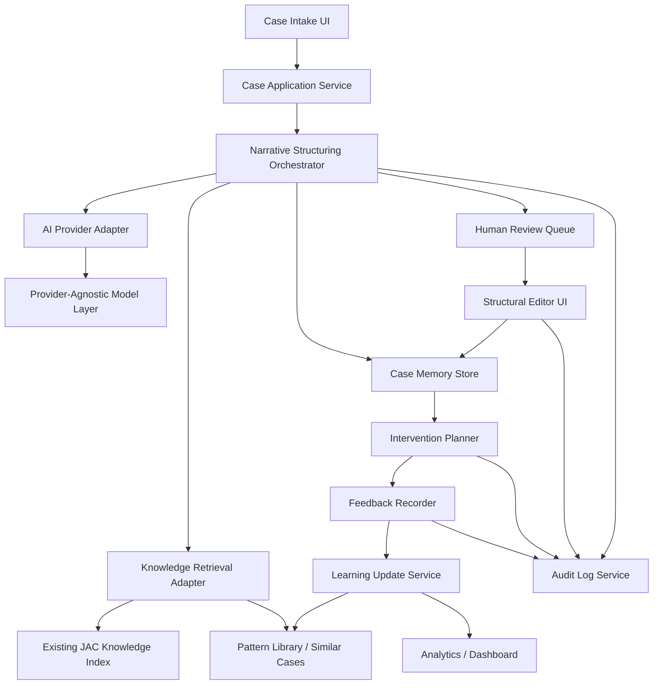
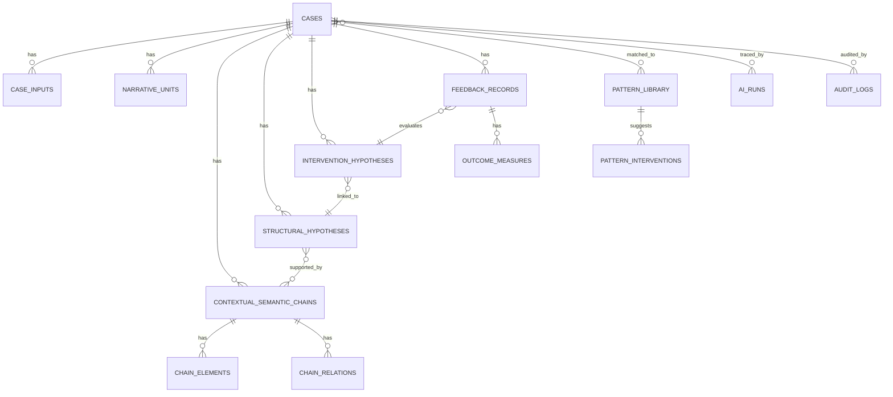

# FCHMA Consultation OS Redesign

更新日: 2026-03-30
Status: handoff draft

## 1. Summary

この再設計では、現行の `配慮設計アシスト` を単発の相談整理 UI から、FCHMA を中核にした `ケース中心の相談支援 OS` へ移行する。

中核方針は次のとおり。

- ケースを最上位単位にする
- ICF を共通参照座標にする
- 自由記述を `文脈的意味連鎖` として保持する
- AI は `候補生成器`、人間は `監査と確定の責任主体` とする
- 見立て、支援提案、実施結果、再見立てを同一ケース履歴で接続する
- モデル依存は疎結合にし、将来の汎用 AI 更新を吸収できるようにする

現行 repo の強みはすでに存在する。

- Next.js + TypeScript の UI 基盤
- `lib/knowledge/*` の retrieval / safety gate 骨格
- `lib/jac/*` の支援知整理、Step 4 evidence pack、地域支援接続
- OpenAI 呼び出しを API route で隔離している点

したがって、全面破棄ではなく、`JAC の既存知識パイプラインを土台に、ケース中心ドメインへ再編成する` のが最適である。

## 2. Target Product Shape

このプロダクトは次の 4 レイヤで構成する。

1. `Case Workspace`
   ケース登録、構造分析、人間監査、支援計画、フィードバック記録を行う主 UI
2. `Analysis and Review Engine`
   AI による一次構造化、仮説生成、類似ケース参照、根拠整理を行うアプリケーション層
3. `Learning Memory`
   ケース履歴、構造型、介入と結果、監査差分を蓄積するデータ層
4. `Knowledge and AI Adapters`
   既存 JAC knowledge index、外部 evidence、ベクトル検索、モデル API を接続する基盤層

## 3. Overall Architecture



## 4. Bounded Contexts

### 4.1 Case Management

責務:

- ケース作成
- 基本属性管理
- ケースステータス管理
- ケース単位のアクセス制御

主要オブジェクト:

- `Case`
- `CaseInput`
- `CaseStatus`
- `CaseMember`

### 4.2 Narrative Analysis

責務:

- NarrativeUnit 分割
- 文脈的意味連鎖抽出
- ICF 要素マッピング
- 要素間関係候補生成

主要オブジェクト:

- `NarrativeUnit`
- `ContextualSemanticChain`
- `ChainElement`
- `ChainRelation`
- `HyperedgePattern`

### 4.3 Structural Reasoning

責務:

- 構造仮説の生成
- 対抗仮説の生成
- 増幅因子、保護因子、介入可能点の整理
- 類似構造型の参照

主要オブジェクト:

- `StructuralHypothesis`
- `PatternLibraryEntry`
- `SimilarityMatch`

### 4.4 Intervention Planning

責務:

- 支援仮説候補生成
- 実施主体、実施条件、難易度の整理
- どの連鎖やノードを変えたいかの明示

主要オブジェクト:

- `InterventionHypothesis`
- `InterventionTarget`
- `ImplementationCondition`

### 4.5 Feedback and Learning

責務:

- 実施記録
- 観察効果と未改善点の記録
- 構造変化の再記述
- ケース知から構造型ライブラリを更新

主要オブジェクト:

- `FeedbackRecord`
- `OutcomeMeasure`
- `StructureRevision`

### 4.6 Governance and Audit

責務:

- AI 出力のバージョン管理
- 人間修正差分の保持
- 監査ログ
- prompt / output versioning

主要オブジェクト:

- `AiRun`
- `PromptTemplateVersion`
- `AuditLog`

## 5. Domain Model Diagram



## 6. Domain Definitions

### 6.1 Case

相談案件の最上位単位。1 ケースは複数回の入力、分析、支援提案、実施、再評価を持つ。

### 6.2 NarrativeUnit

自由記述や面談記録の原文単位。paragraph / utterance / imported note chunk などを含む。

### 6.3 ContextualSemanticChain

FCHMA における最小の分析成果物。単語列ではなく、文脈内で意味的にまとまった連鎖を保持する。

保持原則:

- source span を持つ
- involved elements を持つ
- sequence を持つ
- 境界の曖昧さを `boundary_confidence` で持つ

### 6.4 ChainElement

連鎖に含まれる個別要素。ICF および拡張カテゴリを持つ。

推奨カテゴリ:

- `body_functions_structures`
- `activities`
- `participation`
- `environmental_factors`
- `personal_factors`
- `health_condition`
- `support_resources`
- `institutional_conditions`
- `work_design`
- `role_expectations`
- `temporal_change`

### 6.5 ChainRelation

要素間関係。二項関係を基本に持ちつつ、hyperedge 的まとまりは別 JSON で保持する。

推奨 relation_type:

- `facilitates`
- `inhibits`
- `mediates`
- `amplifies`
- `compensates`
- `contrasts`
- `delays`
- `loops`
- `triggers`
- `stabilizes`

### 6.6 StructuralHypothesis

ケース全体の問題構造に対する見立て候補。AI 起点でも人間起点でもよいが、必ず reviewer decision を持つ。

### 6.7 InterventionHypothesis

どの構造仮説の、どの関係または要素を、どう変えるかを明示した支援仮説。

### 6.8 FeedbackRecord

支援実施後の一次記録。実施可否だけでなく、連鎖変化と新規課題を記録する。

## 7. Target Data Architecture

### 7.1 Storage Principles

- 正規化すべきものは relational に持つ
- 可変な分析 payload は JSONB に持つ
- 類似検索用に embeddings を別カラムで持つ
- 元テキストと AI 抽出結果を分離して保存する
- human edits は overwrite ではなく revision と diff で保存する

### 7.2 Recommended Stack

- frontend: current Next.js pages router を短期維持
- backend: Next.js API routes を MVP の BFF として利用
- database: PostgreSQL
- ORM / query layer: Drizzle ORM を推奨
- vector search: pgvector
- background jobs: DB-backed queue or lightweight worker
- audit store: PostgreSQL + append-only log table

## 8. DB Schema Proposal

### 8.1 Core Tables

#### `users`

| column          | type        | note                         |
| --------------- | ----------- | ---------------------------- |
| id              | uuid pk     | user id                      |
| organization_id | uuid fk     | 所属組織                     |
| role            | text        | admin, reviewer, case_worker |
| display_name    | text        | 表示名                       |
| created_at      | timestamptz | 作成日時                     |

#### `organizations`

| column        | type        | note                  |
| ------------- | ----------- | --------------------- |
| id            | uuid pk     | organization id       |
| name          | text        | 組織名                |
| settings_json | jsonb       | AI 方針、表示方針など |
| created_at    | timestamptz | 作成日時              |

#### `cases`

| column                | type        | note                                                       |
| --------------------- | ----------- | ---------------------------------------------------------- |
| id                    | uuid pk     | case id                                                    |
| organization_id       | uuid fk     | 組織                                                       |
| case_code             | text unique | ケース識別子                                               |
| title                 | text        | ケース表示名                                               |
| status                | text        | intake, analyzing, in_review, planned, in_followup, closed |
| primary_goal          | text        | 主訴または支援目標                                         |
| current_snapshot_json | jsonb       | UI 表示用の集約 snapshot                                   |
| created_by            | uuid fk     | 作成者                                                     |
| created_at            | timestamptz | 作成日時                                                   |
| updated_at            | timestamptz | 更新日時                                                   |

#### `case_inputs`

| column                  | type        | note                                               |
| ----------------------- | ----------- | -------------------------------------------------- |
| id                      | uuid pk     | input id                                           |
| case_id                 | uuid fk     | ケース                                             |
| input_type              | text        | intake_form, interview_note, followup_note, upload |
| source_label            | text        | 入力元ラベル                                       |
| raw_text                | text        | 原文                                               |
| structured_answers_json | jsonb       | 選択回答や属性情報                                 |
| created_by              | uuid fk     | 入力者                                             |
| created_at              | timestamptz | 作成日時                                           |

#### `narrative_units`

| column          | type        | note                                |
| --------------- | ----------- | ----------------------------------- |
| id              | uuid pk     | unit id                             |
| case_id         | uuid fk     | ケース                              |
| case_input_id   | uuid fk     | 由来入力                            |
| sequence_no     | integer     | 並び順                              |
| unit_type       | text        | paragraph, utterance, summary_chunk |
| raw_text        | text        | 原文                                |
| normalized_text | text        | 前処理済み                          |
| embedding       | vector      | 類似検索用                          |
| created_at      | timestamptz | 作成日時                            |

### 8.2 FCHMA Analysis Tables

#### `contextual_semantic_chains`

| column              | type        | note                                  |
| ------------------- | ----------- | ------------------------------------- |
| id                  | uuid pk     | chain id                              |
| case_id             | uuid fk     | ケース                                |
| source_start        | integer     | narrative unit 開始位置               |
| source_end          | integer     | narrative unit 終了位置               |
| summary             | text        | 連鎖要約                              |
| sequence_json       | jsonb       | 順序構造                              |
| evidence_spans_json | jsonb       | 根拠 span                             |
| hyperedge_json      | jsonb       | 高次関係のまとまり                    |
| boundary_confidence | numeric     | 境界確信度                            |
| created_by_ai       | boolean     | AI 起点か                             |
| reviewed_by_human   | boolean     | 人間確認済みか                        |
| status              | text        | proposed, accepted, revised, rejected |
| ai_run_id           | uuid fk     | 抽出元 AI 実行                        |
| created_at          | timestamptz | 作成日時                              |
| updated_at          | timestamptz | 更新日時                              |

#### `chain_elements`

| column        | type    | note                            |
| ------------- | ------- | ------------------------------- |
| id            | uuid pk | element id                      |
| chain_id      | uuid fk | 連鎖                            |
| element_code  | text    | ICF または拡張カテゴリコード    |
| element_label | text    | 表示名                          |
| domain        | text    | icf core or extended            |
| element_group | text    | body_functions, activities など |
| polarity      | text    | burden, protection, neutral     |
| salience      | numeric | 顕著さ                          |
| evidence_text | text    | 原文根拠                        |
| confidence    | numeric | 確信度                          |

#### `chain_relations`

| column            | type    | note                                  |
| ----------------- | ------- | ------------------------------------- |
| id                | uuid pk | relation id                           |
| chain_id          | uuid fk | 連鎖                                  |
| source_element_id | uuid fk | 起点要素                              |
| target_element_id | uuid fk | 終点要素                              |
| relation_type     | text    | amplifies, inhibits など              |
| confidence        | numeric | 確信度                                |
| evidence_text     | text    | 根拠テキスト                          |
| reviewer_status   | text    | proposed, accepted, revised, rejected |
| reviewer_note     | text    | コメント                              |

### 8.3 Reasoning and Planning Tables

#### `structural_hypotheses`

| column                    | type        | note                                 |
| ------------------------- | ----------- | ------------------------------------ |
| id                        | uuid pk     | hypothesis id                        |
| case_id                   | uuid fk     | ケース                               |
| hypothesis_label          | text        | 仮説ラベル                           |
| rationale                 | text        | 仮説説明                             |
| supporting_chain_ids      | jsonb       | 支持する chain ids                   |
| competing_hypotheses_json | jsonb       | 対抗仮説                             |
| amplifiers_json           | jsonb       | 増幅因子                             |
| protectors_json           | jsonb       | 保護因子                             |
| intervention_points_json  | jsonb       | 介入可能点                           |
| confidence                | numeric     | 確信度                               |
| origin                    | text        | ai, human, hybrid                    |
| reviewer_decision         | text        | accepted, revised, rejected, pending |
| ai_run_id                 | uuid fk     | 生成元 AI 実行                       |
| created_at                | timestamptz | 作成日時                             |
| updated_at                | timestamptz | 更新日時                             |

#### `intervention_hypotheses`

| column                    | type        | note                                             |
| ------------------------- | ----------- | ------------------------------------------------ |
| id                        | uuid pk     | intervention id                                  |
| case_id                   | uuid fk     | ケース                                           |
| linked_hypothesis_id      | uuid fk     | 対応見立て                                       |
| intervention_type         | text        | work_design, accommodation, support_linkage など |
| target_relation_or_node   | text        | 変更対象                                         |
| rationale                 | text        | 理由                                             |
| expected_effect           | text        | 期待される変化                                   |
| implementation_steps_json | jsonb       | 実施手順                                         |
| priority                  | integer     | 優先度                                           |
| feasibility               | text        | low, medium, high                                |
| risk_note                 | text        | 留意点                                           |
| selected_status           | text        | proposed, selected, deferred, rejected           |
| owner_role                | text        | manager, supporter, self, hr など                |
| ai_run_id                 | uuid fk     | 生成元 AI 実行                                   |
| created_at                | timestamptz | 作成日時                                         |

### 8.4 Feedback and Learning Tables

#### `feedback_records`

| column                  | type        | note             |
| ----------------------- | ----------- | ---------------- |
| id                      | uuid pk     | feedback id      |
| case_id                 | uuid fk     | ケース           |
| intervention_id         | uuid fk     | 介入仮説         |
| implemented             | boolean     | 実施有無         |
| implementation_notes    | text        | 実施内容         |
| observed_effect         | text        | 観察された効果   |
| unresolved_issues       | text        | 未解決課題       |
| side_effects            | text        | 副作用、新規課題 |
| updated_structure_notes | text        | 構造再見立てメモ |
| reviewer_summary        | text        | 専門職要約       |
| created_by              | uuid fk     | 記録者           |
| created_at              | timestamptz | 作成日時         |

#### `outcome_measures`

| column             | type    | note                            |
| ------------------ | ------- | ------------------------------- |
| id                 | uuid pk | outcome id                      |
| feedback_record_id | uuid fk | feedback                        |
| measure_name       | text    | 指標名                          |
| measure_type       | text    | numeric, ordinal, boolean, text |
| baseline_value     | text    | 実施前                          |
| observed_value     | text    | 実施後                          |
| interpretation     | text    | 所見                            |

#### `pattern_library`

| column                     | type        | note             |
| -------------------------- | ----------- | ---------------- |
| id                         | uuid pk     | pattern id       |
| pattern_key                | text unique | 構造型 key       |
| title                      | text        | 表示名           |
| summary                    | text        | 要約             |
| structure_signature_json   | jsonb       | 要素と関係の署名 |
| typical_interventions_json | jsonb       | 典型的介入       |
| failure_modes_json         | jsonb       | 外れやすい条件   |
| evidence_count             | integer     | 参照ケース数     |
| updated_at                 | timestamptz | 更新日時         |

#### `pattern_interventions`

| column             | type        | note                    |
| ------------------ | ----------- | ----------------------- |
| id                 | uuid pk     | pattern intervention id |
| pattern_id         | uuid fk     | pattern_library         |
| intervention_type  | text        | 介入タイプ              |
| target_signature   | jsonb       | 典型的な対象構造        |
| success_conditions | jsonb       | 効きやすい条件          |
| failure_conditions | jsonb       | 効きにくい条件          |
| evidence_count     | integer     | 参照ケース数            |
| updated_at         | timestamptz | 更新日時                |

### 8.5 Governance Tables

#### `ai_runs`

| column         | type        | note                                                 |
| -------------- | ----------- | ---------------------------------------------------- |
| id             | uuid pk     | run id                                               |
| case_id        | uuid fk     | ケース                                               |
| run_type       | text        | tag_suggest, chain_extract, hypothesis_generate など |
| provider       | text        | openai, anthropic など                               |
| model          | text        | モデル名                                             |
| prompt_version | text        | prompt version                                       |
| input_hash     | text        | 入力 fingerprint                                     |
| output_json    | jsonb       | 生の構造化出力                                       |
| latency_ms     | integer     | 所要時間                                             |
| status         | text        | success, fallback, failed                            |
| created_at     | timestamptz | 作成日時                                             |

#### `prompt_template_versions`

| column          | type        | note                               |
| --------------- | ----------- | ---------------------------------- |
| id              | uuid pk     | prompt template id                 |
| task_key        | text        | chain_extract, hypothesis_generate |
| version_label   | text        | v1, v2 など                        |
| provider_family | text        | openai, anthropic など             |
| prompt_text     | text        | system or template body            |
| schema_json     | jsonb       | expected output schema             |
| created_at      | timestamptz | 作成日時                           |

#### `audit_logs`

| column      | type        | note                                                |
| ----------- | ----------- | --------------------------------------------------- |
| id          | uuid pk     | log id                                              |
| case_id     | uuid fk     | ケース                                              |
| actor_type  | text        | user, ai, system                                    |
| actor_id    | text        | actor id                                            |
| action_type | text        | create, review, approve, reject, revise             |
| target_type | text        | chain, relation, hypothesis, intervention, feedback |
| target_id   | uuid        | 対象 id                                             |
| diff_json   | jsonb       | 差分                                                |
| created_at  | timestamptz | 作成日時                                            |

## 9. MVP Screen List

### 9.1 Dashboard

目的:

- ケースの進行状況を見る
- レビュー待ち、介入待ち、フィードバック待ちを把握する
- 構造型ライブラリ更新の有無を見る

主要ウィジェット:

- active cases
- review queue
- feedback due
- pattern library updates
- recent audit stream

### 9.2 Case Intake

目的:

- ケース作成
- 相談概要、自由記述、属性、補助質問の入力

主要ブロック:

- basic profile
- narrative input
- structured answers
- intake completeness check

### 9.3 Structural Analysis View

目的:

- AI が出した一次構造化結果を一覧する

主要ブロック:

- ICF map panel
- contextual semantic chains list
- causal and relational map
- amplifiers / protectors
- competing hypotheses
- evidence viewer

### 9.4 Structural Editor

目的:

- 人間監査、修正、確定

主要操作:

- chain accept / revise / reject
- element relabel
- relation type change
- competing hypothesis add
- rationale note add

### 9.5 Intervention Planner

目的:

- 見立てから支援仮説へ落とす

主要ブロック:

- intervention cards
- target relation / node mapping
- feasibility / owner / priority
- risk and preconditions

### 9.6 Feedback Recorder

目的:

- 実施結果と構造変化を記録する

主要ブロック:

- implemented / not implemented
- observed effect
- unresolved issues
- structure changed or not
- next review decision

### 9.7 Knowledge Explorer

目的:

- 類似ケース、構造型、介入条件を探索する

主要ブロック:

- similar cases
- pattern library
- intervention success conditions
- failure modes

## 10. Major User Flows

### 10.1 Flow A: New Case to Reviewed Structure

1. ケースを作成する
2. 相談概要、自由記述、属性情報を入力する
3. AI が NarrativeUnit 化、chain 抽出、ICF マッピング、構造仮説候補を返す
4. 専門職が Structural Analysis View で全体像を確認する
5. Structural Editor で採用、修正、却下を行う
6. ケースの `reviewed structure snapshot` を確定する

### 10.2 Flow B: Reviewed Structure to Intervention Plan

1. 確定した StructuralHypothesis を選ぶ
2. AI が intervention hypotheses を複数生成する
3. 各介入案に target relation / expected effect / feasibility を付与する
4. 専門職が優先度と実施主体を決める
5. selected interventions を保存する

### 10.3 Flow C: Intervention to Feedback and Reframing

1. 実施の有無を記録する
2. 効果、未改善点、新規課題を入力する
3. AI が構造変化候補を返す
4. 専門職が再見立てを行う
5. 構造型ライブラリとケース snapshot を更新する

### 10.4 Flow D: Knowledge Explorer

1. ケース中の構造署名または hypothesis を起点に検索する
2. 類似ケースと pattern library entry を一覧する
3. 効いた介入、効かなかった条件、監査差分を確認する
4. 今回ケースの intervention planning へ戻す

## 11. AI Orchestration Responsibility Split

### 11.1 Principle

AI は `candidate generator` であり、確定権限を持たない。

### 11.2 AI Services

#### `NarrativeStructuringService`

入力:

- case inputs
- narrative units

出力:

- contextual semantic chains
- chain elements
- chain relations

責務:

- 文脈的意味連鎖候補の抽出
- evidence span の特定
- ICF と拡張カテゴリの仮マッピング

#### `StructuralHypothesisService`

入力:

- reviewed or proposed chains
- related evidence
- pattern library candidates

出力:

- structural hypotheses
- competing hypotheses
- amplifier / protector candidates
- intervention points

責務:

- 複数仮説の並列生成
- 対抗仮説と不確実性の明示

#### `InterventionSuggestionService`

入力:

- accepted hypotheses
- case context
- support resources
- historical pattern matches

出力:

- intervention hypotheses
- expected effects
- implementation conditions

責務:

- 介入候補の複数提示
- 実施条件、難易度、リスクの明示

#### `CaseSimilarityService`

入力:

- current case structure signature
- narrative embeddings

出力:

- similar cases
- related pattern library entries
- successful and failed intervention references

責務:

- 類似構造検索
- 類似ケース説明

#### `FeedbackReflectionService`

入力:

- feedback records
- prior hypotheses
- selected interventions

出力:

- structure revision suggestions
- unresolved chain alerts
- library update candidates

責務:

- フィードバックの意味付け
- 再見立て候補の生成

### 11.3 Human-Only Decisions

- StructuralHypothesis の最終採択
- 介入案の最終採択
- フィードバック解釈の最終判断
- 倫理判断
- ケース公開 / 共有範囲の最終決定

### 11.4 Provider-Agnostic Adapter Layer

MVP でも次の interface を導入する。

```ts
type AiProvider = {
  generateStructuredOutput<T>(input: {
    task: string;
    promptVersion: string;
    schema: unknown;
    payload: unknown;
  }): Promise<T>;
  embed(input: { texts: string[] }): Promise<number[][]>;
};
```

この adapter の上に以下を乗せる。

- `generateChains`
- `generateStructuralHypotheses`
- `generateInterventionHypotheses`
- `summarizeFeedbackDelta`

これにより OpenAI 直結実装を段階的に外せる。

## 12. Implementation Architecture for This Repo

### 12.1 Recommended Folder Shape

```text
lib/fchma/domain/
lib/fchma/application/
lib/fchma/infrastructure/
lib/fchma/orchestration/
lib/fchma/presentation/
pages/cases/
pages/api/cases/
components/cases/
db/schema/
```

### 12.2 Migration Mapping from Current JAC

現行資産は次のように転用する。

- `pages/api/jac-tag-suggest.ts`
  - `NarrativeStructuringService` の軽量 signal extractor へ移行
- `pages/api/jac-followup-suggest.ts`
  - case intake の追加確認候補生成へ移行
- `pages/api/jac-assess.ts`
  - 単一 endpoint を分割し、`structure`, `hypothesis`, `intervention`, `feedback reflection` に再編
- `lib/knowledge/*`
  - evidence retrieval と safety gate の基盤として継続利用
- `lib/jac/supportCatalog.ts`
  - `support_resources` and `institutional_conditions` として再配置
- `lib/jac/step4EvidencePack.ts`
  - future `Evidence and Similarity Panel` の server-built pack へ応用

### 12.3 UI Migration Strategy

短期:

- 現行 `pages/jac.tsx` は維持
- 新規に `pages/cases/*` を追加
- FCHMA MVP は別 route で立ち上げる

中期:

- 機能が安定したら `jac.tsx` の一部をケース UI に吸収
- 旧相談フローは compatibility mode に落とす

## 13. MVP Scope

### 13.1 In Scope

- ケース作成
- NarrativeUnit 保存
- AI 一次構造化
- Structural Analysis View
- Structural Editor
- Intervention Planner
- Feedback Recorder
- 類似ケース検索の初歩版
- AI run / audit log 保存

### 13.2 Out of Scope

- fully automated pattern induction
- 高度な manifold visualization
- 組織横断 benchmark dashboard
- 自動介入最適化
- 高度な multi-tenant policy engine

## 14. Implementation Priority

### Phase 0: Foundation

- PostgreSQL と schema 導入
- provider abstraction 導入
- audit log / AI run log 導入
- case domain model の最小テーブル作成

### Phase 1: Case Workspace MVP

- Case Intake UI
- cases API
- narrative_units 保存
- chain extraction API
- Structural Analysis View

### Phase 2: Human Review and Planning

- Structural Editor
- reviewer decisions 保存
- intervention hypotheses 生成
- Intervention Planner UI

### Phase 3: Feedback Loop

- Feedback Recorder
- OutcomeMeasures
- structure revision suggestions
- dashboard の基礎指標

### Phase 4: Similarity and Learning

- pgvector embeddings
- similar cases retrieval
- pattern library 初版
- explorer UI

## 15. Success Metrics for MVP

- ケース登録完了率
- AI chain 候補の採用または修正採用率
- reviewer が 1 ケースを監査完了するまでの時間
- intervention hypotheses の採択率
- feedback record 入力率
- AI run ごとの human correction ratio

## 16. Immediate Build Order

この repo で最初に着手すべき実装順は次のとおり。

1. DB と `cases` 系 schema を入れる
2. `lib/fchma` の domain / application / provider abstraction を切る
3. `pages/api/cases` の create / read を作る
4. `NarrativeStructuringService` の MVP を、既存 `jac-tag-suggest` と `jac-followup-suggest` の知見を流用して作る
5. `pages/cases/[id]` に Structural Analysis View を作る
6. human review 保存を実装する
7. intervention planning と feedback recording を追加する

## 17. Recommended Next Deliverables

この文書の次に作るべき設計成果物は次の順。

1. wireframe spec
2. Drizzle schema draft
3. `lib/fchma` module map
4. provider abstraction interface
5. `pages/cases` MVP routing plan
6. migration checklist from current JAC
